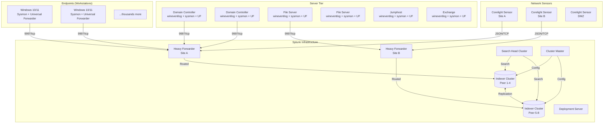
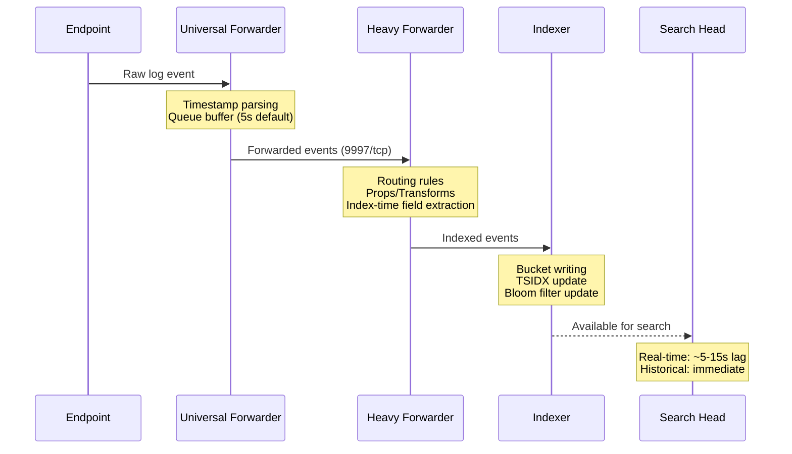
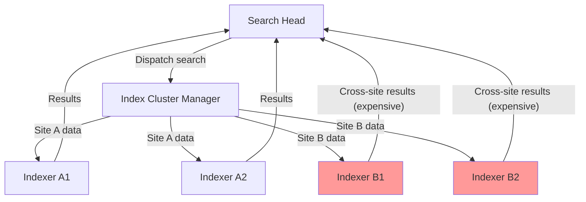

# Module 01 — Infrastructure Overview
## Architecture, Data Flows & Index Topology

---

## 1.1 Enterprise Architecture at Scale



---

## 1.2 Index Topology & Data Ownership

```mermaid
graph LR
    subgraph "Index: corelight"
        direction TB
        CL_CONN[conn — all TCP/UDP flows]
        CL_DNS[dns — all DNS queries/responses]
        CL_SMB[smb_files / smb_mapping]
        CL_KRB[kerberos — ticket events]
        CL_NTLM[ntlm — NTLM auth events]
        CL_RDP[rdp — RDP sessions]
        CL_HTTP[http — HTTP/HTTPS metadata]
        CL_FILES[files — extracted file metadata]
        CL_X509[x509 — certificates]
        CL_LDAP[ldap — LDAP queries]
        CL_DCE[dce_rpc — RPC calls]
    end

    subgraph "Index: wineventlog"
        direction TB
        WEL_4624[4624 — Logon Success]
        WEL_4625[4625 — Logon Failure]
        WEL_4634[4634 — Logoff]
        WEL_4648[4648 — Explicit Credential Logon]
        WEL_4662[4662 — Object Access AD]
        WEL_4663[4663 — Object Access File]
        WEL_4688[4688 — Process Create]
        WEL_4698[4698 — Scheduled Task Create]
        WEL_4720[4720 — Account Created]
        WEL_4728[4728 — Group Member Added]
        WEL_4768[4768 — Kerberos TGT Request]
        WEL_4769[4769 — Kerberos Service Ticket]
        WEL_4771[4771 — Kerberos Pre-Auth Failed]
        WEL_5140[5140 — Network Share Access]
        WEL_5145[5145 — Share Object Access]
        WEL_7045[7045 — Service Installed]
        WEL_8004[8004 — LSASS Access]
    end

    subgraph "Index: sysmon"
        direction TB
        SY_1[EventID 1 — Process Create]
        SY_3[EventID 3 — Network Connect]
        SY_7[EventID 7 — Image Load]
        SY_8[EventID 8 — CreateRemoteThread]
        SY_10[EventID 10 — Process Access]
        SY_11[EventID 11 — File Create]
        SY_12[EventID 12/13 — Registry]
        SY_17[EventID 17/18 — Named Pipe]
        SY_22[EventID 22 — DNS Query]
        SY_25[EventID 25 — Process Tamper]
    end

    DC1[Domain Controllers] -->|Security Log| WEL_4624
    DC1 -->|Sysmon| SY_1
    NET[Network Sensors] -->|Corelight| CL_CONN
```



---

## 1.3 TSIDX Internals — What You're Actually Searching

Understanding the TSIDX (Time-Series Index) file structure is essential for writing efficient searches.

```
Splunk Bucket Structure (per index)
━━━━━━━━━━━━━━━━━━━━━━━━━━━━━━━━━━━━━━━━━━━━━━━━━━━━━
db/
├── hot_v1_0/               ← Currently being written
│   ├── rawdata/            ← Compressed raw events (.gz slices)
│   ├── <name>.tsidx        ← Time-Series Index: term→bucket bitmap
│   ├── <name>.bloomfilter  ← Bloom filter for keyword pre-check
│   ├── Strings.data        ← String table for field values
│   └── optimize.conf
├── warm_v1_*/              ← Recent, fully written buckets
└── cold_v1_*/              ← Older buckets (may be on slower storage)
━━━━━━━━━━━━━━━━━━━━━━━━━━━━━━━━━━━━━━━━━━━━━━━━━━━━━
```

### The Search Pipeline Against Raw Data

```
Search: index=wineventlog EventCode=4624 LogonType=3
         earliest=-1h

Step 1: TIME FILTER
  → Identify buckets where maxTime >= earliest AND minTime <= latest
  → Skip all other buckets entirely (free operation)

Step 2: BLOOM FILTER CHECK (per bucket)
  → Check if "4624" appears in this bucket's bloom filter
  → False negatives impossible; false positives possible (~1%)
  → Eliminates ~60-90% of buckets on targeted searches

Step 3: TSIDX LOOKUP
  → For indexed fields, map field=value → list of event offsets
  → Avoids scanning rawdata for those fields
  → Only fields in fields.conf/transforms.conf are indexed

Step 4: RAWDATA SCAN
  → Decompress and scan rawdata slices for remaining filters
  → Most expensive operation — minimize events reaching this stage

Step 5: FIELD EXTRACTION (search-time)
  → Apply transforms, props.conf regexes
  → eval, rex, lookup — all happen here

Step 6: AGGREGATION
  → stats, timechart, chart
```

### Which Fields Are Indexed (TSIDX)?

Only these fields are in TSIDX by default:

| Field | Notes |
|---|---|
| `_time` | Always indexed |
| `host` | Always indexed |
| `source` | Always indexed |
| `sourcetype` | Always indexed |
| `index` | Always indexed |
| `linecount` | Always indexed |
| Custom fields | Only if defined in `fields.conf` with `INDEXED = true` |

> **Critical insight**: `EventCode`, `src_ip`, `user`, `dest_ip` are **NOT** in TSIDX unless you explicitly indexed them. This means filtering on these fields in a `search` command requires rawdata scanning. Use `tstats` with `prestats=true` or pre-indexed fields to avoid this.

---

## 1.4 Data Flow Latency Map



### Latency Impact on Detections

```
DETECTION TIMING REALITY CHECK
━━━━━━━━━━━━━━━━━━━━━━━━━━━━━━━━━━━━━━━━━━━━━━━━━━━━━
UF queue delay:          5-30 seconds (configurable)
Network transit:         1-5 seconds (site-to-site: up to 60s)
HF processing:           1-10 seconds (under load: up to 120s)
Indexer ingest lag:      2-30 seconds (under load)
Replication lag:         5-60 seconds (between indexer peers)
━━━━━━━━━━━━━━━━━━━━━━━━━━━━━━━━━━━━━━━━━━━━━━━━━━━━━
TOTAL REALISTIC LAG:     15 seconds - 5 minutes

Implication: All real-time alerts should use earliest=-5m
or earlier, never earliest=rt (real-time). Real-time
searches consume 4-10x more resources than historical.
━━━━━━━━━━━━━━━━━━━━━━━━━━━━━━━━━━━━━━━━━━━━━━━━━━━━━
```

---

## 1.5 Index Volume Reality at Scale

```
ESTIMATED DAILY INDEX VOLUMES (Trillions of events/hour scenario)
━━━━━━━━━━━━━━━━━━━━━━━━━━━━━━━━━━━━━━━━━━━━━━━━━━━━━━━━━━━━━━━
Index          Sourcetype              Events/Hour    GB/Day
━━━━━━━━━━━━━━━━━━━━━━━━━━━━━━━━━━━━━━━━━━━━━━━━━━━━━━━━━━━━━━━
corelight      bro_conn                ~800B          ~12,000
corelight      bro_dns                 ~200B          ~3,000
corelight      bro_smb_*               ~50B           ~800
corelight      bro_kerberos            ~20B           ~400
corelight      bro_ntlm                ~10B           ~200
corelight      bro_http                ~100B          ~2,000
wineventlog    WinEventLog:Security    ~150B          ~4,500
wineventlog    WinEventLog:System      ~20B           ~400
sysmon         XmlWinEventLog:*        ~200B          ~6,000
━━━━━━━━━━━━━━━━━━━━━━━━━━━━━━━━━━━━━━━━━━━━━━━━━━━━━━━━━━━━━━━
TOTAL                                  ~1.5T/hr       ~29,300 GB/day
━━━━━━━━━━━━━━━━━━━━━━━━━━━━━━━━━━━━━━━━━━━━━━━━━━━━━━━━━━━━━━━
```

---

## 1.6 Jumphost & Domain Controller Special Considerations

### Domain Controller Traffic Patterns

Domain controllers generate **disproportionate** event volume due to:
- Kerberos ticket issuance for every service access (Event 4769)
- DC replication traffic (Event 4932, 4933) — can look like DCSync
- LDAP queries from every domain-joined machine at startup
- DNS dynamic updates from all machines

```splunk
| Comment "ALWAYS filter DC replication traffic when not specifically hunting it"

| Comment "BAD: This returns millions of false positives on DCs"
index=wineventlog EventCode=4662
    ObjectType="{19195a5a-6da0-11d0-afd3-00c04fd930c9}"

| Comment "GOOD: Exclude known DC replication accounts and machine accounts"
index=wineventlog EventCode=4662
    ObjectType="{19195a5a-6da0-11d0-afd3-00c04fd930c9}"
    NOT SubjectUserName="*$"
    NOT SubjectUserName IN ("MSOL_*", "AAD_*", "ADFS*")
    NOT ComputerName IN ("*-DC-*", "DC-*", "*DC01*", "*DC02*")
```

### Jumphost Behavioral Baselines

Jumphosts are high-noise sources. They generate:
- Thousands of successful logons per day (4624, LogonType=10)
- Hundreds of distinct source IPs connecting
- Legitimate admin tool execution (PsExec, WMI, WSMAN)

```splunk
| Comment "Establish jumphost baseline BEFORE writing detections against them"

index=wineventlog sourcetype="WinEventLog:Security" EventCode=4624
    ComputerName IN ("jumphost-*", "jh-*", "bastion-*")
    earliest=-30d latest=-1d
| stats dc(AccountName) as unique_users,
        dc(IpAddress) as unique_src_ips,
        count as total_logons by ComputerName
| sort -total_logons
```

---

## 1.7 Indexer Cluster Search Affinity

In a multi-site indexer cluster, understand where your data lives:



> Cross-site searches under network constraints can add 10-60 seconds of latency. Use `splunk_server_group` filtering in searches that don't need cross-site data:

```splunk
| Comment "Restrict to local site indexers when cross-site data not needed"
index=wineventlog EventCode=4624 splunk_server_group=site1_indexers
    earliest=-15m
```

---

[← README](./README.md) | [Next: Search Optimization Fundamentals →](./02-search-optimization-fundamentals.md)
