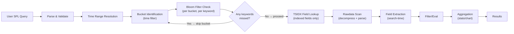

# Module 02 — Search Optimization Fundamentals
## Bloom Filters, TSIDX, Search Order & Eval vs Field Extraction

---

## 2.1 The Search Processing Language (SPL) Execution Model



---

## 2.2 `tstats` — The Most Powerful Optimization Tool

`tstats` queries only TSIDX files. It **never touches rawdata**. At trillion-event scale, this is the difference between a 2-second search and a 20-minute search.

### Basic tstats Pattern

```splunk
| tstats count
    WHERE index=wineventlog
    BY _time span=1m host sourcetype
```

### Using tstats with Datamodel (CIM)

```splunk
| Comment "Authentication events via datamodel (fastest for CIM-compliant data)"
| tstats summariesonly=false allow_old_summaries=true
    count min(_time) as firstTime max(_time) as lastTime
    FROM datamodel=Authentication.Authentication
    WHERE Authentication.action="success"
        Authentication.app="splunk"
    BY Authentication.src Authentication.dest Authentication.user
    _time span=5m
| `drop_dm_object_name("Authentication")`
| where count > 10
```

### tstats for Raw Index Data (No Datamodel)

```splunk
| Comment "Count logon failures per host using only TSIDX — no rawdata touch"
| tstats count
    WHERE index=wineventlog sourcetype="WinEventLog:Security"
    BY host _time span=5m
| where count > 1000
```

> **Limitation**: `tstats` can only filter and group by **indexed fields** (`host`, `source`, `sourcetype`, `index`, `_time`, and custom indexed fields). For non-indexed fields like `EventCode`, you need `prestats` or must accept rawdata scanning.

### tstats with prestats (Hybrid Optimization)

```splunk
| Comment "prestats reduces data volume before rawdata extraction"
| tstats prestats=true count
    WHERE index=wineventlog
    BY host _time span=1m
| stats count by host _time
| where count > 5000
| Comment "Now do the expensive raw search only on high-volume hosts"
```

---

## 2.3 Bloom Filter Optimization

The bloom filter is a probabilistic data structure that answers: "Does term X appear in this bucket?"

### What Terms Are in the Bloom Filter?

Every **token** from rawdata is in the bloom filter. Tokens are created by splitting on default delimiters: space, comma, semicolon, pipe, `[`, `]`, `{`, `}`, `<`, `>`, `=`, `"`, `'`.

```
Raw event: "EventCode=4624 AccountName=jdoe LogonType=3"
Tokens:    ["EventCode", "4624", "AccountName", "jdoe", "LogonType", "3"]

Bloom filter contains: ALL of the above tokens
```

### Maximizing Bloom Filter Hits

```splunk
| Comment "GOOD: Short, specific string that bloom filter can eliminate buckets on"
index=wineventlog "4625" "0xC000006A"
| where EventCode=4625 AND Status="0xC000006A"

| Comment "BAD: Wildcard at start defeats bloom filter"
index=wineventlog EventCode=4625 Status="*C000006A"
| Comment "Bloom filter can't check '*C000006A' — must scan rawdata for every bucket"

| Comment "ALSO BAD: regex at search-time defeats bloom filter entirely"
index=wineventlog EventCode=4625 [rex field=Status "(?i)c000006a"]
```

### Wildcard Positioning Rules

```
Bloom filter effectiveness by wildcard position:
━━━━━━━━━━━━━━━━━━━━━━━━━━━━━━━━━━━━━━━━━━━━━━━━━━━━━
"exactterm"          → FULL bloom filter benefit
"prefix*"            → PARTIAL benefit (prefix checked)
"*suffix"            → NO benefit (leading wildcard)
"*middle*"           → NO benefit
field=value          → Same rules as above
field="exact value"  → FULL benefit for each token in value
━━━━━━━━━━━━━━━━━━━━━━━━━━━━━━━━━━━━━━━━━━━━━━━━━━━━━
```

---

## 2.4 Search Command Cost Hierarchy

```
COMMAND COST TABLE (approximate, scale-dependent)
━━━━━━━━━━━━━━━━━━━━━━━━━━━━━━━━━━━━━━━━━━━━━━━━━━━━━━━━━━━━━━━━━
Command              Cost    Notes
━━━━━━━━━━━━━━━━━━━━━━━━━━━━━━━━━━━━━━━━━━━━━━━━━━━━━━━━━━━━━━━━━
tstats               ★☆☆☆☆  TSIDX only, no rawdata
inputlookup          ★☆☆☆☆  Reads CSV/KV store directly
search (indexed)     ★★☆☆☆  Bloom filter + TSIDX
stats                ★★☆☆☆  In-memory aggregation
eval                 ★★☆☆☆  Per-event computation
where                ★★☆☆☆  Post-extraction filter
dedup                ★★★☆☆  In-memory sort+deduplicate
lookup               ★★☆☆☆  Per-event KV lookup
transaction          ★★★★☆  Very memory-intensive
join                 ★★★★☆  Nested search + memory
rex (search-time)    ★★★☆☆  Per-event regex engine
mvexpand             ★★★☆☆  Explodes result set
subsearch [ ]        ★★★★☆  Spawns full nested search
streamstats          ★★★☆☆  Stateful per-event computation
eventstats           ★★★☆☆  Aggregation + per-event join
━━━━━━━━━━━━━━━━━━━━━━━━━━━━━━━━━━━━━━━━━━━━━━━━━━━━━━━━━━━━━━━━━
```

---

## 2.5 Field Extraction: `rex` vs `extract` vs Indexed Fields

### The Field Extraction Priority Chain

```
Priority order (fastest → slowest):
1. Indexed fields (fields.conf INDEXED=true) → from TSIDX
2. Extracted fields (transforms.conf) → from rawdata after scan
3. rex command (search-time) → regex per event in pipeline
4. eval + if/match → per event in pipeline
5. lookup command → per event with I/O
```

### `rex` Anti-Patterns at Scale

```splunk
| Comment "BAD: rex on millions of events for something already parsed"
index=sysmon EventCode=1
| rex field=_raw "ParentImage=(?<parent_process>[^\n]+)"
| where parent_process="*powershell*"

| Comment "GOOD: If Sysmon is parsed, use extracted fields directly"
index=sysmon EventCode=1 ParentImage="*powershell*"
| stats count by Image ParentImage CommandLine host

| Comment "GOOD: If you must rex, filter first to minimize events entering rex"
index=sysmon EventCode=1 "powershell"
| rex field=ParentImage "(?<parent_name>[^\\\\]+)$"
| where parent_name IN ("powershell.exe", "powershell_ise.exe")
```

### Strategic `extract` Placement

```splunk
| Comment "Use extract early only on fields you'll filter on"
| Comment "Use extract late only on fields you'll display"

| Comment "Pattern: Extract → Filter → Aggregate → Display"
index=wineventlog sourcetype="WinEventLog:Security" EventCode=4688
| fields + host _time CommandLine ParentProcessName ProcessName AccountName
| where match(CommandLine, "(?i)(invoke-expression|iex|downloadstring|bypass)")
| stats count dc(host) as host_count values(CommandLine) as cmds by ProcessName
```

---

## 2.6 Subsearch Optimization

Subsearches are single-threaded, have a 60-second timeout, and return a maximum of 50,000 results (configurable). They are **extremely expensive**.

### Subsearch Anti-Pattern

```splunk
| Comment "TERRIBLE: Subsearch on high-volume data"
index=wineventlog EventCode=4624
    [search index=wineventlog EventCode=4625 earliest=-1h
     | stats count by IpAddress
     | where count > 100
     | fields IpAddress]
```

### Replacement: Join Strategy (Still Expensive)

```splunk
| Comment "BETTER: Explicit join with limited scope"
index=wineventlog EventCode=4625 earliest=-1h
| stats count as failures by IpAddress
| where failures > 100
| join type=inner IpAddress [
    search index=wineventlog EventCode=4624 earliest=-1h
    | stats count as successes by IpAddress
]
| table IpAddress failures successes
```

### Best Practice: `append` + `stats` Pattern

```splunk
| Comment "BEST: Use append+stats to avoid subsearch entirely"
index=wineventlog EventCode IN (4624, 4625) earliest=-1h
| stats count(eval(EventCode=4624)) as successes
        count(eval(EventCode=4625)) as failures
        by IpAddress
| where failures > 100 AND successes > 0
| eval spray_ratio = round(failures / (successes + failures), 2)
| sort -spray_ratio
```

### When Subsearch Is Acceptable

```splunk
| Comment "OK: Subsearch on a lookup file (fast, no index scan)"
index=wineventlog EventCode=4624
    [inputlookup privileged_accounts.csv | fields AccountName]

| Comment "OK: Subsearch returns small result set (<1000 rows)"
index=wineventlog EventCode=4698
    [search index=wineventlog EventCode=4720 earliest=-24h
     | stats count by TargetUserName | head 100
     | fields TargetUserName]
```

---

## 2.7 Time Range Strategy

### Effective Time Bounding

```
TIME RANGE COST COMPARISON (on 1TB index)
━━━━━━━━━━━━━━━━━━━━━━━━━━━━━━━━━━━━━━━━━━━━━━━━━━━━━
Range           Buckets Scanned    Approx Time
━━━━━━━━━━━━━━━━━━━━━━━━━━━━━━━━━━━━━━━━━━━━━━━━━━━━━
All time        ALL                90+ minutes
-30d            ~720 buckets       8-15 minutes
-7d             ~168 buckets       2-4 minutes
-24h            ~24 buckets        30-60 seconds
-1h             ~1-2 buckets       5-15 seconds
-15m            <1 bucket          1-5 seconds
━━━━━━━━━━━━━━━━━━━━━━━━━━━━━━━━━━━━━━━━━━━━━━━━━━━━━
```

### Alert Scheduling vs Window Overlap

```
For scheduled alerts, always overlap windows:
━━━━━━━━━━━━━━━━━━━━━━━━━━━━━━━━━━━━━━━━━━━━━━━━━━━━━
Schedule      Window          Rationale
━━━━━━━━━━━━━━━━━━━━━━━━━━━━━━━━━━━━━━━━━━━━━━━━━━━━━
*/5min        earliest=-10m   Covers indexing lag
*/15min       earliest=-20m   Covers HF lag
*/1h          earliest=-70m   Covers site-to-site lag
━━━━━━━━━━━━━━━━━━━━━━━━━━━━━━━━━━━━━━━━━━━━━━━━━━━━━
Use dedup or distinct counts to handle duplicate
alerts from window overlap.
━━━━━━━━━━━━━━━━━━━━━━━━━━━━━━━━━━━━━━━━━━━━━━━━━━━━━
```

---

## 2.8 `stats` vs `eventstats` vs `streamstats`

### When to Use Each

```splunk
| Comment "stats: Final aggregation, removes raw events from pipeline"
index=wineventlog EventCode=4625 earliest=-1h
| stats count by IpAddress AccountName
| sort -count

| Comment "eventstats: Add aggregate info to each event (keeps all rows)"
index=wineventlog EventCode=4625 earliest=-1h
| eventstats count as total_failures by IpAddress
| where total_failures > 50
| table _time IpAddress AccountName total_failures

| Comment "streamstats: Running calculation — detect acceleration patterns"
| Comment "Use for: brute force detection with time-aware thresholds"
index=wineventlog EventCode=4625 earliest=-1h
| sort _time
| streamstats time_window=5m count as failures_in_window by IpAddress
| where failures_in_window > 20
| table _time IpAddress AccountName failures_in_window
```

### Detecting Brute Force with Acceleration Using streamstats

```splunk
| Comment "Detect accelerating failure rate — sign of automated brute force"
index=wineventlog EventCode=4625 earliest=-2h
| sort 0 _time
| streamstats time_window=5m count as count_5m by IpAddress
| streamstats time_window=15m count as count_15m by IpAddress
| eval rate_5m = count_5m / 5
| eval rate_15m = count_15m / 15
| eval acceleration = round(rate_5m / (rate_15m + 0.001), 2)
| where acceleration > 3
    AND count_5m > 10
| stats max(acceleration) as peak_accel
        max(count_5m) as peak_5m
        dc(AccountName) as accounts_targeted
        by IpAddress
| sort -peak_accel
```

---

## 2.9 The `fields` Command — Critical for Memory Management

At scale, the events pipeline holds **millions of rows in memory**. Each field costs memory.

```splunk
| Comment "ALWAYS trim fields early to reduce memory footprint"

| Comment "BAD: Full events flow through entire pipeline"
index=sysmon EventCode=1 earliest=-1h
| stats count by Image CommandLine ParentImage host

| Comment "GOOD: Trim to only needed fields immediately after index filter"
index=sysmon EventCode=1 earliest=-1h
| fields host _time Image CommandLine ParentImage
| stats count by Image CommandLine ParentImage host
```

### `fields` Inclusion vs Exclusion

```splunk
| Comment "Include only what you need (preferred)"
| fields host _time src_ip dest_ip user action

| Comment "Exclude specific fields (use when most fields are needed)"
| fields - _raw _kv punct linecount

| Comment "Use fields immediately after the initial filter"
index=corelight sourcetype=bro_conn earliest=-15m
| fields _time id.orig_h id.resp_h id.resp_p proto bytes_sent bytes_received
| stats sum(bytes_sent) as out_bytes by id.orig_h id.resp_h
```

---

## 2.10 `head` and `tail` — Use with Caution

```splunk
| Comment "head stops processing after N results — saves compute IF used early"
| Comment "BUT: 'head' after an expensive operation saves nothing"

| Comment "BAD: head after full aggregation"
index=wineventlog EventCode=4624 earliest=-24h
| stats count by AccountName
| sort -count
| head 20

| Comment "GOOD FOR EXPLORATION: Use head to limit while building queries"
index=wineventlog EventCode=4624 earliest=-15m
| head 1000
| stats count by AccountName
| sort -count
| head 20

| Comment "PRODUCTION: Remove head from production searches"
| Comment "Use 'where count > N' instead to filter meaningfully"
```

---

## 2.11 `bucket` — Efficient Time Binning Without `timechart`

```splunk
| Comment "timechart is convenient but inflexible at scale"
| Comment "bucket _time + stats gives more control"

| Comment "Detect login spikes using bucket"
index=wineventlog EventCode=4624 LogonType=3 earliest=-6h
| bucket _time span=5m
| stats count dc(IpAddress) as unique_sources by _time host
| where count > 500 OR unique_sources > 50
| sort _time

| Comment "Compare current vs previous period in single search"
index=wineventlog EventCode=4625 earliest=-2h
| eval period = if(_time >= relative_time(now(), "-1h"), "current", "previous")
| stats count by period IpAddress
| xyseries IpAddress period count
| eval delta = current - previous
| where delta > 20
| sort -delta
```

---

[← Infrastructure Overview](./01-infrastructure-overview.md) | [Next: Cross-Index Correlation →](./03-cross-index-correlation.md)
