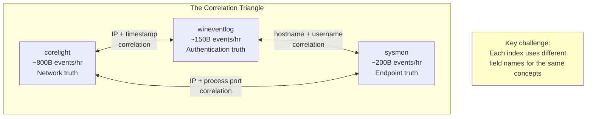
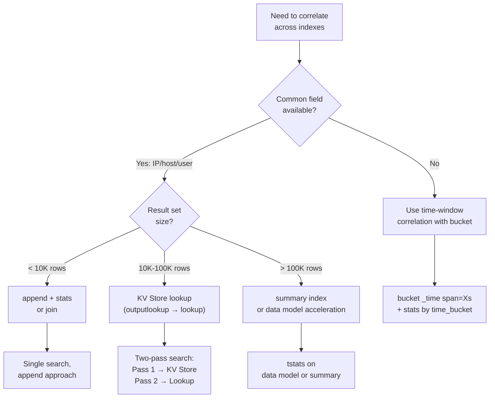
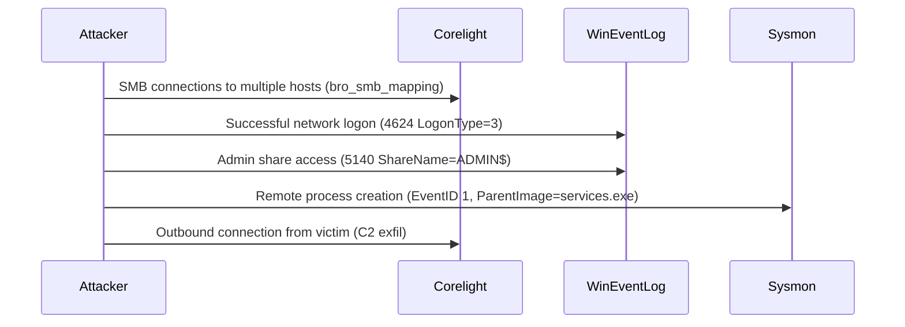
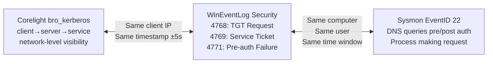

# Module 03 — Cross-Index Correlation
## Joining corelight + wineventlog + sysmon Efficiently with Distributable First-Pass Filtering

---

## 3.1 The Correlation Problem at Scale

Correlating three massive indexes is one of the hardest challenges in enterprise SIEM. A naive approach can cause search head memory exhaustion.



### Field Name Mapping Across Indexes

```
CONCEPT          CORELIGHT           WINEVENTLOG         SYSMON
━━━━━━━━━━━━━━━━━━━━━━━━━━━━━━━━━━━━━━━━━━━━━━━━━━━━━━━━━━━━━━━━━━━━━
Source IP        id.orig_h           IpAddress           SourceIp
Destination IP   id.resp_h           (not present)       DestinationIp
Destination Port id.resp_p           (not present)       DestinationPort
Username         (kerberos: client)  AccountName         User
Hostname         (DNS reverse)       ComputerName        Computer
Protocol         proto               (not present)       (not present)
Process          (not present)       ProcessName         Image
Parent Process   (not present)       ParentProcessName   ParentImage
Timestamp        _time               _time               _time
━━━━━━━━━━━━━━━━━━━━━━━━━━━━━━━━━━━━━━━━━━━━━━━━━━━━━━━━━━━━━━━━━━━━━
```

---

## 3.2 Correlation Strategy Decision Tree



---

## 3.3 The `append` Pattern — Most Efficient Cross-Index Join

The append pattern runs multiple sub-searches, normalizes field names, then correlates in a single `stats` pass. No subsearch nesting.

### Pattern: Detect Successful Auth After Multiple Failures (Cross-Source)

```splunk
| Comment "Correlate Corelight NTLM failures with WinEventLog successes"
| Comment "Technique: append + normalize + stats"

index=corelight sourcetype=bro_ntlm earliest=-1h
    status IN ("NTLMSSP_AUTH", "fail")
| eval src = id.orig_h
| eval dest = id.resp_h
| eval user = username
| eval outcome = if(status="NTLMSSP_AUTH", "success", "failure")
| eval data_source = "corelight"
| fields _time src dest user outcome data_source

| append [
    search index=wineventlog sourcetype="WinEventLog:Security"
        EventCode IN (4624, 4625) earliest=-1h
    | eval src = IpAddress
    | eval dest = ComputerName
    | eval user = AccountName
    | eval outcome = if(EventCode=4624, "success", "failure")
    | eval data_source = "wineventlog"
    | fields _time src dest user outcome data_source
]

| stats count(eval(outcome="failure")) as failures
        count(eval(outcome="success")) as successes
        values(data_source) as sources
        min(_time) as first_seen
        max(_time) as last_seen
        by src user
| where failures > 10 AND successes > 0
| eval spray_to_success = round(successes / (failures + successes) * 100, 1)
| sort -failures
| table src user failures successes spray_to_success sources
```

---

## 3.4 Two-Pass KV Store Correlation

For large-scale correlations that need to persist across searches or be reused by multiple detections.

### Pass 1: Populate KV Store with Suspicious IPs

```splunk
| Comment "Scheduled search: Run every 15 minutes"
| Comment "Identifies IPs with authentication failures and stores them"

index=corelight sourcetype=bro_ntlm
    NOT status="NTLMSSP_AUTH"
    earliest=-20m latest=-5m
| stats count as ntlm_failures dc(username) as users_targeted by id.orig_h
| where ntlm_failures > 30

| append [
    search index=wineventlog EventCode=4625 earliest=-20m latest=-5m
    | stats count as win_failures dc(AccountName) as accounts_targeted by IpAddress
    | rename IpAddress as id.orig_h
    | where win_failures > 30
]

| stats sum(ntlm_failures) as ntlm_failures
        sum(win_failures) as win_failures
        max(users_targeted) as users_targeted
        max(accounts_targeted) as accounts_targeted
        by id.orig_h
| rename id.orig_h as src_ip
| eval threat_score = (ntlm_failures * 1) + (win_failures * 2) + (accounts_targeted * 5)
| eval last_updated = now()
| outputlookup suspicious_ips_kvstore append=false key_field=src_ip
```

### Pass 2: Correlate Against KV Store in Detection Searches

```splunk
| Comment "Fast lookup against pre-computed suspicious IPs"
| Comment "This search runs on real-time alerts — must be fast"

index=sysmon EventCode=3 earliest=-10m
| rename DestinationIp as dest_ip
| rename SourceIp as src_ip
| lookup suspicious_ips_kvstore src_ip OUTPUT threat_score ntlm_failures win_failures
| where isnotnull(threat_score) AND threat_score > 50
| eval severity = case(
    threat_score > 200, "critical",
    threat_score > 100, "high",
    threat_score > 50,  "medium",
    true(),             "low"
)
| stats count values(dest_ip) as destinations values(Image) as processes by src_ip severity
| sort -threat_score
```

---

## 3.5 Summary Index Strategy

For heavy correlations run frequently, pre-compute results into a summary index.

### Summary Index Population Search (Scheduled)

```splunk
| Comment "Run every 5 minutes, store aggregated auth activity"
| Comment "Summary index dramatically reduces cost of detection searches"

index=wineventlog sourcetype="WinEventLog:Security"
    EventCode IN (4624, 4625, 4648, 4768, 4769, 4771)
    earliest=-10m latest=-5m

| eval event_type = case(
    EventCode=4624, "logon_success",
    EventCode=4625, "logon_failure",
    EventCode=4648, "explicit_cred",
    EventCode=4768, "kerberos_tgt",
    EventCode=4769, "kerberos_st",
    EventCode=4771, "kerberos_preauth_fail",
    true(), "other"
)
| eval logon_type = if(EventCode=4624, LogonType, null())
| eval src = coalesce(IpAddress, WorkstationName, "unknown")
| eval dest = coalesce(ComputerName, "unknown")
| eval user = coalesce(AccountName, TargetUserName, "unknown")

| stats count by _time event_type src dest user LogonType
| collect index=auth_summary sourcetype=auth_summary_5m
    marker="search_name=auth_summary_population"
```

### Detection on Summary Index (Blazing Fast)

```splunk
| Comment "Search summary index instead of raw wineventlog"
| Comment "1000x smaller dataset, same analytical power"

index=auth_summary sourcetype=auth_summary_5m earliest=-2h
| stats sum(count) as events by event_type src dest user
| eval failures = if(event_type IN ("logon_failure","kerberos_preauth_fail"), events, 0)
| eval successes = if(event_type="logon_success", events, 0)
| stats sum(failures) as total_failures sum(successes) as total_successes by src user
| where total_failures > 50 AND total_successes > 0
| eval success_after_failures = "true"
```

---

## 3.6 Time-Window Correlation Without Common Fields

When you can't correlate on a shared field, use time bucketing to find co-occurring events.

### Detect Port Scan (Corelight) Correlated with LDAP Enumeration (WinEventLog)

```splunk
| Comment "No direct IP→username field link available"
| Comment "Strategy: bucket by time + destination, then join on bucket"

index=corelight sourcetype=bro_conn earliest=-30m
    id.resp_p IN (389, 636, 3268, 3269)
| bucket _time span=2m
| stats dc(id.orig_h) as scanners count as ldap_conns by _time id.resp_h
| where scanners > 5 OR ldap_conns > 100
| rename id.resp_h as ComputerName
| eval time_bucket = _time

| join type=inner time_bucket ComputerName [
    search index=wineventlog EventCode=4662 earliest=-30m
        ObjectType="{bf967aba-0de6-11d0-a285-00aa003049e2}"
    | bucket _time span=2m
    | stats count as ad_obj_access dc(SubjectUserName) as users_accessing by _time ComputerName
    | rename _time as time_bucket
    | where ad_obj_access > 50
]
| table time_bucket ComputerName scanners ldap_conns ad_obj_access users_accessing
```

---

## 3.7 Three-Index Correlation: Full Attack Chain Detection

This is the gold standard for detection — correlating network, auth, and endpoint telemetry.

### Detect Lateral Movement: SMB Scan → Auth → Remote Execution



```splunk
| Comment "Three-index lateral movement detection"
| Comment "Step 1: Find SMB spreaders from Corelight"

index=corelight sourcetype=bro_smb_mapping earliest=-1h
| stats dc(id.resp_h) as targets_reached count as smb_attempts by id.orig_h
| where targets_reached > 5 AND smb_attempts > 20
| rename id.orig_h as src_ip
| eval phase = "smb_spread"
| fields src_ip targets_reached smb_attempts phase

| Comment "Step 2: Correlate with WinEventLog admin share access"
| append [
    search index=wineventlog EventCode=5140 earliest=-1h
        ShareName IN ("\\\\*\\ADMIN$", "\\\\*\\C$", "\\\\*\\IPC$")
    | stats dc(ComputerName) as hosts_accessed count by IpAddress
    | where hosts_accessed > 3
    | rename IpAddress as src_ip
    | eval phase = "admin_share_access"
    | fields src_ip hosts_accessed phase
]

| Comment "Step 3: Correlate with Sysmon remote process creation"
| append [
    search index=sysmon EventCode=1 earliest=-1h
        ParentImage IN ("*\\services.exe", "*\\svchost.exe")
        NOT Image IN ("*\\MsMpEng.exe", "*\\svchost.exe", "*\\WmiPrvSE.exe")
    | stats dc(Computer) as execution_hosts count by SourceIp
    | where execution_hosts > 2
    | rename SourceIp as src_ip
    | eval phase = "remote_execution"
    | fields src_ip execution_hosts phase
]

| Comment "Now find IPs appearing in all 3 phases"
| stats values(phase) as phases_seen
        values(targets_reached) as smb_targets
        values(hosts_accessed) as share_hosts
        values(execution_hosts) as exec_hosts
        by src_ip
| eval phase_count = mvcount(phases_seen)
| where phase_count >= 2
| eval confidence = case(
    phase_count = 3, "HIGH — All 3 phases confirmed",
    phase_count = 2 AND mvfind(phases_seen, "smb_spread") >= 0
        AND mvfind(phases_seen, "remote_execution") >= 0, "HIGH — SMB + Execution",
    phase_count = 2, "MEDIUM — Partial chain",
    true(), "LOW"
)
| sort -phase_count
| table src_ip confidence phases_seen smb_targets share_hosts exec_hosts
```

---

## 3.8 DNS-Based Correlation (Corelight → All Indexes)

DNS is the universal translator — every IP can be resolved to a hostname, and vice versa.

### Build IP-to-Hostname Map from Corelight DNS

```splunk
| Comment "Build enrichment lookup from Corelight DNS data"
| Comment "Run as scheduled search every hour"

index=corelight sourcetype=bro_dns earliest=-1h
    query_type IN ("A", "AAAA") answers!=""
| eval hostname = query
| eval ip = mvindex(split(answers, ","), 0)
| eval ip = trim(ip)
| stats max(_time) as last_seen values(ip) as known_ips by hostname
| where isnotnull(ip) AND ip != ""
| outputlookup dns_ip_hostname_map.csv
```

### Use DNS Map to Enrich Corelight Connections with Sysmon Context

```splunk
| Comment "Correlate Corelight outbound connections with Sysmon process that made them"

index=corelight sourcetype=bro_conn earliest=-15m
    NOT id.resp_h IN ("10.0.0.0/8", "172.16.0.0/12", "192.168.0.0/16")
    id.resp_p IN (443, 80, 8080, 8443)
| rename id.orig_h as src_ip
| lookup dns_ip_hostname_map.csv known_ips as src_ip OUTPUT hostname as src_hostname

| append [
    search index=sysmon EventCode=3 earliest=-15m
        NOT DestinationIp IN ("10.0.0.0/8", "172.16.0.0/12", "192.168.0.0/16")
    | rename SourceIp as src_ip DestinationIp as dest_ip
    | fields _time src_ip dest_ip DestinationPort Image User Computer
]

| stats values(Image) as processes
        values(User) as users
        values(Computer) as endpoints
        count as connections
        by src_ip
| lookup dns_ip_hostname_map.csv known_ips as src_ip OUTPUT hostname as src_hostname
| where isnotnull(processes)
| lookup threat_intel_ips.csv src_ip OUTPUT category as intel_category
| where isnotnull(intel_category)
| table src_ip src_hostname intel_category processes users endpoints connections
```

---

## 3.9 Kerberos Correlation Triangle

Kerberos events appear in all three indexes. Correlating them reveals the full authentication story.



```splunk
| Comment "Detect Kerberoasting: Many service ticket requests from one client"
| Comment "Cross-validate between Corelight and WinEventLog"

index=corelight sourcetype=bro_kerberos earliest=-1h
    request_type="TGS"
| stats count as corelight_tgs_count
        dc(service) as unique_services
        values(service) as services_requested
        by client id.orig_h
| where unique_services > 20
| rename id.orig_h as src_ip
| rename client as kerberos_client

| join type=outer src_ip [
    search index=wineventlog EventCode=4769 earliest=-1h
        TicketEncryptionType IN ("0x17", "0x18")
    | stats count as win_tgs_count
            dc(ServiceName) as win_unique_services
            values(ServiceName) as win_services
            by IpAddress
    | where win_unique_services > 20
    | rename IpAddress as src_ip
]

| eval corroborated = if(isnotnull(win_tgs_count), "YES - Both sources", "CORELIGHT ONLY")
| eval total_services = max(unique_services, win_unique_services)
| where total_services > 20
| sort -total_services
| table src_ip kerberos_client corelight_tgs_count win_tgs_count total_services corroborated
```

---

## 3.10 Handling Index Skew and Clock Drift

In a large enterprise, clocks may drift by seconds to minutes. This breaks time-window correlations.

```splunk
| Comment "Account for clock drift in cross-index correlation"
| Comment "Strategy: Use a larger time window and deduplicate"

| Comment "Corelight and WinEventLog may differ by up to 30 seconds"
| Comment "Use 60-second correlation windows to be safe"

index=corelight sourcetype=bro_smb_files earliest=-1h
    action="SMB::FILE_OPEN"
| eval time_bucket = floor(_time / 60) * 60
| eval src_ip = id.orig_h
| stats count as smb_file_opens
        values(name) as files_accessed
        by time_bucket src_ip

| join type=inner time_bucket src_ip [
    search index=wineventlog EventCode=5145 earliest=-1h
    | eval time_bucket = floor(_time / 60) * 60
    | eval src_ip = IpAddress
    | stats count as win_share_access
            values(ShareName) as shares
            values(RelativeTargetName) as target_files
            by time_bucket src_ip
]

| Comment "Allow ±1 bucket for clock drift by also checking adjacent buckets"
| Comment "In practice, use a UDF macro or lookups for drift-tolerant correlation"
| eval drift_adjusted_time = strftime(time_bucket, "%Y-%m-%d %H:%M:%S")
| table drift_adjusted_time src_ip smb_file_opens win_share_access files_accessed shares
```

---

## 3.11 Distributable First-Pass for Cross-Index Correlation

When correlating across indexes, each sub-search (inside `append` or `union`) runs independently and **can be fully distributable** up to its own split point. Structure each leg to do maximum work on indexers before results merge.

```
CROSS-INDEX CORRELATION EFFICIENCY PATTERN:
━━━━━━━━━━━━━━━━━━━━━━━━━━━━━━━━━━━━━━━━━━━━━━━━━━━━━━━━━━━━━━━━━
Each append/union leg:
  1. Index filter         ← indexer-side, free via bloom filter
  2. eval normalization   ← distributable, runs on each indexer
  3. where filter         ← distributable, eliminates rows early
  4. CSV lookup           ← distributable, enriches before transfer
  5. fields trim          ← distributable, reduces wire size

Then at merge point (search head):
  6. stats / join         ← non-distributable, on small merged set
━━━━━━━━━━━━━━━━━━━━━━━━━━━━━━━━━━━━━━━━━━━━━━━━━━━━━━━━━━━━━━━━━
```

```splunk
| Comment "Distributable-first three-index correlation template"
| Comment "Each leg does maximum work on indexers; merge is on tiny result sets"

index=corelight sourcetype=bro_ntlm earliest=-1h
| Comment "--- Leg 1 distributable tier ---"
| eval src   = id.orig_h
| eval user  = username
| eval auth  = if(status="NTLMSSP_AUTH", "success", "failure")
| eval layer = "network"
| lookup asset_inventory.csv src OUTPUT asset_type
| where auth="failure"
| fields _time src user auth layer asset_type

| append [
    search index=wineventlog EventCode=4625 earliest=-1h
    | Comment "--- Leg 2 distributable tier ---"
    | eval src   = IpAddress
    | eval user  = AccountName
    | eval auth  = "failure"
    | eval layer = "windows"
    | lookup asset_inventory.csv src OUTPUT asset_type
    | where NOT match(user, "^.*\$$") AND src NOT IN ("-","::1")
    | fields _time src user auth layer asset_type
]

| append [
    search index=sysmon EventCode=3 earliest=-1h
        NOT DestinationIp IN ("10.0.0.0/8","172.16.0.0/12","192.168.0.0/16")
    | Comment "--- Leg 3 distributable tier ---"
    | eval src   = SourceIp
    | eval user  = User
    | eval auth  = "network_connect"
    | eval layer = "endpoint"
    | lookup asset_inventory.csv src OUTPUT asset_type
    | fields _time src user auth layer asset_type
]

| Comment "=== All three legs merged on search head — now a small dataset ==="
| stats count dc(layer) as sources_corroborated values(layer) as layers by src user
| where sources_corroborated >= 2
| sort -sources_corroborated
```

> For the complete streaming and distributable command reference covering all attack stages, see [Module 10](./10-streaming-and-distributable-commands.md).

---

[← Search Optimization Fundamentals](./02-search-optimization-fundamentals.md) | [Next: Active Directory Detections →](./04-active-directory-detections.md)
