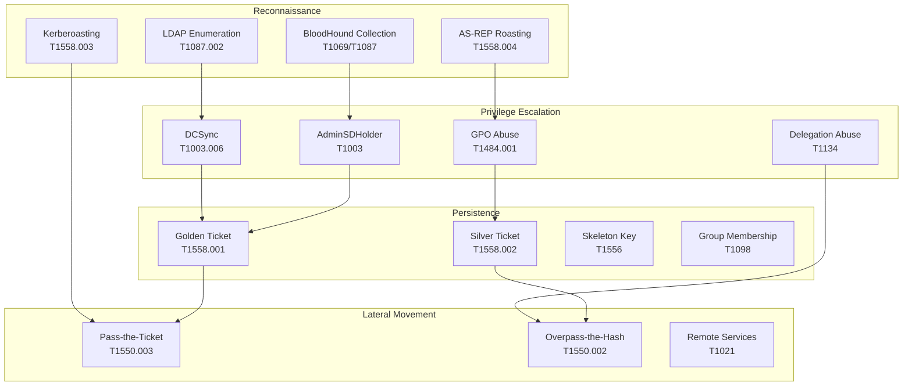
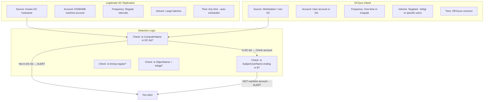

# Module 04 — Active Directory Detections
## Kerberos Attacks, LDAP Enumeration, DCSync, GPO Abuse

---

## 4.1 The AD Attack Surface Map



---

## 4.2 Kerberoasting Detection

Kerberoasting requests RC4-encrypted service tickets (encryption type 0x17) for offline cracking.

### From WinEventLog (Event 4769)

```splunk
| Comment "Kerberoasting: RC4 Service Ticket requests for non-machine accounts"
| Comment "EventCode 4769 — Kerberos Service Ticket was Requested"
| Comment "Filter: EncryptionType=0x17 (RC4), not machine accounts, not krbtgt"

index=wineventlog sourcetype="WinEventLog:Security" EventCode=4769 earliest=-1h
    TicketEncryptionType IN ("0x17", "0x18")
    NOT ServiceName IN ("krbtgt*", "*$")
    NOT IpAddress IN ("::1", "127.0.0.1")
    NOT IpAddress IN ("10.0.0.0/8", "172.16.0.0/12", "192.168.0.0/16")

| Comment "Adjust last filter — internal IPs CAN be Kerberoasting sources"
| Comment "Remove private IP exclusion if hunting internally"

| bucket _time span=10m
| stats count as ticket_requests
        dc(ServiceName) as unique_services
        values(ServiceName) as services
        by _time IpAddress AccountName
| where unique_services > 5 OR ticket_requests > 30
| eval kerberoasting_score = unique_services * 3 + ticket_requests
| sort -kerberoasting_score
| table _time IpAddress AccountName ticket_requests unique_services kerberoasting_score services
```

### Cross-Validated with Corelight (bro_kerberos)

```splunk
| Comment "Validate Kerberoasting with network-level Corelight data"
| Comment "Provides additional context: cipher used, service, client IP"

index=corelight sourcetype=bro_kerberos earliest=-1h
    request_type="TGS"
    cipher IN ("rc4-hmac", "rc4-hmac-exp", "rc4-hmac-old")
    NOT service IN ("krbtgt*")

| bucket _time span=10m
| stats count as net_tgs_requests
        dc(service) as net_unique_services
        values(service) as net_services
        values(cipher) as ciphers_used
        by _time id.orig_h client

| rename id.orig_h as src_ip
| join type=outer _time src_ip [
    search index=wineventlog EventCode=4769
        TicketEncryptionType IN ("0x17", "0x18")
        earliest=-1h
    | bucket _time span=10m
    | stats count as win_tgs_count dc(ServiceName) as win_unique_svc by _time IpAddress
    | rename IpAddress as src_ip
]

| eval both_sources = if(isnotnull(win_tgs_count), "CONFIRMED", "Network Only")
| where net_unique_services > 5 OR win_tgs_count > 20
| table _time src_ip client net_tgs_requests win_tgs_count net_unique_services both_sources ciphers_used
```

---

## 4.3 AS-REP Roasting Detection

Users without Kerberos pre-authentication enabled can have their AS-REP hashes captured offline.

```splunk
| Comment "AS-REP Roasting: Requests for accounts without pre-auth"
| Comment "EventCode 4768 with pre-auth type 0x00 indicates no pre-auth required"

index=wineventlog sourcetype="WinEventLog:Security" EventCode=4768 earliest=-1h
    PreAuthType="0"
    NOT TargetUserName IN ("*$")

| stats count as asrep_requests
        values(TargetUserName) as accounts_targeted
        dc(TargetUserName) as unique_accounts
        by IpAddress
| where count > 1
| sort -count
| table IpAddress asrep_requests unique_accounts accounts_targeted

| Comment "Also check for the failure event when pre-auth IS required"
| Comment "EventCode 4771: Pre-auth failure (attacker probing which accounts lack it)"

| append [
    search index=wineventlog EventCode=4771 earliest=-1h
        FailureCode="0x18"
    | stats count dc(TargetUserName) as accounts_tested by IpAddress
    | eval activity = "Pre-auth_probing"
]
```

---

## 4.4 DCSync Detection

DCSync abuses `MS-DRSR` (Directory Replication Service Remote Protocol) to extract password hashes.

### The DCSync Event Chain

```
DCSync generates these events on Domain Controllers:
━━━━━━━━━━━━━━━━━━━━━━━━━━━━━━━━━━━━━━━━━━━━━━━━━━━━━
Event 4662: Object Access
  → ObjectType: {19195a5a-6da0-11d0-afd3-00c04fd930c9} (Domain-DNS)
  → AccessMask: 0x100 (DS-Replication-Get-Changes)
  → AccessMask: 0x40 (DS-Replication-Get-Changes-All)

Event 4624/4634: Logon/Logoff (if remote DCSync)

Corelight dce_rpc:
  → endpoint: "drsuapi"
  → operation: "DRSGetNCChanges"
━━━━━━━━━━━━━━━━━━━━━━━━━━━━━━━━━━━━━━━━━━━━━━━━━━━━━
```

### DCSync via WinEventLog (High Fidelity)

```splunk
| Comment "DCSync detection via 4662 — Object access with replication rights"
| Comment "CRITICAL: Must audit 'Directory Service Access' in AD audit policy"
| Comment "CRITICAL: SubjectUserName ending in $ = DC machine account = LEGITIMATE"

index=wineventlog sourcetype="WinEventLog:Security" EventCode=4662 earliest=-1h
    ObjectType="{19195a5a-6da0-11d0-afd3-00c04fd930c9}"
    (AccessMask="0x100" OR AccessMask="0x40" OR AccessMask="0x140")
    NOT SubjectUserName="*$"
    NOT SubjectUserName IN ("MSOL_*", "AAD_*", "ADSync*", "ADFS*")

| Comment "MSOL_, AAD_ = Azure AD Connect sync accounts — ALWAYS legitimate DCSync"
| Comment "These accounts MUST be in your exclusion list or you'll have false positives"

| stats count as replication_events
        values(AccessMask) as access_masks
        dc(ObjectName) as objects_accessed
        min(_time) as first_event
        max(_time) as last_event
        by SubjectUserName SubjectDomainName ComputerName
| where replication_events > 0
| eval duration_seconds = last_event - first_event
| eval alert_confidence = case(
    replication_events > 10, "HIGH",
    replication_events > 3,  "MEDIUM",
    true(),                  "LOW"
)
| sort -replication_events
```

### DCSync via Corelight (Network Confirmation)

```splunk
| Comment "Network-level DCSync: DRSGetNCChanges operation via DCE/RPC"
| Comment "This catches DCSync even from hosts not forwarding Windows logs"

index=corelight sourcetype=bro_dce_rpc earliest=-1h
    endpoint="drsuapi"
    operation="DRSGetNCChanges"
| rename id.orig_h as src_ip id.resp_h as dest_ip
| stats count as drsync_calls
        values(operation) as operations
        min(_time) as first_seen
        max(_time) as last_seen
        by src_ip dest_ip
| lookup domain_controllers.csv dest_ip OUTPUT is_dc
| where is_dc="true" OR isnull(is_dc)
| Comment "Flag if src_ip is NOT a known Domain Controller"
| lookup domain_controllers.csv src_ip OUTPUT is_dc as src_is_dc
| where NOT (src_is_dc="true")
| eval alert = "SUSPICIOUS: Non-DC performing directory replication"
| table src_ip dest_ip drsync_calls first_seen last_seen alert
```

### Combined DCSync Alert

```splunk
| Comment "High-confidence DCSync: Confirmed by both Event Log AND Network"

index=wineventlog EventCode=4662 earliest=-30m
    ObjectType="{19195a5a-6da0-11d0-afd3-00c04fd930c9}"
    AccessMask IN ("0x100", "0x40")
    NOT SubjectUserName="*$"
    NOT SubjectUserName IN ("MSOL_*", "AAD_*", "ADSync*")
| stats count by SubjectUserName ComputerName
| join type=inner SubjectUserName [
    search index=corelight sourcetype=bro_dce_rpc earliest=-30m
        endpoint="drsuapi" operation="DRSGetNCChanges"
    | rename id.orig_h as attacker_ip
    | stats values(attacker_ip) as src_ips by id.resp_h
    | lookup dns_ip_hostname_map.csv known_ips as id.resp_h OUTPUT hostname as dc_hostname
    | Comment "Try to map Corelight IP to WinEventLog ComputerName via DNS map"
]
| eval alert_severity = "CRITICAL"
| eval mitre = "T1003.006 — DCSync"
```

---

## 4.5 LDAP Enumeration Detection

Attackers use LDAP to enumerate users, groups, computers, and ACLs.

### High-Volume LDAP Queries (Corelight)

```splunk
| Comment "Detect LDAP enumeration via Corelight bro_ldap"
| Comment "Normal LDAP queries: workstation startup ~10-20/hour"
| Comment "BloodHound/ldapsearch: thousands per minute"

index=corelight sourcetype=bro_ldap earliest=-30m
| bucket _time span=5m
| stats count as ldap_queries
        dc(id.resp_h) as dcs_queried
        dc(filter) as unique_filters
        values(filter) as sample_filters
        by _time id.orig_h
| where ldap_queries > 500 OR unique_filters > 100
| eval enumeration_score = ldap_queries + (unique_filters * 10)
| sort -enumeration_score
| table _time id.orig_h ldap_queries unique_filters enumeration_score sample_filters
```

### LDAP Enumeration + BloodHound Filter Signatures

```splunk
| Comment "Detect BloodHound-specific LDAP queries"
| Comment "BloodHound uses distinctive filter patterns to enumerate AD objects"

index=corelight sourcetype=bro_ldap earliest=-1h
    (filter="*(samAccountType=805306368)*"
  OR filter="*(objectCategory=groupPolicyContainer)*"
  OR filter="*(objectclass=trusteddomain)*"
  OR filter="*(msds-allowedtodelegateto=*)*"
  OR filter="*(userAccountControl:1.2.840.113556.1.4.803:=65536)*"
  OR filter="*(servicePrincipalName=*)*")
| bucket _time span=2m
| stats count as bh_query_count
        values(filter) as query_types
        dc(filter) as distinct_query_types
        by _time id.orig_h
| where bh_query_count > 10 OR distinct_query_types > 3
| eval tool_signature = "BloodHound/SharpHound likely"
| sort -bh_query_count
```

### Correlate LDAP Enum with Account Logon

```splunk
| Comment "LDAP enumeration followed by new account logon = recon before attack"

index=corelight sourcetype=bro_ldap earliest=-2h
| stats count as ldap_count dc(filter) as unique_filters by id.orig_h
| where ldap_count > 200
| rename id.orig_h as src_ip
| eval ldap_activity = "true"
| eval ldap_window_start = now() - 7200

| join type=inner src_ip [
    search index=wineventlog EventCode=4624 LogonType IN ("3", "10") earliest=-2h
    | stats count as logons_after_enum
            values(AccountName) as accounts_used
            min(_time) as first_logon
            by IpAddress
    | rename IpAddress as src_ip
]
| where first_logon > ldap_window_start
| table src_ip ldap_count unique_filters logons_after_enum accounts_used first_logon
```

---

## 4.6 GPO Abuse Detection

Group Policy Object modifications can push malicious configurations to all domain members.

```splunk
| Comment "GPO creation or modification events"
| Comment "EventCode 5136: A directory service object was modified (GPO)"
| Comment "EventCode 5137: A directory service object was created"
| Comment "ObjectClass: groupPolicyContainer"

index=wineventlog sourcetype="WinEventLog:Security"
    EventCode IN (5136, 5137, 5141) earliest=-24h
    ObjectClass="groupPolicyContainer"
    NOT SubjectUserName IN ("*$")

| eval event_type = case(
    EventCode=5137, "GPO_Created",
    EventCode=5136, "GPO_Modified",
    EventCode=5141, "GPO_Deleted",
    true(), "Unknown"
)
| stats count as total_changes
        values(event_type) as change_types
        values(ObjectDN) as affected_gpos
        values(AttributeLDAPDisplayName) as modified_attrs
        min(_time) as first_change
        max(_time) as last_change
        by SubjectUserName SubjectDomainName ComputerName

| Comment "Flag unusual hours"
| eval change_hour = tonumber(strftime(first_change, "%H"))
| eval unusual_hours = if(change_hour < 6 OR change_hour > 20, "YES", "NO")
| sort -total_changes
| table SubjectUserName SubjectDomainName ComputerName total_changes change_types unusual_hours affected_gpos
```

### Detect Immediate GPO Push After Modification

```splunk
| Comment "Detect rapid GPO push: Modified then forced via gpupdate"
| Comment "Correlate GPO event with process creation of gpupdate.exe"

index=wineventlog EventCode IN (5136, 5137) earliest=-2h
    ObjectClass="groupPolicyContainer"
| eval gpo_change_time = _time
| eval modifier = SubjectUserName
| eval gpo_dn = ObjectDN

| join type=inner modifier [
    search index=sysmon EventCode=1 earliest=-2h
        Image="*\\gpupdate.exe"
    | rename User as modifier
    | eval gpupdate_time = _time
    | fields modifier gpupdate_time Computer CommandLine
]

| where gpupdate_time > gpo_change_time AND gpupdate_time < gpo_change_time + 300
| eval seconds_to_push = gpupdate_time - gpo_change_time
| table modifier gpo_dn gpo_change_time gpupdate_time seconds_to_push Computer CommandLine
```

---

## 4.7 Account and Group Manipulation Detection

### Privileged Group Modification Timeline

```splunk
| Comment "Track changes to high-value groups with MITRE mapping"

index=wineventlog sourcetype="WinEventLog:Security"
    EventCode IN (4728, 4732, 4756, 4729, 4733, 4757) earliest=-7d

| eval change_type = case(
    EventCode IN (4728, 4732, 4756), "Member Added",
    EventCode IN (4729, 4733, 4757), "Member Removed",
    true(), "Unknown"
)
| eval target_group = coalesce(TargetUserName, GroupName)
| eval changed_account = coalesce(MemberName, SubjectUserName)

| lookup privileged_groups.csv target_group OUTPUT group_tier sensitivity
| where sensitivity IN ("Tier0", "Tier1") OR isnull(sensitivity)

| stats count as total_changes
        values(change_type) as changes
        values(changed_account) as accounts_modified
        values(sensitivity) as group_tiers
        by SubjectUserName target_group ComputerName
| where total_changes > 0
| eval alert_priority = case(
    mvfind(group_tiers, "Tier0") >= 0, "CRITICAL",
    mvfind(group_tiers, "Tier1") >= 0, "HIGH",
    true(), "MEDIUM"
)
| sort -alert_priority
```

### New Account Created + Immediately Added to Admin Group

```splunk
| Comment "Account creation immediately followed by privileged group add"
| Comment "Classic persistence or insider threat indicator"

index=wineventlog EventCode=4720 earliest=-24h
| eval account_created_time = _time
| eval new_account = TargetUserName
| eval creator = SubjectUserName

| join type=inner new_account [
    search index=wineventlog EventCode IN (4728, 4732, 4756) earliest=-24h
        TargetUserName IN ("Domain Admins", "Enterprise Admins",
                           "Schema Admins", "Administrators",
                           "Account Operators", "Backup Operators")
    | eval new_account = MemberName
    | eval group_added_to = TargetUserName
    | eval group_add_time = _time
    | fields new_account group_added_to group_add_time SubjectUserName
]

| eval seconds_between = group_add_time - account_created_time
| where seconds_between < 3600 AND seconds_between > 0
| table creator new_account group_added_to account_created_time group_add_time seconds_between
| sort seconds_between
```

---

## 4.8 Kerberos Ticket Anomalies (Golden & Silver Tickets)

### Golden Ticket Indicators

```splunk
| Comment "Golden Ticket indicators in WinEventLog"
| Comment "Signs: TGT with abnormal lifetime, encryption type mismatch"

index=wineventlog EventCode=4768 earliest=-24h
| eval ticket_lifetime = TicketOptions
| eval encryption = EncryptionType

| Comment "Legitimate TGTs use AES256 (0x12) in modern AD"
| Comment "Golden tickets often use RC4 (0x17) unless attacker specifies AES"
| where EncryptionType IN ("0x17", "0x18") AND NOT IpAddress="::1"

| Comment "Also look for TGT from unusual IPs for privileged accounts"
| lookup privileged_accounts.csv AccountName OUTPUT account_tier
| where account_tier IN ("Tier0", "Tier1") AND NOT IpAddress IN ("10.0.0.0/8")

| stats count dc(IpAddress) as source_ips values(IpAddress) as sources by AccountName EncryptionType
| sort -count
```

### Silver Ticket: Forged Service Tickets Without TGT

```splunk
| Comment "Silver Ticket: Service ticket used without prior TGT request"
| Comment "Sign: EventCode 4769 (Service Ticket) with no preceding 4768 (TGT)"

index=wineventlog EventCode=4769 earliest=-1h
| eval client_key = IpAddress + "||" + AccountName
| eval service_ticket_time = _time

| join type=leftanti client_key [
    search index=wineventlog EventCode=4768 earliest=-2h
    | eval client_key = IpAddress + "||" + AccountName
    | stats count by client_key
]

| Comment "Events with no matching TGT = potential Silver Ticket"
| where NOT AccountName IN ("*$")
    AND NOT IpAddress IN ("::1", "127.0.0.1")
| stats count as orphaned_service_tickets
        values(ServiceName) as services
        by IpAddress AccountName
| where orphaned_service_tickets > 0
| sort -orphaned_service_tickets
```

---

## 4.9 DC Replication Traffic Discrimination

The hardest challenge: distinguishing legitimate DC replication from DCSync attacks.



```splunk
| Comment "DC Replication Discrimination: Legitimate vs DCSync"

index=wineventlog EventCode=4662 earliest=-1h
    ObjectType="{19195a5a-6da0-11d0-afd3-00c04fd930c9}"

| eval is_machine_account = if(match(SubjectUserName, "^.*\$$"), "yes", "no")
| eval is_known_dc = if(match(ComputerName, "(?i)(dc|domcon|ad)-\d+"), "yes", "no")
| eval is_sync_account = if(match(SubjectUserName, "(?i)(MSOL_|AAD_|ADSync|ADFS|AzureAD)"), "yes", "no")
| eval is_krbtgt_target = if(match(ObjectName, "(?i)krbtgt"), "yes", "no")

| eval replication_classification = case(
    is_machine_account="yes" AND is_known_dc="yes", "LEGITIMATE_DC_REPLICATION",
    is_sync_account="yes", "LEGITIMATE_AZURE_SYNC",
    is_machine_account="no" AND is_known_dc="no", "SUSPICIOUS_DCSYNC_HIGH",
    is_machine_account="no" AND is_known_dc="yes", "SUSPICIOUS_DCSYNC_MEDIUM",
    true(), "NEEDS_REVIEW"
)
| where replication_classification IN ("SUSPICIOUS_DCSYNC_HIGH", "SUSPICIOUS_DCSYNC_MEDIUM", "NEEDS_REVIEW")
| table _time SubjectUserName ComputerName ObjectName is_krbtgt_target replication_classification
```

---

[← Cross-Index Correlation](./03-cross-index-correlation.md) | [Next: Lateral Movement & SMB →](./05-lateral-movement-and-smb.md)
