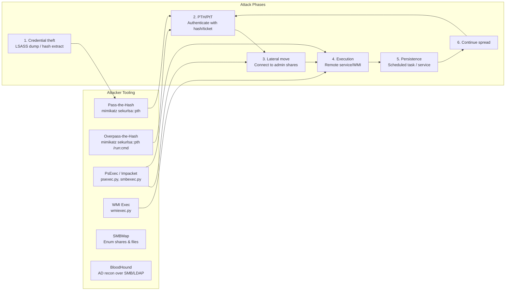

# Module 05 — Lateral Movement & SMB
## Pass-the-Hash, PsExec, SMB Enumeration, Admin Shares

---

## 5.1 SMB Attack Surface Overview



---

## 5.2 Pass-the-Hash Detection

Pass-the-Hash (PtH) uses NTLM authentication with a stolen password hash. Key indicator: NTLMv2 auth from a non-privileged host.

### The PTH Signature

```
Pass-the-Hash in WinEventLog:
━━━━━━━━━━━━━━━━━━━━━━━━━━━━━━━━━━━━━━━━━━━━━━━━━━━━━
Event 4624 LogonType=3 with:
  - AuthenticationPackageName=NTLM
  - LogonProcessName=NtLmSsp
  - KeyLength=0 (LM hash not provided = PTH indicator)
  - WorkstationName != ComputerName (remote auth)

Event 4624 LogonType=9 (NewCredentials):
  - Created by RunAs /netonly or PTH tools
  - Requires Impersonation level check
━━━━━━━━━━━━━━━━━━━━━━━━━━━━━━━━━━━━━━━━━━━━━━━━━━━━━
```

```splunk
| Comment "Pass-the-Hash detection via WinEventLog"
| Comment "NTLM network logon with KeyLength=0 from privileged accounts"

index=wineventlog sourcetype="WinEventLog:Security" EventCode=4624 earliest=-1h
    LogonType="3"
    AuthenticationPackageName="NTLM"
    KeyLength="0"
    NOT AccountName IN ("*$", "ANONYMOUS LOGON", "")
    NOT IpAddress IN ("::1", "127.0.0.1", "-")

| lookup domain_admins.csv AccountName OUTPUT is_privileged account_tier
| where is_privileged="true" OR account_tier IN ("Tier0", "Tier1")

| Comment "Check if the source IP is a known privileged workstation"
| lookup privileged_admin_workstations.csv IpAddress OUTPUT is_paw
| where NOT is_paw="true"

| stats count as ntlm_logons
        dc(ComputerName) as targets_accessed
        values(ComputerName) as target_systems
        min(_time) as first_seen
        max(_time) as last_seen
        by AccountName IpAddress
| where ntlm_logons > 0
| sort -ntlm_logons
```

### PTH Corroborated with Corelight NTLM

```splunk
| Comment "Cross-validate PTH with Corelight NTLM telemetry"
| Comment "Corelight captures the NTLM negotiation at the wire level"

index=corelight sourcetype=bro_ntlm earliest=-1h
    status="NTLMSSP_AUTH"
| eval src_ip = id.orig_h
| eval dest_ip = id.resp_h
| eval ntlm_user = username
| eval ntlm_domain = domainname

| Comment "NTLM on non-standard ports is suspicious"
| eval is_unusual_port = if(id.resp_p NOT IN (139, 445, 80, 443, 3268, 389), "YES", "NO")

| join type=inner src_ip [
    search index=wineventlog EventCode=4624 LogonType="3"
        AuthenticationPackageName="NTLM" KeyLength="0" earliest=-1h
    | rename IpAddress as src_ip AccountName as win_user
    | stats count values(win_user) as win_accounts
            values(ComputerName) as win_targets by src_ip
]

| stats count as corroborated_events
        values(ntlm_user) as cl_users
        values(win_accounts) as win_users
        values(dest_ip) as destinations
        values(is_unusual_port) as unusual_ports
        by src_ip ntlm_domain
| eval user_mismatch = if(mvcount(cl_users)!=mvcount(win_users), "MISMATCH - Possible PTH", "Consistent")
| sort -corroborated_events
```

---

## 5.3 PsExec / Remote Execution Detection

PsExec and similar tools create a service on the remote host to achieve code execution.

### The PsExec Service Creation Pattern

```
PsExec Attack Chain:
━━━━━━━━━━━━━━━━━━━━━━━━━━━━━━━━━━━━━━━━━━━━━━━━━━━━━
1. WinEventLog 5140: ADMIN$ share accessed (SMB copy of PSEXESVC.exe)
2. WinEventLog 7045: Service "PSEXESVC" created on target
3. WinEventLog 4624: Logon to target host (LogonType=3)
4. WinEventLog 4688: cmd.exe spawned by PSEXESVC (or custom svc)
5. Sysmon EventID 1:  Process create - Image path has PsExe pattern
6. Corelight bro_smb: SMB write to ADMIN$/PSEXESVC.exe
━━━━━━━━━━━━━━━━━━━━━━━━━━━━━━━━━━━━━━━━━━━━━━━━━━━━━
```

```splunk
| Comment "PsExec detection — Service installation via SMB"
| Comment "Correlate: 5140 (ADMIN$) + 7045 (Service Create) + 4624 (Logon)"

index=wineventlog EventCode=7045 earliest=-1h
    ServiceFileName IN ("*\\PSEXESVC.exe", "*\\PAEXEC.exe", "C:\\Windows\\*svc*.exe")
| eval service_install_time = _time
| eval target_host = ComputerName
| eval install_user = SubjectUserName

| Comment "Find the network logon that preceded the service install"
| join type=inner target_host [
    search index=wineventlog EventCode=5140 earliest=-1h
        ShareName IN ("\\\\*\\ADMIN$", "\\\\*\\C$")
    | eval target_host = ComputerName
    | eval share_access_time = _time
    | eval share_src_ip = IpAddress
    | eval share_user = AccountName
    | fields target_host share_access_time share_src_ip share_user ShareName
]

| where share_access_time < service_install_time
    AND service_install_time - share_access_time < 120
| table target_host install_user share_src_ip ShareName service_install_time ServiceName ServiceFileName
| sort service_install_time
```

### Impacket Tool Detection (smbexec, wmiexec, atexec)

```splunk
| Comment "Impacket tool detection via distinctive artifacts"
| Comment "smbexec: Creates \\ service with obfuscated cmd path"
| Comment "wmiexec: WMI service execution, cmd.exe with random window title"
| Comment "atexec: AT job scheduling"

index=sysmon EventCode=1 earliest=-1h
    (ParentImage IN ("*\\services.exe", "*\\svchost.exe")
     AND (Image="*\\cmd.exe" OR Image="*\\powershell.exe" OR Image="*\\conhost.exe"))
OR (Image="*\\cmd.exe"
    AND CommandLine="*cmd.exe /Q /c*"
    AND CommandLine="*\\\\127.0.0.1\\*")
| eval lateral_tool = case(
    CommandLine="*cmd.exe /Q /c*" AND CommandLine="*\\\\127.0.0.1\\*", "Impacket-smbexec",
    ParentImage="*\\services.exe" AND CommandLine="*%COMSPEC%*",      "Impacket-smbexec-variant",
    ParentImage="*\\WmiPrvSE.exe" AND CommandLine="*cmd.exe /c*",     "Impacket-wmiexec",
    true(), "Suspicious-remote-exec"
)
| stats count dc(Computer) as hosts values(CommandLine) as cmds by User lateral_tool
| sort -count
```

---

## 5.4 SMB Lateral Movement Detection at Scale

### High-Performance SMB Scan Detection (Corelight)

```splunk
| Comment "SMB scanning: One source → many destinations in short time"
| Comment "Use tstats for first pass to avoid scanning all Corelight SMB events"

| tstats count dc(id.resp_h) as unique_targets
    WHERE index=corelight sourcetype IN ("bro_smb_mapping", "bro_conn")
    BY id.orig_h _time span=5m

| Comment "Rename for readability"
| rename id.orig_h as src_ip

| where unique_targets > 20
| eval scan_rate = count / 5
| sort -unique_targets
| lookup asset_inventory.csv src_ip OUTPUT asset_type hostname
| eval suspicious = if(asset_type="workstation" AND unique_targets > 10, "HIGH",
                   if(asset_type="server" AND unique_targets > 50, "MEDIUM", "LOW"))
| where suspicious != "LOW"
| table _time src_ip hostname asset_type unique_targets scan_rate suspicious
```

### SMB Tree Connect Enumeration

```splunk
| Comment "Detect share enumeration: connecting to many shares on few hosts"
| Comment "Classic admin share discovery before lateral movement"

index=corelight sourcetype=bro_smb_mapping earliest=-30m
| stats dc(path) as unique_shares
        count as smb_conns
        values(path) as shares_accessed
        dc(id.resp_h) as targets
        by id.orig_h
| where unique_shares > 5 OR (targets > 3 AND smb_conns > 20)
| eval share_score = unique_shares * 2 + targets * 3 + smb_conns * 0.5
| sort -share_score
| lookup dns_ip_hostname_map.csv known_ips as id.orig_h OUTPUT hostname as attacker_hostname
| table id.orig_h attacker_hostname unique_shares targets smb_conns share_score shares_accessed
```

---

## 5.5 Admin Share Access Monitoring

### Detect Abnormal Admin Share Access Pattern

```splunk
| Comment "Admin share access that deviates from baseline"
| Comment "Method: Use eventstats to compare against host-level baseline"

index=wineventlog EventCode=5140 earliest=-2h
    ShareName IN ("\\\\*\\ADMIN$", "\\\\*\\C$", "\\\\*\\IPC$")
    NOT IpAddress IN ("::1", "127.0.0.1", "-")
    NOT AccountName IN ("*$")

| bucket _time span=1h
| stats count as share_accesses
        dc(IpAddress) as unique_sources
        dc(AccountName) as unique_accounts
        values(AccountName) as accounts
        values(IpAddress) as source_ips
        by _time ComputerName ShareName

| eventstats avg(share_accesses) as avg_accesses stdev(share_accesses) as stdev_accesses
    by ComputerName ShareName
| eval zscore = round((share_accesses - avg_accesses) / (stdev_accesses + 1), 2)
| where zscore > 2.5 AND share_accesses > 10

| Comment "Tag with threat context"
| eval anomaly_description = "Admin share access " + tostring(round(zscore,1)) + " std devs above average"
| sort -zscore
| table _time ComputerName ShareName share_accesses avg_accesses zscore unique_sources accounts anomaly_description
```

---

## 5.6 WMI-Based Lateral Movement

### WMI Process Execution Detection (Multi-Source)

```splunk
| Comment "WMI lateral movement: WmiPrvSE.exe spawning unusual processes"
| Comment "Use Sysmon for process hierarchy, Corelight for network context"

index=sysmon EventCode=1 earliest=-1h
    ParentImage="*\\WmiPrvSE.exe"
    NOT Image IN (
        "*\\WmiPrvSE.exe",
        "*\\msiexec.exe",
        "*\\svchost.exe",
        "*\\conhost.exe",
        "*\\DllHost.exe",
        "*\\SearchIndexer.exe",
        "*\\wsqmcons.exe"
    )
| eval src_process = Image
| eval cmdline = CommandLine
| eval target_host = Computer
| eval wmi_user = User

| Comment "Correlate with Corelight to find who connected before this WMI exec"
| lookup dns_ip_hostname_map.csv hostname as target_host OUTPUT known_ips as target_ips
| eval target_ip = mvindex(split(target_ips, "|"), 0)

| stats count dc(target_host) as hosts_compromised
        values(src_process) as executed_processes
        values(cmdline) as command_lines
        values(target_host) as target_systems
        by wmi_user
| where count > 0
| sort -hosts_compromised
```

### Corelight DCE/RPC for WMI Detection

```splunk
| Comment "WMI at network layer: DCE/RPC endpoint 'IWbemServices' operations"

index=corelight sourcetype=bro_dce_rpc earliest=-1h
    endpoint IN ("IWbemServices", "IWbemLevel1Login", "IWbemObjectSink")
    operation IN ("ExecMethod", "ExecQuery", "CreateInstanceEnum")
| rename id.orig_h as src_ip id.resp_h as dest_ip

| lookup domain_controllers.csv dest_ip OUTPUT is_dc
| lookup asset_inventory.csv src_ip OUTPUT src_type src_hostname

| stats count as wmi_operations
        dc(dest_ip) as targets
        values(operation) as ops_used
        values(dest_ip) as dest_systems
        by src_ip src_hostname src_type
| where wmi_operations > 5
| eval risk = case(
    src_type="workstation" AND targets > 3, "HIGH",
    targets > 10, "HIGH",
    targets > 5, "MEDIUM",
    true(), "LOW"
)
| where risk != "LOW"
| sort -wmi_operations
```

---

## 5.7 Named Pipe Activity — PsExec and Tool Staging

Named pipes are used by PsExec, Cobalt Strike, and other C2 frameworks.

```splunk
| Comment "Named pipe detection via Sysmon EventID 17 (Pipe Created)"
| Comment "and EventID 18 (Pipe Connected)"

index=sysmon EventCode IN (17, 18) earliest=-1h
    NOT PipeName IN (
        "\\lsass",
        "\\srvsvc",
        "\\samr",
        "\\netlogon",
        "\\wkssvc",
        "\\spoolss",
        "\\atsvc",
        "\\epmapper",
        "\\RpcProxy\\*"
    )
| eval pipe_type = if(EventCode=17, "Created", "Connected")
| stats count dc(Computer) as hosts
        values(Image) as creating_processes
        values(PipeName) as pipe_names
        values(Computer) as affected_hosts
        by User pipe_type
| where count > 0

| Comment "Flag known malicious pipe names"
| eval known_bad_pipe = case(
    mvfind(pipe_names, "(?i)MSSE-") >= 0,     "Cobalt Strike Beacon",
    mvfind(pipe_names, "(?i)postex_") >= 0,   "Cobalt Strike PostEx",
    mvfind(pipe_names, "(?i)mojo\.") >= 0,    "Chrome/CobaltStrike",
    mvfind(pipe_names, "(?i)PSEXESVC") >= 0,  "PsExec",
    mvfind(pipe_names, "(?i)msagent_") >= 0,  "Cobalt Strike",
    mvfind(pipe_names, "(?i)\\\\[0-9a-f]{8}") >= 0, "Random Hex - C2 Suspected",
    true(), "Unknown"
)
| sort -count
| table User pipe_type count hosts known_bad_pipe creating_processes pipe_names
```

---

## 5.8 Credential-Based Lateral Movement Fingerprinting

### Detect Spray-to-Hop Pattern (PTH → Success → New Host)

```splunk
| Comment "Full lateral movement chain: Auth failure → Success → New target auth"

| Comment "Step 1: Find hosts that had auth failures then successes"
index=wineventlog EventCode IN (4624, 4625) LogonType="3" earliest=-2h
| eval event_class = if(EventCode=4624, "success", "failure")
| bucket _time span=10m
| stats count(eval(event_class="failure")) as failures
        count(eval(event_class="success")) as successes
        by _time IpAddress AccountName

| where failures > 5 AND successes > 0
| eval compromise_window = _time
| eval pivot_src = IpAddress
| eval pivot_user = AccountName

| Comment "Step 2: Check if the compromised host then pivoted to other hosts"
| join type=inner pivot_src [
    search index=wineventlog EventCode=4624 LogonType="3" earliest=-2h
    | eval outbound_src = IpAddress
    | lookup asset_inventory.csv outbound_src OUTPUT hostname as src_hostname asset_type as src_type
    | where src_type = "server" OR src_type = "workstation"
    | stats dc(ComputerName) as onward_targets
            values(ComputerName) as pivoted_to_hosts
            by outbound_src AccountName
    | where onward_targets > 2
    | rename outbound_src as pivot_src AccountName as pivot_user
]

| where onward_targets > 2
| eval chain_depth = "Pivot detected — " + tostring(onward_targets) + " additional targets"
| table pivot_src pivot_user failures successes onward_targets pivoted_to_hosts chain_depth
```

---

## 5.9 NTLM Relay Attack Detection

NTLM relay captures and replays authentication to gain access to different resources.

```splunk
| Comment "NTLM Relay: Authentication to unexpected services using NTLM"
| Comment "Signs: NTLM auth to services that should use Kerberos"
| Comment "e.g., NTLM auth to LDAP, HTTP admin interfaces, etc."

index=corelight sourcetype=bro_ntlm earliest=-1h
    status="NTLMSSP_AUTH"
| eval service_port = id.resp_p
| eval is_unexpected_ntlm = case(
    service_port=389, "NTLM_to_LDAP",
    service_port=636, "NTLM_to_LDAPS",
    service_port=80,  "NTLM_to_HTTP",
    service_port=443, "NTLM_to_HTTPS",
    service_port=8080,"NTLM_to_AltHTTP",
    service_port=5985,"NTLM_to_WinRM",
    service_port=5986,"NTLM_to_WinRM_HTTPS",
    true(), "NTLM_to_Standard"
)
| where is_unexpected_ntlm != "NTLM_to_Standard"

| stats count as relayed_auths
        dc(id.resp_h) as targets
        values(is_unexpected_ntlm) as relay_types
        values(username) as users
        by id.orig_h
| where relayed_auths > 0
| sort -relayed_auths

| Comment "NTLM relay to LDAP is particularly dangerous — can lead to privilege escalation"
| eval severity = if(mvfind(relay_types, "NTLM_to_LDAP") >= 0, "CRITICAL", "HIGH")
| table id.orig_h relayed_auths targets relay_types users severity
```

---

## 5.10 Jumphost Abuse Detection

Jumphosts are sanctioned lateral movement vectors — detect abuse within them.

```splunk
| Comment "Detect jumphost sessions initiating unexpected internal connections"
| Comment "Baseline: Jumphosts connect to known server ranges"
| Comment "Alert: Jumphost connecting to endpoints or unusual ports"

index=corelight sourcetype=bro_conn earliest=-1h
| lookup jumphost_inventory.csv id.orig_h OUTPUT is_jumphost jumphost_name
| where is_jumphost="true"

| eval dest_class = case(
    cidrmatch("10.10.0.0/16", id.resp_h),    "server_range",
    cidrmatch("10.20.0.0/16", id.resp_h),    "endpoint_range",
    cidrmatch("10.30.0.0/16", id.resp_h),    "dmz_range",
    NOT cidrmatch("10.0.0.0/8", id.resp_h),  "EXTERNAL",
    true(), "other_internal"
)

| stats count dc(id.resp_h) as unique_dests
        dc(id.resp_p) as unique_ports
        values(id.resp_p) as ports
        by id.orig_h jumphost_name dest_class _time span=1h

| Comment "Alert on jumphost connecting to endpoint range (should only go to servers)"
| where dest_class IN ("endpoint_range", "EXTERNAL")

| eval alert = case(
    dest_class="EXTERNAL", "CRITICAL: Jumphost exfiltrating externally",
    dest_class="endpoint_range" AND unique_dests > 5, "HIGH: Jumphost spreading to endpoints",
    true(), "MEDIUM: Unusual jumphost destination"
)
| sort -count
```

---

[← Active Directory Detections](./04-active-directory-detections.md) | [Next: Resource-Constrained Searching →](./06-resource-constrained-searching.md)
