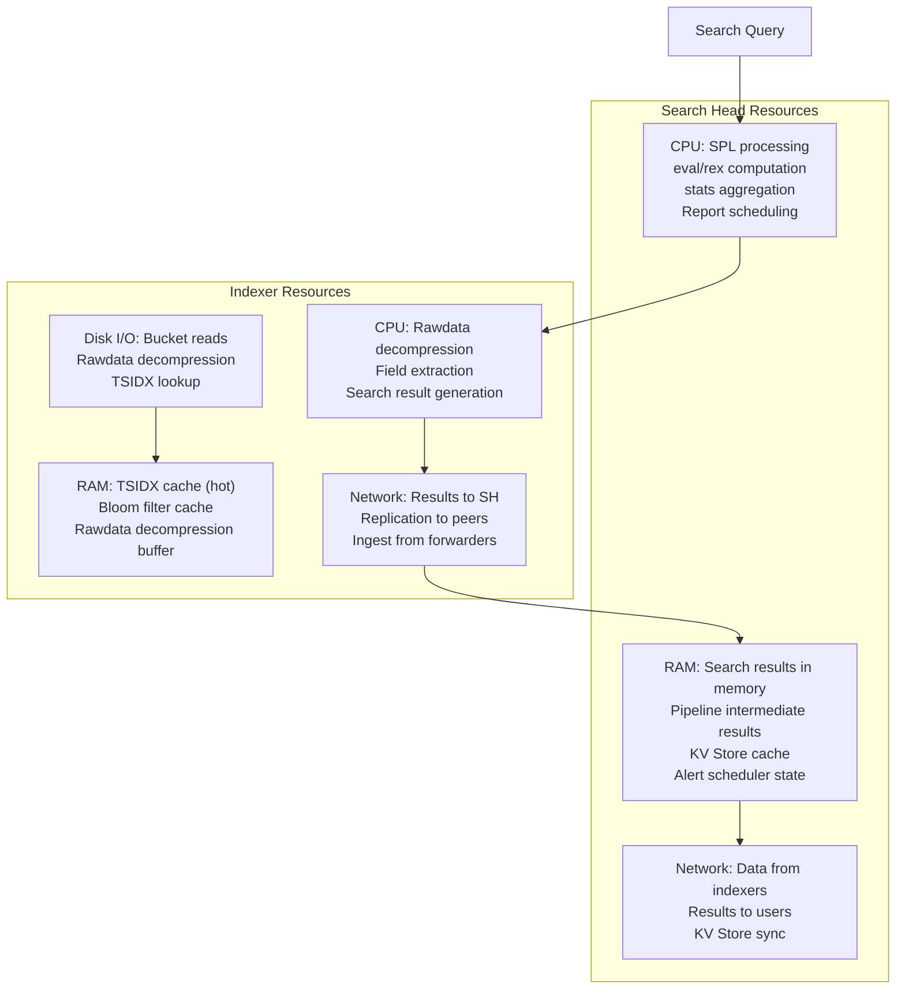
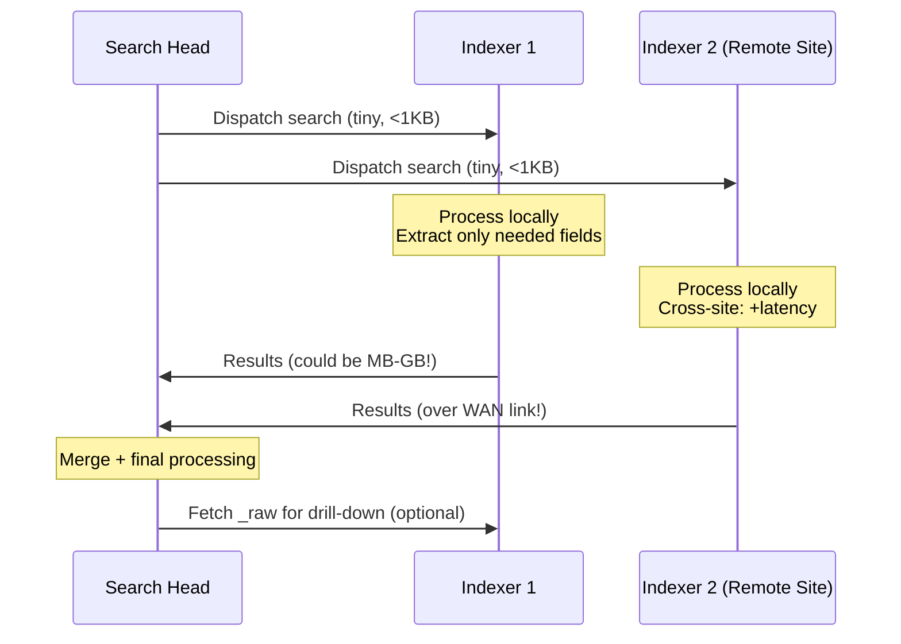

# Module 06 — Resource-Constrained Searching
## RAM Pressure, CPU Throttling, Network-Limited Searches

---

## 6.1 Understanding Splunk Resource Consumption



---

## 6.2 RAM-Constrained Environments

### The Memory Death Spiral

```
HIGH MEMORY USAGE TRIGGERS:
━━━━━━━━━━━━━━━━━━━━━━━━━━━━━━━━━━━━━━━━━━━━━━━━━━━━━
1. transaction command on large datasets
   → Holds all matching events in RAM until timeout

2. join with large result sets (> 50K rows)
   → Both sides held in RAM simultaneously

3. stats with high cardinality BY clause
   → One memory entry per unique combination

4. mvexpand on multi-value fields
   → Can explode 1M rows to 10M+ rows

5. Multiple concurrent real-time searches
   → Each maintains state indefinitely

6. Large subsearch results
   → Subsearch results stored as inline filter terms
━━━━━━━━━━━━━━━━━━━━━━━━━━━━━━━━━━━━━━━━━━━━━━━━━━━━━
```

### `transaction` — The Memory Killer and Its Replacement

```splunk
| Comment "NEVER use transaction at scale"
| Comment "BAD: transaction holds ALL matching events in RAM until maxevents or maxpause"

index=wineventlog EventCode IN (4624, 4634) earliest=-24h
| transaction AccountName maxspan=8h maxevents=1000
| eval session_duration = duration

| Comment "=== GOOD: Replace with streamstats ====="
| Comment "streamstats is O(n) memory — only keeps a sliding window"

index=wineventlog EventCode IN (4624, 4634) earliest=-24h
| sort 0 _time AccountName
| streamstats current=false last(_time) as prev_time last(EventCode) as prev_event by AccountName
| eval session_event = case(
    EventCode=4624 AND (isnull(prev_event) OR prev_event=4634), "SESSION_START",
    EventCode=4634 AND prev_event=4624, "SESSION_END",
    true(), "CONTINUATION"
)
| eval session_duration = if(session_event="SESSION_END", _time - prev_time, null())
| where isnotnull(session_duration) AND session_duration > 0
| stats avg(session_duration) as avg_duration
        max(session_duration) as max_duration
        count as sessions
        by AccountName
```

### Memory-Safe Aggregation Patterns

```splunk
| Comment "High-cardinality stats: Pre-filter before stats to reduce memory"
| Comment "BAD: stats with millions of unique combinations"

index=wineventlog EventCode=4624 earliest=-24h
| stats count by AccountName ComputerName IpAddress LogonType

| Comment "GOOD: Filter first, then aggregate"
index=wineventlog EventCode=4624 earliest=-24h
| where LogonType IN ("3", "10")
    AND NOT AccountName IN ("*$", "ANONYMOUS*")
| stats count by AccountName ComputerName
| where count > 100

| Comment "ALSO GOOD: Use tstats for first-pass aggregation"
| tstats count
    WHERE index=wineventlog
    BY host _time span=1h
| where count > 10000
| Comment "Only now fetch the expensive field-level data"
```

### Controlling Result Set Size with `sistats`

```splunk
| Comment "sistats: Server-side stats — aggregates on indexers before sending to SH"
| Comment "Dramatically reduces network transfer and SH RAM usage"
| Comment "Trade-off: approximate results (uses sampling)"

index=wineventlog EventCode=4625 earliest=-6h
| sistats count dc(AccountName) as accounts by IpAddress
| sort -count
| head 100

| Comment "For exact results but lower SH RAM, use tstats which also pushes work to indexers"
| tstats count dc(host) as hosts
    WHERE index=wineventlog
    BY host
| sort -count
```

---

## 6.3 CPU-Constrained Environments

### CPU Cost Hierarchy of Search Commands

```
CPU COST BY OPERATION TYPE:
━━━━━━━━━━━━━━━━━━━━━━━━━━━━━━━━━━━━━━━━━━━━━━━━━━━━━━━━
Operation                       Relative CPU Cost
━━━━━━━━━━━━━━━━━━━━━━━━━━━━━━━━━━━━━━━━━━━━━━━━━━━━━━━━
Bloom filter check              1x (baseline)
TSIDX lookup                    2x
Rawdata decompression           10x
Regex field extraction          50x
rex command (ad-hoc)            100x
Complex eval expression         20x
stats (in-memory)               5x
transaction                     500x+ (memory limited)
join (large result sets)        200x+
dedup                           50x
━━━━━━━━━━━━━━━━━━━━━━━━━━━━━━━━━━━━━━━━━━━━━━━━━━━━━━━━
```

### Regex Optimization at Scale

```splunk
| Comment "Regex in search commands runs per-event. Optimize ruthlessly."

| Comment "BAD: Slow regex applied to all events"
index=sysmon EventCode=1 earliest=-1h
| rex field=CommandLine "(?i)(?:powershell|pwsh)[^\"]*(?:-(?:e(?:nc(?:oded(?:c(?:o(?:m(?:m(?:and?)?)?)?)?)?)?)?))"
| where isnotnull(encoded_cmd)

| Comment "GOOD: Bloom filter first, then targeted regex"
index=sysmon EventCode=1 earliest=-1h
    "EncodedCommand" OR "encodedcommand" OR " -enc " OR " -ec "
| rex field=CommandLine "(?i)(?:-enc(?:odedcommand)?\s+)(?<encoded_cmd>[A-Za-z0-9+/=]{20,})"
| where isnotnull(encoded_cmd)

| Comment "BEST: Use Sysmon field directly if parsed"
index=sysmon EventCode=1 earliest=-1h
    CommandLine="* -enc*" OR CommandLine="* -EncodedCommand*"
| where match(CommandLine, "(?i)-enc")
| stats count by Computer User Image CommandLine
```

### Accelerating via `map` Command (Distributed Processing)

```splunk
| Comment "map runs sub-searches in parallel on result rows"
| Comment "Useful for: running per-host searches on a known list"

| inputlookup suspicious_hosts.csv
| map search="search index=sysmon EventCode=1 Computer=\"$hostname$\" earliest=-1h
    | stats count by Image CommandLine
    | head 10"
| stats sum(count) as total_count by hostname Image
```

---

## 6.4 Network-Constrained Environments

### Understanding Search Data Movement



### Network Reduction Strategies

```splunk
| Comment "Reduce data sent from indexers to search head"

| Comment "Strategy 1: Aggressive fields trimming before any aggregation"
index=corelight sourcetype=bro_conn earliest=-1h
| fields _time id.orig_h id.resp_h id.resp_p proto bytes_sent
| Comment "Without this, ALL fields including _raw travel over the network"

| Comment "Strategy 2: Pre-aggregate on indexers with prestats"
| tstats prestats=true count sum(bytes_sent) as total_bytes
    WHERE index=corelight sourcetype=bro_conn
    BY id.orig_h _time span=5m
| stats count sum(total_bytes) as bytes by id.orig_h _time

| Comment "Strategy 3: Use 'remote=true' searches carefully"
| Comment "Normally searches ARE distributed. Only change if you need specific site."

| Comment "Strategy 4: Limit result count early"
index=wineventlog EventCode=4625 earliest=-1h
| stats count by IpAddress
| sort -count
| head 50
| Comment "50 rows travel instead of millions of raw events"
```

### Splunk Server Group Optimization

```splunk
| Comment "Use splunk_server_group to restrict to local site"
| Comment "Saves WAN bandwidth when cross-site data isn't needed"

| Comment "Site A only (avoid WAN transfer)"
index=wineventlog EventCode=4624 earliest=-1h
    splunk_server_group=site_a_indexers
| stats count by AccountName

| Comment "All sites but reduce with aggressive pre-filter"
index=corelight sourcetype=bro_conn earliest=-15m
    id.resp_p IN (443, 80, 8080)
    NOT id.resp_h IN ("10.0.0.0/8")
| tstats prestats=true count BY id.orig_h _time span=1m
| stats count by id.orig_h
| where count > 100
```

---

## 6.5 Disk I/O Constrained Environments

Cold buckets on slow storage (spinning disk, NAS, S3-compatible) are dramatically slower than hot/warm buckets on SSD.

### Bucket-Aware Time Bounding

```splunk
| Comment "Know your storage tier boundaries"
| Comment "hot/warm = SSD (fast), cold = spinning or NAS (slow)"

| Comment "For recent detections: stay in hot/warm (last 7 days typical)"
index=wineventlog EventCode=4624 earliest=-7d latest=now

| Comment "For hunting: explicitly acknowledge cold bucket cost"
| Comment "Add time boundaries to minimize cold bucket reads"
index=wineventlog EventCode=4624
    earliest="2024-01-15T00:00:00"
    latest="2024-01-15T23:59:59"

| Comment "For trend analysis: use summary index instead of cold bucket reads"
index=auth_summary sourcetype=auth_summary_5m earliest=-90d
| timechart span=1d count by event_type
```

### Bucket Skipping with Specific Keywords

```splunk
| Comment "Add rare/specific keywords to maximize bloom filter bucket elimination"
| Comment "Even on cold storage, bloom filter check is fast (metadata only)"

| Comment "BAD: No keywords → must scan every cold bucket"
index=wineventlog LogonType=3 earliest=-90d

| Comment "GOOD: Specific keywords → bloom filter eliminates irrelevant buckets"
index=wineventlog "LogonType=3" "4624" "NTLM" earliest=-90d
| where EventCode=4624 AND LogonType="3" AND AuthenticationPackageName="NTLM"
```

---

## 6.6 Scheduled Alert Optimization Under Resource Constraints

### The Concurrent Search Problem

```
Under resource constraints, avoid concurrent searches of the same data:
━━━━━━━━━━━━━━━━━━━━━━━━━━━━━━━━━━━━━━━━━━━━━━━━━━━━━━━━━━━━━━━━━━
Problem: 50 alerts all scheduled at :00 each hour
→ 50 concurrent index scans
→ Indexer I/O saturation
→ Search queue backup → cascade failure

Solution: Stagger alert schedules
━━━━━━━━━━━━━━━━━━━━━━━━━━━━━━━━━━━━━━━━━━━━━━━━━━━━━━━━━━━━━━━━━━
Alert Tier    Schedule            Window
━━━━━━━━━━━━━━━━━━━━━━━━━━━━━━━━━━━━━━━━━━━━━━━━━━━━━━━━━━━━━━━━━━
Critical      */5 * * * *         earliest=-10m (stagger: :00,:01)
High          */15 * * * *        earliest=-20m (stagger: :02,:05)
Medium        0 * * * *           earliest=-70m (stagger: :10,:15)
Low           0 */4 * * *         earliest=-4h30m
━━━━━━━━━━━━━━━━━━━━━━━━━━━━━━━━━━━━━━━━━━━━━━━━━━━━━━━━━━━━━━━━━━
```

### Alert Efficiency Score — Know Your Alerts' Cost

```splunk
| Comment "Audit your scheduled searches for resource efficiency"
| Comment "Run this on the Search Head to understand search burden"

| rest /services/saved/searches splunk_server=local
| search is_scheduled=1 disabled=0
| fields title search cron_schedule dispatch.earliest_time dispatch.latest_time
          qualifiedSearch eai:acl.app
| eval search_length = len(search)
| eval has_tstats = if(match(search, "tstats"), "yes", "no")
| eval has_transaction = if(match(search, "\|\s*transaction"), "YES_BAD", "no")
| eval has_join = if(match(search, "\|\s*join"), "YES_EXPENSIVE", "no")
| eval has_subsearch = if(match(search, "\[search "), "YES_EXPENSIVE", "no")
| eval has_index_filter = if(match(search, "index="), "yes", "NO_BAD")
| eval efficiency_score = case(
    has_transaction="YES_BAD" OR has_subsearch="YES_EXPENSIVE", "OPTIMIZE_IMMEDIATELY",
    has_tstats="yes" AND has_join="no", "EFFICIENT",
    has_join="YES_EXPENSIVE" AND has_index_filter="yes", "ACCEPTABLE",
    true(), "REVIEW"
)
| table title eai:acl.app cron_schedule has_tstats has_transaction has_join has_subsearch efficiency_score
| sort efficiency_score
```

---

## 6.7 Real-Time Searches — When to Use and Avoid

```
REAL-TIME SEARCH COST MULTIPLIER:
━━━━━━━━━━━━━━━━━━━━━━━━━━━━━━━━━━━━━━━━━━━━━━━━━━━━━━━━━━
Historical search:     1x (baseline)
Continuous real-time:  4-10x CPU, holds open connections
Windowed real-time:    2-5x CPU, some state maintenance
━━━━━━━━━━━━━━━━━━━━━━━━━━━━━━━━━━━━━━━━━━━━━━━━━━━━━━━━━━
Rule: NEVER use real-time searches for SIEM alerts
      in a resource-constrained environment.
      Use scheduled searches with appropriate windows.
━━━━━━━━━━━━━━━━━━━━━━━━━━━━━━━━━━━━━━━━━━━━━━━━━━━━━━━━━━
```

### The "Near Real-Time" Pattern

```splunk
| Comment "Achieve near-real-time detection without real-time search cost"
| Comment "Schedule: Every 2 minutes, look back 5 minutes"
| Comment "cron: */2 * * * *"
| Comment "earliest=-5m, latest=now"

index=wineventlog EventCode=4625 earliest=-5m latest=now
| stats count by IpAddress AccountName
| where count > 20
| eval detection_time = now()
| eval search_window_start = relative_time(now(), "-5m")
```

---

## 6.8 Traffic Spike Handling — Infrastructure Events vs Attacks

Traffic spikes from legitimate infrastructure events (patch Tuesday, DC replication storms, software deployments) mask real attacks.

```splunk
| Comment "Detect if current period is an infrastructure spike"
| Comment "If yes, apply higher thresholds to reduce false positives"

index=wineventlog sourcetype="WinEventLog:Security" earliest=-2h
| bucket _time span=5m
| stats count as events_in_bucket by _time

| eventstats avg(events_in_bucket) as avg_events
             stdev(events_in_bucket) as stdev_events
             p95(events_in_bucket) as p95_events
| eval is_spike = if(events_in_bucket > avg_events + (2 * stdev_events), "YES", "NO")
| eval dynamic_threshold = if(is_spike="YES",
    round(avg_events * 3, 0),
    round(avg_events * 1.5, 0))

| Comment "Use dynamic_threshold in downstream detection"
| eval spike_context = if(is_spike="YES",
    "WARNING: Infrastructure spike active - thresholds adjusted",
    "Normal baseline")
| table _time events_in_bucket avg_events p95_events is_spike dynamic_threshold spike_context
| where is_spike="YES"
```

### Patch Tuesday / Known Event Suppression

```splunk
| Comment "Suppress known high-volume events during maintenance windows"
| Comment "Method: Lookup-based suppression list"

index=wineventlog EventCode=4624 earliest=-1h
| lookup maintenance_windows.csv _time OUTPUT is_maintenance_window window_name
| where NOT is_maintenance_window="true"

| Comment "Alternative: Time-based inline suppression"
| eval day_of_week = strftime(_time, "%u")
| eval hour_of_day = tonumber(strftime(_time, "%H"))
| eval is_patch_tuesday = if(
    day_of_week="2"
    AND hour_of_day BETWEEN 8 AND 20
    AND strftime(_time, "%d") BETWEEN "8" AND "14",
    "true", "false"
)
| where is_patch_tuesday="false" OR EventCode NOT IN (4624, 4634, 4688)
```

---

## 6.9 Search Concurrency Management

```splunk
| Comment "Monitor search concurrency to prevent resource exhaustion"

| rest /services/search/jobs splunk_server=local
| search isDone=0
| stats count as running_searches
        sum(runDuration) as total_run_seconds
        count(eval(isRealTimeSearch=1)) as realtime_count
        by dispatchState
| where running_searches > 20

| Comment "Identify long-running searches"
| rest /services/search/jobs splunk_server=local
| search isDone=0 runDuration>300
| fields sid label runDuration eventCount resultCount owner
| sort -runDuration
| head 20
```

---

[← Lateral Movement & SMB](./05-lateral-movement-and-smb.md) | [Next: Data Quality & Normalization →](./07-data-quality-and-normalization.md)
