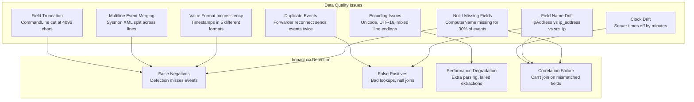

# Module 07 — Data Quality & Normalization
## Null Fields, Format Drift, Multiline Events, Deduplication

---

## 7.1 The Data Quality Problem at Enterprise Scale



---

## 7.2 Handling Null and Missing Fields

### The `coalesce` Pattern for Field Resilience

```splunk
| Comment "Windows events use different field names in different contexts"
| Comment "EventCode 4624: IpAddress = source, WorkstationName = machine name"
| Comment "EventCode 4662: SubjectUserName = actor"
| Comment "coalesce() picks first non-null value"

index=wineventlog sourcetype="WinEventLog:Security" earliest=-1h
| eval src_ip = coalesce(IpAddress, WorkstationName, "UNKNOWN")
| eval actor = coalesce(SubjectUserName, AccountName, TargetUserName, "UNKNOWN")
| eval target = coalesce(ComputerName, TargetServerName, "UNKNOWN")
| eval src_host = coalesce(WorkstationName, IpAddress, "UNKNOWN")

| Comment "Normalize ANONYMOUS LOGON and machine accounts"
| eval actor = if(actor IN ("ANONYMOUS LOGON", "-", ""), "ANONYMOUS", actor)
| eval is_machine_account = if(match(actor, "^[A-Z0-9_-]+\$$"), "YES", "NO")
```

### Detecting Data Gaps (Missing Fields by Source)

```splunk
| Comment "Identify which hosts are sending incomplete data"
| Comment "Critical: If ComputerName is missing, you can't do host-based correlation"

index=wineventlog sourcetype="WinEventLog:Security" EventCode=4624 earliest=-24h
| eval has_ip = if(isnotnull(IpAddress) AND IpAddress != "-", 1, 0)
| eval has_computer = if(isnotnull(ComputerName) AND ComputerName != "", 1, 0)
| eval has_account = if(isnotnull(AccountName) AND AccountName != "-", 1, 0)
| eval has_logontype = if(isnotnull(LogonType), 1, 0)

| stats count as total_events
        sum(has_ip) as events_with_ip
        sum(has_computer) as events_with_computer
        sum(has_account) as events_with_account
        sum(has_logontype) as events_with_logontype
        by host
| eval ip_coverage = round(events_with_ip / total_events * 100, 1)
| eval computer_coverage = round(events_with_computer / total_events * 100, 1)
| eval account_coverage = round(events_with_account / total_events * 100, 1)
| eval data_quality_score = round((ip_coverage + computer_coverage + account_coverage) / 3, 1)
| where data_quality_score < 80
| sort data_quality_score
| table host total_events ip_coverage computer_coverage account_coverage data_quality_score
```

---

## 7.3 Field Name Normalization

### The AD Field Name Zoo

```
WINDOWS EVENT LOG FIELD NAME VARIATIONS:
━━━━━━━━━━━━━━━━━━━━━━━━━━━━━━━━━━━━━━━━━━━━━━━━━━━━━━━━━━━━
Concept          Event 4624    Event 4662    Event 4769    Event 5140
━━━━━━━━━━━━━━━━━━━━━━━━━━━━━━━━━━━━━━━━━━━━━━━━━━━━━━━━━━━━
Actor username   AccountName   SubjectUName  AccountName   AccountName
Actor domain     AccountDomain SubjectDomain AccountDomain SubjectDomain
Source IP        IpAddress     (N/A)         IpAddress     IpAddress
Source port      IpPort        (N/A)         IpPort        (N/A)
Target host      ComputerName  ComputerName  ComputerName  ComputerName
Target account   TargetUserN   TargetObj     TargetUserN   ObjectName
━━━━━━━━━━━━━━━━━━━━━━━━━━━━━━━━━━━━━━━━━━━━━━━━━━━━━━━━━━━━
```

### Universal Normalization Macro Pattern

```splunk
| Comment "Use a macro to apply consistent normalization"
| Comment "Define in macros.conf as 'normalize_windows_auth'"
| Comment "Usage: `normalize_windows_auth`"

| Comment "Macro contents:"
eval src_ip = coalesce(IpAddress, WorkstationName, Workstation, "UNKNOWN")
| eval src_ip = if(src_ip IN ("-", "::1", "127.0.0.1", ""), "LOCAL", src_ip)
| eval actor = coalesce(SubjectUserName, AccountName, TargetUserName, "UNKNOWN")
| eval actor_domain = coalesce(SubjectDomainName, AccountDomain, TargetDomainName, "UNKNOWN")
| eval target_host = coalesce(TargetServerName, ComputerName, "UNKNOWN")
| eval target_account = coalesce(TargetUserName, ObjectName, "UNKNOWN")
| eval full_actor = actor_domain + "\\" + actor
| eval event_outcome = case(
    EventCode IN (4624, 4768, 4769), "success",
    EventCode IN (4625, 4771, 4776), "failure",
    true(), "unknown"
)
```

### Corelight Field Normalization

```splunk
| Comment "Corelight uses Zeek field naming conventions"
| Comment "Normalize to common field names for cross-source correlation"

index=corelight earliest=-1h
| eval src_ip = coalesce('id.orig_h', orig_h, "UNKNOWN")
| eval dest_ip = coalesce('id.resp_h', resp_h, "UNKNOWN")
| eval src_port = coalesce('id.orig_p', orig_p, 0)
| eval dest_port = coalesce('id.resp_p', resp_p, 0)
| eval bytes_in = coalesce(bytes_recv, orig_bytes, 0)
| eval bytes_out = coalesce(bytes_sent, resp_bytes, 0)
| eval protocol = coalesce(proto, service, "unknown")
| eval src_host = coalesce('id.orig_h', orig_h)
| eval dest_host = coalesce('id.resp_h', resp_h)
| eval connection_state = case(
    conn_state="S0", "connection_attempt_no_response",
    conn_state="S1", "established",
    conn_state="SF", "normal",
    conn_state="REJ", "rejected",
    conn_state="S2", "half_closed",
    conn_state="RSTO", "reset_by_originator",
    conn_state="RSTR", "reset_by_responder",
    true(), conn_state
)
```

---

## 7.4 Handling Duplicate Events

Forwarder reconnects, heavy forwarder failover, and indexer cluster replication can all cause duplicate events.

### Deduplication Strategy Comparison

```
DEDUP STRATEGY COMPARISON:
━━━━━━━━━━━━━━━━━━━━━━━━━━━━━━━━━━━━━━━━━━━━━━━━━━━━━━━━━━━━
Strategy              Accuracy    Performance    Use Case
━━━━━━━━━━━━━━━━━━━━━━━━━━━━━━━━━━━━━━━━━━━━━━━━━━━━━━━━━━━━
| dedup fields        Exact        Poor (sorts)   Small datasets
| stats count by      Count-based  Good           Aggregated views
| streamstats         Stateful     Medium         Sequential dedup
sourcetype filter     Pre-search   Excellent      When duplicates
KV Store checkmark    Persistent   Excellent      Across searches
━━━━━━━━━━━━━━━━━━━━━━━━━━━━━━━━━━━━━━━━━━━━━━━━━━━━━━━━━━━━
```

```splunk
| Comment "Dedup at aggregation level (best performance)"
index=wineventlog EventCode=4625 earliest=-1h
| stats count min(_time) as first_seen max(_time) as last_seen
        by IpAddress AccountName ComputerName
| where count > 5

| Comment "Dedup by event fingerprint (for when raw events are needed)"
index=wineventlog EventCode=4688 earliest=-30m
| eval event_fingerprint = md5(host + AccountName + NewProcessName + CommandLine + strftime(_time, "%Y%m%d%H%M"))
| dedup event_fingerprint
| table _time host AccountName NewProcessName CommandLine

| Comment "Persistent dedup: Track processed event IDs in KV Store"
index=wineventlog EventCode=4720 earliest=-15m
| eval event_key = host + "_" + TargetUserName + "_" + strftime(_time, "%Y%m%d%H%M")
| lookup processed_events_kvstore event_key OUTPUT already_processed
| where NOT already_processed="true"
| eval already_processed = "true"
| outputlookup append=true processed_events_kvstore key_field=event_key
```

---

## 7.5 Timestamp Normalization

### Common Timestamp Format Issues

```splunk
| Comment "Detect events with incorrect timestamps (index time vs event time divergence)"
| Comment "Events more than 5 minutes old at index time = forwarder lag or clock drift"

index=wineventlog earliest=-1h
| eval index_time = _indextime
| eval event_time = _time
| eval lag_seconds = index_time - event_time
| eval lag_minutes = round(lag_seconds / 60, 1)
| where lag_minutes > 5 OR lag_minutes < -5

| stats count as affected_events
        avg(lag_minutes) as avg_lag_min
        max(lag_minutes) as max_lag_min
        min(lag_minutes) as min_lag_min
        by host sourcetype
| sort -avg_lag_min
| table host sourcetype affected_events avg_lag_min max_lag_min min_lag_min

| Comment "Action: Fix on forwarder (inputs.conf max_age_before_indextime)"
| Comment "Or fix on HF (MAX_TIMESTAMP_LOOKAHEAD, TIME_FORMAT in props.conf)"
```

### Parsing Multiple Timestamp Formats

```splunk
| Comment "Corelight timestamps are epoch (float), WinEventLog uses XML datetime"
| Comment "Normalize both to _time (Splunk auto-parses most formats)"

| Comment "Manual epoch conversion if needed (Corelight sometimes sends ms timestamps)"
index=corelight earliest=-1h
| eval _time = if(_time > 2000000000, _time/1000, _time)
| eval readable_time = strftime(_time, "%Y-%m-%d %H:%M:%S.%3Q")

| Comment "Handle Windows XML datetime if not auto-parsed"
index=wineventlog earliest=-1h
| rex field=TimeCreated "SystemTime='(?<win_time>[^']+)'"
| eval parsed_time = strptime(win_time, "%Y-%m-%dT%H:%M:%S.%7N%z")
| eval time_diff = abs(_time - parsed_time)
| where time_diff > 60
| Comment "If time_diff > 60s, timestamp was parsed incorrectly"
```

---

## 7.6 Sysmon XML Parsing Issues

Sysmon events are XML-formatted, and multiline XML can cause field extraction failures.

### Detecting Truncated Sysmon Events

```splunk
| Comment "Sysmon CommandLine truncated at 4096 chars (Windows limitation)"
| Comment "Detect truncated commands to know when coverage is incomplete"

index=sysmon EventCode=1 earliest=-1h
| eval cmdline_len = len(CommandLine)
| eval is_truncated = if(cmdline_len >= 4096, "YES", "NO")
| where is_truncated="YES"
| stats count dc(Computer) as hosts values(Image) as processes by User
| table User count hosts processes

| Comment "Also detect when ParentCommandLine is missing (older Sysmon versions)"
| Comment "This affects parent process context for detection"
index=sysmon EventCode=1 earliest=-24h
| eval missing_parent_cmd = if(isnull(ParentCommandLine) OR ParentCommandLine="", "YES", "NO")
| stats count(eval(missing_parent_cmd="YES")) as missing
        count(eval(missing_parent_cmd="NO")) as present
        by host
| eval coverage_pct = round(present / (missing + present) * 100, 1)
| where coverage_pct < 90
| sort coverage_pct
```

### Sysmon Field Extraction Resilience

```splunk
| Comment "Sysmon field names vary by version and sourcetype configuration"
| Comment "Build resilient extraction using coalesce for common variants"

index=sysmon EventCode=1 earliest=-1h
| eval process_image = coalesce(Image, ProcessImage, process_image, "UNKNOWN")
| eval process_cmd = coalesce(CommandLine, process_cmdline, "UNKNOWN")
| eval parent_image = coalesce(ParentImage, ParentProcessImage, "UNKNOWN")
| eval parent_cmd = coalesce(ParentCommandLine, parent_process_cmdline, "UNKNOWN")
| eval process_hash = coalesce(Hashes, hash, "UNKNOWN")
| eval user_account = coalesce(User, AccountName, "UNKNOWN")
| eval target_host = coalesce(Computer, ComputerName, host, "UNKNOWN")

| Comment "Extract SHA256 from multi-hash Hashes field"
| rex field=process_hash "SHA256=(?<sha256>[A-F0-9]{64})"
| rex field=process_hash "MD5=(?<md5>[A-F0-9]{32})"
```

---

## 7.7 IP Address Normalization

In a large enterprise, the same machine may appear with:
- IPv4 address
- IPv6 address
- Short hostname
- FQDN
- NetBIOS name

```splunk
| Comment "Build comprehensive IP-to-identity mapping"
| Comment "Sources: DNS (corelight), DHCP logs, WMI asset data"

| Comment "Step 1: Extract IPs from Corelight DNS"
index=corelight sourcetype=bro_dns earliest=-1h
    query_type IN ("A", "PTR", "AAAA")
| eval ip = case(
    query_type="PTR",
        replace(replace(query, "\\.in-addr\\.arpa$", ""),
                "^(\\d+)\\.(\\d+)\\.(\\d+)\\.(\\d+)$",
                "\\4.\\3.\\2.\\1"),
    query_type IN ("A", "AAAA"),
        mvindex(split(answers, ","), 0),
    true(), null()
)
| eval hostname = case(
    query_type="PTR", mvindex(split(answers, ","), 0),
    query_type IN ("A", "AAAA"), query,
    true(), null()
)
| where isnotnull(ip) AND isnotnull(hostname)
| eval ip = trim(ip)
| eval hostname = lower(trim(hostname))
| stats max(_time) as last_seen by ip hostname
| outputlookup append=false ip_hostname_enrichment.csv

| Comment "Step 2: Use enrichment in detections"
index=corelight sourcetype=bro_conn earliest=-15m
| lookup ip_hostname_enrichment.csv ip as id.orig_h OUTPUT hostname as src_hostname
| lookup ip_hostname_enrichment.csv ip as id.resp_h OUTPUT hostname as dest_hostname
| eval src_display = coalesce(src_hostname, id.orig_h)
| eval dest_display = coalesce(dest_hostname, id.resp_h)
```

### IPv4/IPv6 Dual-Stack Normalization

```splunk
| Comment "Handle dual-stack environments where the same host appears with both addresses"
| Comment "IPv6 link-local (fe80::) should be converted or excluded"

index=wineventlog EventCode=4624 earliest=-1h
| eval src_ip = IpAddress
| eval src_ip = if(match(src_ip, "^::ffff:"), replace(src_ip, "^::ffff:", ""), src_ip)
| eval src_ip = if(match(src_ip, "^fe80:"), "LINK_LOCAL_IPV6", src_ip)
| eval src_ip = if(src_ip IN ("::1", "127.0.0.1"), "LOCALHOST", src_ip)
| where src_ip NOT IN ("LOCALHOST", "LINK_LOCAL_IPV6", "-", "")
```

---

## 7.8 Handling High-Cardinality Noisy Fields

### The Username Explosion Problem

Enterprise domains have:
- Service accounts (hundreds)
- Machine accounts (thousands)
- System processes (SYSTEM, LOCAL SERVICE, NETWORK SERVICE)
- Defunct/disabled accounts still generating events

```splunk
| Comment "Classify and filter accounts by type for cleaner detections"

index=wineventlog EventCode=4624 earliest=-1h
| eval account_type = case(
    match(AccountName, "^.*\$$"),                           "machine",
    AccountName IN ("SYSTEM", "LOCAL SERVICE",
                    "NETWORK SERVICE", "DWM-*",
                    "UMFD-*", "ANONYMOUS LOGON"),           "system",
    match(AccountName, "(?i)^(svc|svc_|service|srvc)"),    "service",
    match(AccountName, "(?i)^(adm|admin|adm_|it_adm)"),    "admin",
    match(AccountName, "(?i)^(test|dev|qa|temp|tmp)"),     "test",
    true(),                                                  "user"
)

| Comment "Only care about user and admin accounts for most detections"
| where account_type IN ("user", "admin")
| stats count dc(ComputerName) as hosts by AccountName account_type
| sort -count
```

---

## 7.9 Detecting and Recovering from Forwarder Gaps

### Gap Detection in Event Stream

```splunk
| Comment "Detect forwarder gaps: time periods with no events from a host"
| Comment "Critical: Gaps may indicate forwarder failure OR log tampering"

| tstats count WHERE index=wineventlog
    BY host _time span=5m
| sort host _time
| streamstats current=false last(_time) as prev_bucket by host
| eval gap_minutes = round((_time - prev_bucket) / 60, 1)
| where gap_minutes > 15
| eval alert = "FORWARDER GAP: " + host + " had " + tostring(gap_minutes) + " minute gap"
| table _time host gap_minutes prev_bucket alert
| sort -gap_minutes
```

### Heartbeat-Based Coverage Monitoring

```splunk
| Comment "Detect hosts that stopped sending entirely"
| Comment "Method: Cross-reference known hosts with recent senders"

| inputlookup monitored_hosts.csv
| eval expected_host = hostname
| fields expected_host site tier

| Comment "Find which expected hosts have sent events in last 30 minutes"
| join type=leftanti expected_host [
    | tstats count WHERE index=wineventlog earliest=-30m
      BY host
    | rename host as expected_host
]

| Comment "Remaining = expected hosts with NO events = potential gap"
| table expected_host site tier
| eval alert = "NO EVENTS IN 30 MINUTES: " + expected_host
| sort expected_host
```

---

## 7.10 Data Quality Dashboard Queries

### Real-Time Data Quality Scorecard

```splunk
| Comment "Comprehensive data quality check across all three indexes"

| tstats count WHERE index IN (corelight, wineventlog, sysmon)
    BY index host _time span=5m
| stats max(_time) as last_event count as event_count by index host
| eval minutes_since_last = round((now() - last_event) / 60, 1)
| eval freshness = case(
    minutes_since_last < 5,  "FRESH",
    minutes_since_last < 15, "ACCEPTABLE",
    minutes_since_last < 60, "STALE",
    true(),                  "DEAD"
)
| stats count(eval(freshness="FRESH")) as fresh_hosts
        count(eval(freshness="ACCEPTABLE")) as ok_hosts
        count(eval(freshness="STALE")) as stale_hosts
        count(eval(freshness="DEAD")) as dead_hosts
        sum(event_count) as total_events
        by index
| eval total_hosts = fresh_hosts + ok_hosts + stale_hosts + dead_hosts
| eval health_pct = round(fresh_hosts / total_hosts * 100, 1)
| table index total_hosts fresh_hosts ok_hosts stale_hosts dead_hosts total_events health_pct
```

---

[← Resource-Constrained Searching](./06-resource-constrained-searching.md) | [Next: Advanced Detection Engineering →](./08-advanced-detection-engineering.md)
