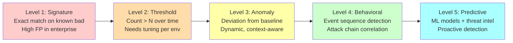
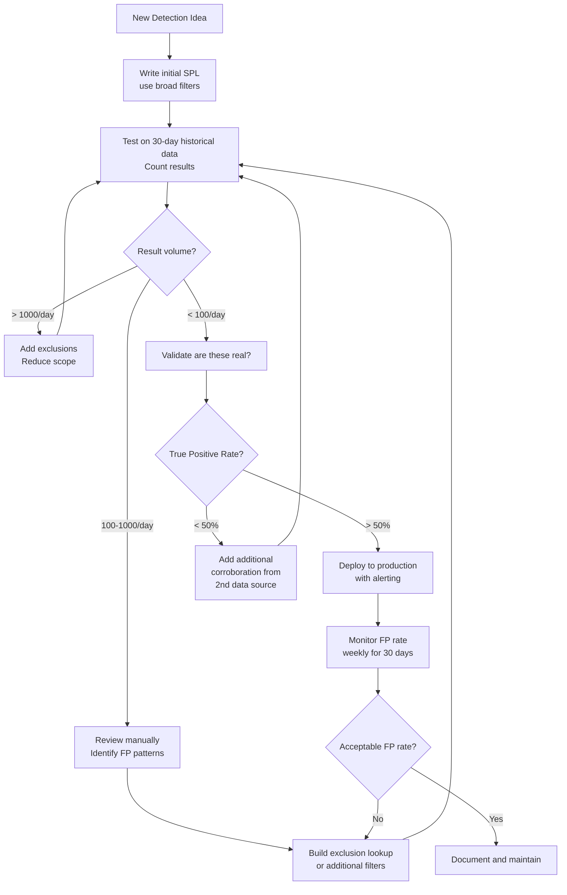

# Module 08 — Advanced Detection Engineering
## Baselining, ML Primitives, rare(), streamstats, Event Sequencing

---

## 8.1 Detection Engineering Maturity Model



---

## 8.2 Behavioral Baselining with `stats` + `eval`

### Building a User Login Baseline

```splunk
| Comment "Build rolling 30-day baseline for each user's login patterns"
| Comment "Run as scheduled search, store in summary index or KV Store"

index=wineventlog sourcetype="WinEventLog:Security" EventCode=4624 earliest=-30d latest=-1d
    LogonType IN ("2", "10")
    NOT AccountName IN ("*$", "ANONYMOUS*", "SYSTEM")

| eval day_of_week = strftime(_time, "%u")
| eval hour_of_day = tonumber(strftime(_time, "%H"))
| eval logon_period = case(
    hour_of_day BETWEEN 7 AND 9,    "morning",
    hour_of_day BETWEEN 9 AND 17,   "business_hours",
    hour_of_day BETWEEN 17 AND 20,  "evening",
    true(),                          "off_hours"
)

| stats count as logon_count
        dc(IpAddress) as unique_src_ips
        dc(ComputerName) as unique_targets
        mode(logon_period) as typical_period
        mode(day_of_week) as typical_dow
        mode(IpAddress) as typical_src
        by AccountName
| eval account_baseline = "true"
| outputlookup user_logon_baseline.csv
```

### Detecting Deviation from Baseline

```splunk
| Comment "Compare current day's logins against 30-day baseline"

index=wineventlog EventCode=4624 LogonType IN ("2","10") earliest=-24h
    NOT AccountName IN ("*$", "ANONYMOUS*", "SYSTEM")
| eval hour_of_day = tonumber(strftime(_time, "%H"))
| eval logon_period = case(
    hour_of_day BETWEEN 7 AND 9,   "morning",
    hour_of_day BETWEEN 9 AND 17,  "business_hours",
    hour_of_day BETWEEN 17 AND 20, "evening",
    true(),                         "off_hours"
)
| stats count as today_logons
        dc(IpAddress) as today_src_ips
        dc(ComputerName) as today_targets
        mode(logon_period) as today_period
        mode(IpAddress) as today_src
        by AccountName

| lookup user_logon_baseline.csv AccountName OUTPUT
    logon_count as baseline_count
    unique_src_ips as baseline_src_ips
    unique_targets as baseline_targets
    typical_period as baseline_period
    typical_src as baseline_src

| eval src_ip_ratio = round(today_src_ips / (baseline_src_ips + 1), 2)
| eval target_ratio = round(today_targets / (baseline_targets + 1), 2)
| eval logon_ratio  = round(today_logons / (baseline_count / 30 + 1), 2)
| eval unusual_period = if(today_period != baseline_period AND today_period="off_hours", "YES", "NO")
| eval unusual_src = if(today_src != baseline_src AND isnotnull(baseline_src), "YES", "NO")

| eval anomaly_score = (
    if(src_ip_ratio > 3, 30, 0) +
    if(target_ratio > 5, 30, 0) +
    if(unusual_period="YES", 25, 0) +
    if(unusual_src="YES", 15, 0)
)
| where anomaly_score > 30
| sort -anomaly_score
| table AccountName today_logons baseline_count src_ip_ratio target_ratio unusual_period unusual_src anomaly_score
```

---

## 8.3 `rare()` — Finding Low-Frequency Signals

### Rare Process Executions (Sysmon)

```splunk
| Comment "Find processes that run rarely across the fleet"
| Comment "Rare executables in known paths = high suspicion"
| Comment "Key: Exclude common processes, focus on Windows system paths"

index=sysmon EventCode=1 earliest=-7d
    Image IN (
        "C:\\Windows\\System32\\*",
        "C:\\Windows\\SysWOW64\\*",
        "C:\\Windows\\*"
    )
    NOT Image IN (
        "*\\svchost.exe",
        "*\\explorer.exe",
        "*\\services.exe",
        "*\\lsass.exe",
        "*\\csrss.exe",
        "*\\wininit.exe",
        "*\\smss.exe",
        "*\\taskhostw.exe",
        "*\\conhost.exe",
        "*\\SearchIndexer.exe",
        "*\\MsMpEng.exe",
        "*\\dwm.exe",
        "*\\WmiPrvSE.exe",
        "*\\dllhost.exe"
    )

| stats count as exec_count dc(Computer) as host_count by Image
| eval prevalence_score = exec_count * host_count
| sort prevalence_score
| head 50
| eval rarity = case(
    host_count = 1, "VERY_RARE - Single host",
    host_count < 5, "RARE - Few hosts",
    exec_count < 10, "INFREQUENT - Low runs",
    true(), "UNCOMMON"
)
| table Image exec_count host_count prevalence_score rarity
```

### Rare Parent-Child Process Combinations

```splunk
| Comment "Detect unusual parent-child relationships"
| Comment "Method: Build frequency table of parent→child pairs"

index=sysmon EventCode=1 earliest=-30d
| stats count as pair_count dc(Computer) as hosts by ParentImage Image
| sort pair_count
| eval expected_pair = case(
    ParentImage="*\\explorer.exe" AND
        Image IN ("*\\cmd.exe","*\\powershell.exe","*\\notepad.exe"), "normal",
    ParentImage="*\\services.exe" AND
        Image IN ("*\\svchost.exe"), "normal",
    ParentImage="*\\svchost.exe" AND
        Image IN ("*\\WmiPrvSE.exe","*\\msiexec.exe"), "normal",
    pair_count > 100, "common",
    pair_count > 10, "uncommon",
    true(), "rare"
)
| where expected_pair IN ("rare", "uncommon") AND pair_count < 5
| lookup suspicious_process_pairs.csv ParentImage Image OUTPUT known_attack_technique
| table ParentImage Image pair_count hosts expected_pair known_attack_technique
| sort pair_count
```

---

## 8.4 Temporal Pattern Detection with `streamstats`

### Detecting Credential Stuffing Attacks

```splunk
| Comment "Credential stuffing: Many accounts tried from same IP, low lockout rate"
| Comment "Pattern: High account diversity, moderate failure rate per account"

index=wineventlog EventCode=4625 earliest=-2h
| sort 0 _time
| streamstats time_window=10m
    count as failures_10m
    dc(AccountName) as accounts_10m
    by IpAddress

| streamstats time_window=60m
    count as failures_1h
    dc(AccountName) as accounts_1h
    by IpAddress

| eval accounts_per_failure_rate = round(accounts_10m / (failures_10m + 1), 2)
| eval is_stuffing = if(
    failures_10m > 10 AND
    accounts_10m > 5 AND
    accounts_per_failure_rate > 0.5,
    "YES", "NO"
)
| where is_stuffing="YES"
| dedup IpAddress sortby -failures_10m
| lookup geo_ip.csv IpAddress OUTPUT country city isp
| table _time IpAddress country city isp failures_10m accounts_10m accounts_1h accounts_per_failure_rate
```

### Detecting Password Spraying (Low-Slow)

```splunk
| Comment "Password spray: One password tried against many accounts slowly"
| Comment "Evades threshold-based detections by staying under lockout limits"

index=wineventlog EventCode IN (4625, 4771) earliest=-4h

| eval failed_user = coalesce(AccountName, TargetUserName, "UNKNOWN")
| eval src = coalesce(IpAddress, "UNKNOWN")

| sort 0 _time
| streamstats time_window=30m
    count as failures_30m
    dc(failed_user) as accounts_30m
    by src

| streamstats time_window=4h
    count as failures_4h
    dc(failed_user) as accounts_4h
    by src

| eval spread_over_time = accounts_4h / (failures_4h / 4)
| eval per_account_rate = failures_4h / (accounts_4h + 1)

| Comment "Spray signature: High account diversity + low per-account frequency"
| eval is_spray = case(
    accounts_4h > 30 AND per_account_rate < 5, "HIGH_CONFIDENCE_SPRAY",
    accounts_4h > 15 AND per_account_rate < 3, "MEDIUM_CONFIDENCE_SPRAY",
    accounts_30m > 10 AND failures_30m > 10,   "POSSIBLE_SPRAY",
    true(), "NO"
)
| where is_spray != "NO"
| dedup src sortby -accounts_4h
| table _time src failures_4h accounts_4h per_account_rate is_spray
```

---

## 8.5 Event Sequencing — Full Attack Chain Detection

### The `transaction` Replacement: State Machine via `streamstats`

```splunk
| Comment "Detect the Reconnaissance → Access → Escalation chain"
| Comment "Step 1: Assign event types"

index=wineventlog sourcetype="WinEventLog:Security"
    EventCode IN (4625, 4624, 4728, 4732, 4756, 7045, 4698)
    earliest=-2h
| eval actor = coalesce(IpAddress, SubjectUserName, "UNKNOWN")
| eval event_stage = case(
    EventCode=4625, "1_RECON_FAILURE",
    EventCode=4624 AND LogonType="3", "2_INITIAL_ACCESS",
    EventCode IN (4728, 4732, 4756), "3_PRIVILEGE_ESCALATION",
    EventCode=7045, "4_PERSISTENCE_SERVICE",
    EventCode=4698, "4_PERSISTENCE_TASK",
    true(), "OTHER"
)
| where event_stage != "OTHER"
| sort 0 _time actor

| Comment "Track stage progression per actor"
| streamstats time_window=2h
    values(event_stage) as stages_seen
    count as events_in_chain
    by actor

| eval stage_count = mvcount(stages_seen)
| eval has_recon = if(mvfind(stages_seen, "1_RECON") >= 0, 1, 0)
| eval has_access = if(mvfind(stages_seen, "2_INITIAL") >= 0, 1, 0)
| eval has_escalation = if(mvfind(stages_seen, "3_PRIVILEGE") >= 0, 1, 0)
| eval has_persistence = if(mvfind(stages_seen, "4_PERSISTENCE") >= 0, 1, 0)

| eval chain_score = (has_recon * 1) + (has_access * 2) + (has_escalation * 4) + (has_persistence * 8)
| where chain_score >= 3

| eval chain_description = case(
    chain_score >= 15, "CRITICAL: Full attack chain (Recon→Access→Escalation→Persistence)",
    chain_score >= 7,  "HIGH: Partial chain with escalation or persistence",
    chain_score >= 3,  "MEDIUM: Access following recon",
    true(), "LOW"
)

| dedup actor sortby -chain_score
| table _time actor events_in_chain stages_seen chain_score chain_description
```

---

## 8.6 ML Primitives in SPL

Splunk's built-in ML commands provide anomaly detection without requiring MLTK.

### `anomalydetection` for Baseline Comparison

```splunk
| Comment "Use anomalydetection for automatic outlier identification"
| Comment "Useful when you don't know what normal looks like"

index=wineventlog EventCode=4624 earliest=-7d
| bucket _time span=1h
| stats count as logon_count by _time host
| anomalydetection action=annotate method=histogram pthresh=0.02 maxresults=100
    logon_count
| where prob < 0.02
| table _time host logon_count prob
```

### Clustering Network Behavior (corelight)

```splunk
| Comment "Use kmeans to identify anomalous network traffic patterns"
| Comment "Requires ML Toolkit or use manual z-score approach"

| Comment "Manual z-score approach (no MLTK required):"
index=corelight sourcetype=bro_conn earliest=-24h
| stats count as conn_count
        sum(bytes_sent) as total_bytes_out
        sum(bytes_received) as total_bytes_in
        dc(id.resp_h) as unique_dests
        dc(id.resp_p) as unique_ports
        by id.orig_h

| eventstats avg(conn_count) as avg_conn stdev(conn_count) as stdev_conn
             avg(total_bytes_out) as avg_bytes stdev(total_bytes_out) as stdev_bytes
             avg(unique_dests) as avg_dests stdev(unique_dests) as stdev_dests

| eval z_conn = round((conn_count - avg_conn) / (stdev_conn + 1), 2)
| eval z_bytes = round((total_bytes_out - avg_bytes) / (stdev_bytes + 1), 2)
| eval z_dests = round((unique_dests - avg_dests) / (stdev_dests + 1), 2)
| eval composite_z = round((abs(z_conn) + abs(z_bytes) + abs(z_dests)) / 3, 2)

| where composite_z > 3
| sort -composite_z
| lookup asset_inventory.csv id.orig_h OUTPUT hostname asset_type
| table id.orig_h hostname asset_type conn_count total_bytes_out unique_dests composite_z z_conn z_bytes z_dests
```

### Time-Series Anomaly Detection

```splunk
| Comment "Detect activity in windows where it's historically absent"
| Comment "e.g., admin activity at 3am is rare even if count is 'normal'"

index=wineventlog EventCode=4624 earliest=-30d
    NOT AccountName IN ("*$", "ANONYMOUS*")
| eval hour = tonumber(strftime(_time, "%H"))
| eval day_of_week = strftime(_time, "%u")

| Comment "Build hour-of-day baseline per user"
| stats count as logons by AccountName hour day_of_week
| eventstats avg(logons) as avg_logons stdev(logons) as stdev_logons by AccountName hour

| Comment "Now check current period against historical baseline"
| where logons > 0
| eval z_score = round((logons - avg_logons) / (stdev_logons + 0.001), 2)
| eval is_anomalous = if(z_score > 3 AND hour BETWEEN 0 AND 6, "YES_OFFHOURS", "NO")
| where is_anomalous != "NO"
| sort -z_score
| table AccountName hour day_of_week logons avg_logons z_score is_anomalous
```

---

## 8.7 Threat Hunting Macros and Saved Searches

### Macro Library Pattern

```splunk
| Comment "Define reusable macros in macros.conf for common detection patterns"

| Comment "Macro: is_admin_account(1)"
| Comment "Usage: `is_admin_account(AccountName)`"
| Comment "Definition: lookup admin_accounts.csv $account_field$ OUTPUT is_admin account_tier"
| Comment "where is_admin='true'"

| Comment "Macro: exclude_noise()"
| Comment "Usage: `exclude_noise`"
| Comment "Definition: NOT AccountName IN (\"*$\",\"ANONYMOUS*\",\"SYSTEM\")"
| Comment "NOT IpAddress IN (\"::1\",\"127.0.0.1\",\"-\")"
| Comment "NOT ComputerName IN (\"*BACKUP*\",\"*MONITOR*\")"

| Comment "Using macros in production searches:"
index=wineventlog EventCode=4624 LogonType="3" earliest=-1h
`exclude_noise`
| `is_admin_account(AccountName)`
| where account_tier="Tier0"
| stats count by AccountName ComputerName IpAddress
```

### Parameterized Detection Template

```splunk
| Comment "Template for threshold-based detections"
| Comment "Parameters: index, event_code, group_by_field, threshold, time_window"

| Comment "Instantiated example: Detect DC with > 10000 Kerberos events in 5 min"
index=wineventlog sourcetype="WinEventLog:Security"
    EventCode IN (4768, 4769, 4771) earliest=-10m
| bucket _time span=5m
| stats count as kerberos_events by _time ComputerName
| where kerberos_events > 10000
| eval alert_name = "DC_Kerberos_Spike"
| eval threshold = 10000
| eval detection_time = now()
| eval severity = case(
    kerberos_events > 50000, "critical",
    kerberos_events > 20000, "high",
    kerberos_events > 10000, "medium",
    true(), "low"
)
```

---

## 8.8 Risk-Based Alerting (RBA) Framework

### Risk Score Accumulation

```splunk
| Comment "Each detection contributes risk points to an entity"
| Comment "Alert only when cumulative risk exceeds threshold"
| Comment "Dramatically reduces alert fatigue"

| Comment "=== RISK CONTRIBUTOR 1: Failed auth from new IP ==="
index=wineventlog EventCode=4625 earliest=-1h
| lookup user_typical_ips.csv AccountName OUTPUT known_ips
| where NOT match(IpAddress, known_ips) AND known_ips!=""
| eval entity = AccountName
| eval risk_score = 20
| eval risk_reason = "Auth failure from new/unknown IP"
| eval risk_object_type = "user"
| fields entity risk_score risk_reason risk_object_type _time

| Comment "=== RISK CONTRIBUTOR 2: Kerberoasting attempt ==="
| append [
    search index=wineventlog EventCode=4769
        TicketEncryptionType="0x17" earliest=-1h
    | eval entity = AccountName
    | eval risk_score = 40
    | eval risk_reason = "RC4 service ticket request (Kerberoasting)"
    | eval risk_object_type = "user"
    | fields entity risk_score risk_reason risk_object_type _time
]

| Comment "=== RISK CONTRIBUTOR 3: LDAP enumeration ==="
| append [
    search index=corelight sourcetype=bro_ldap earliest=-1h
    | stats count as ldap_queries by id.orig_h
    | where ldap_queries > 500
    | lookup dns_ip_hostname_map.csv known_ips as id.orig_h OUTPUT hostname as entity
    | eval entity = coalesce(entity, id.orig_h)
    | eval risk_score = 30
    | eval risk_reason = "High-volume LDAP enumeration"
    | eval risk_object_type = "host"
    | fields entity risk_score risk_reason risk_object_type _time
]

| Comment "=== ACCUMULATE AND ALERT ==="
| stats sum(risk_score) as total_risk
        values(risk_reason) as risk_reasons
        count as contributing_detections
        min(_time) as first_detection
        max(_time) as last_detection
        by entity risk_object_type
| where total_risk >= 60
| eval risk_level = case(
    total_risk >= 100, "CRITICAL",
    total_risk >= 80,  "HIGH",
    total_risk >= 60,  "MEDIUM",
    true(),            "LOW"
)
| sort -total_risk
| table entity risk_object_type total_risk risk_level contributing_detections risk_reasons first_detection last_detection
```

---

## 8.9 Frequency Analysis for Low-and-Slow Detection

### Detecting Low-Frequency Exfiltration

```splunk
| Comment "Detect slow data exfiltration: steady outbound flow below alert thresholds"
| Comment "Method: Track bytes over rolling windows at different granularities"

index=corelight sourcetype=bro_conn earliest=-24h
    NOT id.resp_h IN ("10.0.0.0/8", "172.16.0.0/12", "192.168.0.0/16")
    bytes_sent > 0
| sort 0 _time id.orig_h

| streamstats time_window=1h sum(bytes_sent) as bytes_1h by id.orig_h
| streamstats time_window=6h sum(bytes_sent) as bytes_6h by id.orig_h
| streamstats time_window=24h sum(bytes_sent) as bytes_24h by id.orig_h

| eval consistency_score = case(
    bytes_1h > 0 AND bytes_6h > 0 AND bytes_24h > 0,
    round(bytes_1h / (bytes_6h / 6 + 0.001), 2),
    true(), null()
)

| Comment "High consistency = steady exfil rate (1.0 = perfectly steady)"
| eval exfil_pattern = case(
    bytes_24h > 1073741824 AND consistency_score BETWEEN 0.5 AND 2.0,
    "LIKELY_EXFILTRATION: >1GB steady over 24h",
    bytes_24h > 104857600 AND consistency_score BETWEEN 0.7 AND 1.5,
    "POSSIBLE_EXFILTRATION: >100MB steady",
    true(), "normal"
)
| where exfil_pattern != "normal"
| dedup id.orig_h sortby -bytes_24h
| lookup asset_inventory.csv id.orig_h OUTPUT hostname asset_type
| table id.orig_h hostname asset_type bytes_1h bytes_6h bytes_24h consistency_score exfil_pattern
```

---

## 8.10 Detection Engineering Anti-Patterns

```
ANTI-PATTERNS TO AVOID:
━━━━━━━━━━━━━━━━━━━━━━━━━━━━━━━━━━━━━━━━━━━━━━━━━━━━━━━━━━━━━━━━━━
❌ Alert on every single event occurrence
   → Use thresholds, time windows, or risk scoring

❌ No exclusions for known-good
   → Always exclude service accounts, machine accounts, backup systems

❌ Static thresholds environment-wide
   → Use per-host or per-user baselines

❌ Alert without context
   → Always include: who, what, where, when, why suspicious

❌ Copy SIGMA rules directly without tuning
   → SIGMA rules are starting points — tune for YOUR environment

❌ Single-source detections for high-severity alerts
   → High-severity alerts should have 2+ source confirmation

❌ Overlapping detection windows without dedup
   → 5-minute alert schedule with 15-minute window = 3x false positives
   → Always dedup or use distinct counts with time bounding

❌ Hunting with summary indexes without verifying coverage
   → Summary indexes may miss events if search failed
   → Always verify: | metadata type=sourcetypes index=summary

❌ Using eval before stats when filter is possible
   → index=wineventlog | eval bad=if(EventCode=4625, 1, 0) | where bad=1
   → Should be: index=wineventlog EventCode=4625
━━━━━━━━━━━━━━━━━━━━━━━━━━━━━━━━━━━━━━━━━━━━━━━━━━━━━━━━━━━━━━━━━━
```

---

## 8.11 Detection Tuning Workflow



---

[← Data Quality & Normalization](./07-data-quality-and-normalization.md) | [Next: Performance Reference Card →](./09-performance-reference-card.md)
