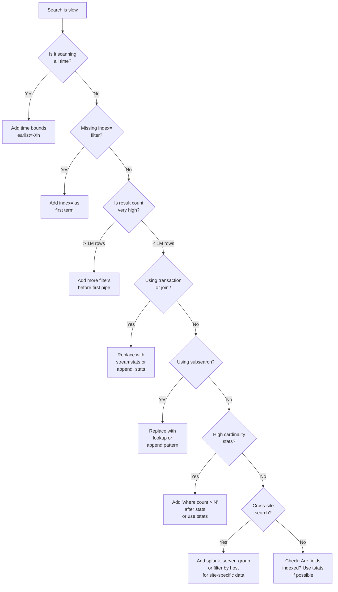

# Module 09 — Performance Reference Card
## Quick-Reference: Command Costs, Anti-Patterns, Cheat Sheet

---

## 9.1 The Master Cheat Sheet

```
┌─────────────────────────────────────────────────────────────────────┐
│              SPLUNK ENTERPRISE SEARCH AT SCALE                      │
│                    MASTER REFERENCE CARD                            │
├─────────────────────────────────────────────────────────────────────┤
│ INDEX FILTER ORDER (always put these first, in this order)          │
│   1. index=<name>          (eliminates other indexes' buckets)      │
│   2. sourcetype=<type>     (bloom filter on sourcetype token)       │
│   3. host=<pattern>        (bloom filter on host token)             │
│   4. earliest/latest       (time-based bucket elimination)          │
│   5. Specific keywords     (bloom filter terms)                     │
│   6. field=value           (rawdata scan after bloom filter)        │
├─────────────────────────────────────────────────────────────────────┤
│ USE tstats WHEN:                │ USE search WHEN:                  │
│  - Counting events             │  - Need full field extractions    │
│  - Aggregating indexed fields  │  - Using non-indexed fields       │
│  - Building trend data         │  - Doing regex extraction         │
│  - Pre-filtering for joins     │  - First-time exploration         │
├─────────────────────────────────────────────────────────────────────┤
│ REPLACE                        │ WITH                              │
│  transaction                   │  streamstats                      │
│  subsearch [search ...]        │  lookup / inputlookup             │
│  join (large datasets)         │  append + stats                   │
│  rex (early in pipeline)       │  keyword pre-filter + rex         │
│  dedup (large datasets)        │  stats by + head                  │
│  real-time searches            │  5-min scheduled + window         │
│  all-time searches             │  bounded time range               │
│  stats without fields trim     │  fields + stats                   │
└─────────────────────────────────────────────────────────────────────┘
```

---

## 9.2 Command Cost Quick Reference

| Command | Memory | CPU | Network | Notes |
|---|---|---|---|---|
| `tstats` | ★☆☆☆☆ | ★☆☆☆☆ | ★☆☆☆☆ | TSIDX only — never touches rawdata |
| `inputlookup` | ★☆☆☆☆ | ★☆☆☆☆ | ★☆☆☆☆ | Reads flat file/KV store |
| `search` (indexed fields) | ★★☆☆☆ | ★★☆☆☆ | ★★☆☆☆ | Bloom filter + TSIDX |
| `search` (non-indexed) | ★★★☆☆ | ★★★☆☆ | ★★★☆☆ | Full rawdata scan |
| `stats` | ★★☆☆☆ | ★★☆☆☆ | ★☆☆☆☆ | In-memory aggregation |
| `eventstats` | ★★★☆☆ | ★★★☆☆ | ★★☆☆☆ | Aggregates AND joins back |
| `streamstats` | ★★☆☆☆ | ★★☆☆☆ | ★★☆☆☆ | Sliding window state |
| `eval` | ★★☆☆☆ | ★★☆☆☆ | ★☆☆☆☆ | Per-event computation |
| `where` | ★★☆☆☆ | ★★☆☆☆ | ★☆☆☆☆ | Post-extraction filter |
| `lookup` | ★★☆☆☆ | ★★☆☆☆ | ★★☆☆☆ | Per-event KV lookup |
| `rex` | ★★★☆☆ | ★★★☆☆ | ★☆☆☆☆ | Per-event regex |
| `dedup` | ★★★★☆ | ★★★☆☆ | ★☆☆☆☆ | Sort + in-memory dedup |
| `transaction` | ★★★★★ | ★★★★☆ | ★★☆☆☆ | All matching events in RAM |
| `join` | ★★★★☆ | ★★★★☆ | ★★★☆☆ | Nested search + memory |
| `subsearch [ ]` | ★★★★☆ | ★★★★☆ | ★★★☆☆ | Spawns full nested search |
| `mvexpand` | ★★★★☆ | ★★★☆☆ | ★★★☆☆ | Can multiply result rows |
| `sistats` | ★★☆☆☆ | ★★☆☆☆ | ★☆☆☆☆ | Server-side approx stats |
| `anomalydetection` | ★★★☆☆ | ★★★☆☆ | ★★☆☆☆ | Statistical outlier detection |

---

## 9.3 Index-Specific Quick Searches

### corelight Quick References

```splunk
| Comment "=== CONNECTION SUMMARY (last 15 min) ==="
index=corelight sourcetype=bro_conn earliest=-15m
| tstats count dc(id.resp_h) as unique_dests sum(bytes_sent) as bytes_out
    WHERE index=corelight sourcetype=bro_conn
    BY id.orig_h _time span=1m

| Comment "=== DNS ANOMALY CHECK ==="
index=corelight sourcetype=bro_dns earliest=-15m
| stats count as queries dc(query) as unique_domains by id.orig_h
| where unique_domains > 200 OR count > 1000

| Comment "=== SMB ACTIVITY OVERVIEW ==="
index=corelight sourcetype=bro_smb_mapping earliest=-1h
| stats count dc(id.resp_h) as targets by id.orig_h
| where targets > 5

| Comment "=== KERBEROS TICKET OVERVIEW ==="
index=corelight sourcetype=bro_kerberos earliest=-1h
| stats count dc(service) as services by client cipher
| where count > 100 OR services > 20

| Comment "=== NTLM AUTHENTICATION ==="
index=corelight sourcetype=bro_ntlm earliest=-1h
| stats count dc(username) as users by id.orig_h status
| where count > 50

| Comment "=== DCE/RPC OPERATIONS ==="
index=corelight sourcetype=bro_dce_rpc earliest=-1h
| stats count dc(id.resp_h) as targets by id.orig_h endpoint operation
| where count > 10

| Comment "=== LDAP QUERIES ==="
index=corelight sourcetype=bro_ldap earliest=-1h
| stats count dc(filter) as unique_filters by id.orig_h
| where count > 100
```

### wineventlog Quick References

```splunk
| Comment "=== AUTHENTICATION OVERVIEW ==="
index=wineventlog sourcetype="WinEventLog:Security"
    EventCode IN (4624, 4625) earliest=-1h
| stats count(eval(EventCode=4624)) as successes
        count(eval(EventCode=4625)) as failures
        by ComputerName LogonType
| sort -failures

| Comment "=== PRIVILEGED ACTIONS ==="
index=wineventlog EventCode IN (4728, 4732, 4756, 4720, 4698, 7045) earliest=-24h
| stats count by EventCode SubjectUserName ComputerName
| sort -count

| Comment "=== PROCESS CREATION (servers only) ==="
index=wineventlog EventCode=4688 earliest=-1h
    NOT NewProcessName IN ("*\\svchost.exe", "*\\WmiPrvSE.exe")
| stats count dc(ComputerName) as hosts by NewProcessName AccountName
| where count < 10
| sort count

| Comment "=== KERBEROS OVERVIEW ==="
index=wineventlog EventCode IN (4768, 4769, 4771) earliest=-1h
| stats count by EventCode ComputerName EncryptionType
| sort -count

| Comment "=== OBJECT ACCESS (AD) ==="
index=wineventlog EventCode=4662 earliest=-1h
    NOT SubjectUserName="*$"
| stats count by SubjectUserName ObjectType AccessMask
| sort -count

| Comment "=== SHARE ACCESS ==="
index=wineventlog EventCode IN (5140, 5145) earliest=-1h
| stats count dc(ComputerName) as hosts by AccountName ShareName
| sort -count
```

### sysmon Quick References

```splunk
| Comment "=== PROCESS TREE OVERVIEW ==="
index=sysmon EventCode=1 earliest=-1h
| stats count dc(Computer) as hosts by Image ParentImage
| sort count

| Comment "=== NETWORK CONNECTIONS ==="
index=sysmon EventCode=3 earliest=-1h
    NOT DestinationIp IN ("10.0.0.0/8", "172.16.0.0/12", "192.168.0.0/16")
| stats count dc(DestinationIp) as ext_dests by Image User
| where ext_dests > 0
| sort -ext_dests

| Comment "=== IMAGE LOADS (DLL) ==="
index=sysmon EventCode=7 earliest=-1h
    NOT Signed=true
| stats count dc(Computer) as hosts by ImageLoaded Image
| where hosts < 3

| Comment "=== REGISTRY MODIFICATIONS ==="
index=sysmon EventCode IN (12, 13, 14) earliest=-1h
| stats count by TargetObject Image EventType
| where count < 5

| Comment "=== NAMED PIPES ==="
index=sysmon EventCode IN (17, 18) earliest=-1h
    NOT PipeName IN ("\\lsass", "\\srvsvc", "\\samr", "\\netlogon")
| stats count by Image PipeName User

| Comment "=== DNS QUERIES ==="
index=sysmon EventCode=22 earliest=-1h
    NOT QueryName IN ("*.microsoft.com", "*.windows.com", "*.live.com")
| stats count dc(QueryName) as unique_domains by Image User
| where unique_domains > 50
```

---

## 9.4 Windows Event ID Quick Reference

```
SECURITY-CRITICAL EVENT IDs
━━━━━━━━━━━━━━━━━━━━━━━━━━━━━━━━━━━━━━━━━━━━━━━━━━━━━━━━━━━━━━━━━━
ID      Description                         Attack Relevance
━━━━━━━━━━━━━━━━━━━━━━━━━━━━━━━━━━━━━━━━━━━━━━━━━━━━━━━━━━━━━━━━━━
4624    Successful logon                    PtH, PtT, Valid creds
4625    Failed logon                        Brute force, spray
4634    Logoff                              Session tracking
4648    Logon with explicit credentials     RunAs, PtH, lateral
4662    AD object access                    DCSync, ACL abuse
4663    File/object access                  Data access, exfil
4672    Special privileges at logon         Privilege tracking
4688    Process creation                    Execution, C2
4698    Scheduled task created              Persistence
4719    Audit policy changed                Defense evasion
4720    User account created                Persistence
4722    Account enabled                     Persistence
4726    Account deleted                     Cover tracks
4728    Member added to global group        Privilege escalation
4732    Member added to local group         Local privilege
4738    User account changed                Account manipulation
4740    Account locked out                  Brute force indicator
4756    Member added to universal group     Domain privilege
4768    Kerberos TGT request                Kerberoasting (RC4)
4769    Kerberos service ticket             Kerberoasting, PtT
4771    Kerberos pre-auth failed            AS-REP, brute force
4776    NTLM auth                           PtH, NTLM relay
4778    Session reconnected                 RDP lateral movement
4798    User's local group enum             Recon
4799    Security-enabled group enum         Recon
5136    DS object modified                  GPO/AD manipulation
5137    DS object created                   Persistence in AD
5140    Network share accessed              Lateral movement
5145    Share object access check           File access
7045    Service installed                   PsExec, persistence
8004    LSASS access                        Credential dumping
━━━━━━━━━━━━━━━━━━━━━━━━━━━━━━━━━━━━━━━━━━━━━━━━━━━━━━━━━━━━━━━━━━
LOGON TYPES
━━━━━━━━━━━━━━━━━━━━━━━━━━━━━━━━━━━━━━━━━━━━━━━━━━━━━━━━━━━━━━━━━━
2   Interactive (console)
3   Network (SMB, etc.)
4   Batch (scheduled task)
5   Service
7   Unlock (screensaver)
8   NetworkCleartext (IIS basic auth)
9   NewCredentials (RunAs /netonly)
10  RemoteInteractive (RDP)
11  CachedInteractive (cached creds)
━━━━━━━━━━━━━━━━━━━━━━━━━━━━━━━━━━━━━━━━━━━━━━━━━━━━━━━━━━━━━━━━━━
```

---

## 9.5 Sysmon Event ID Reference

```
SYSMON EVENT IDs
━━━━━━━━━━━━━━━━━━━━━━━━━━━━━━━━━━━━━━━━━━━━━━━━━━━━━━━━━━━━━━━━━━
ID   Description                    Attack Relevance
━━━━━━━━━━━━━━━━━━━━━━━━━━━━━━━━━━━━━━━━━━━━━━━━━━━━━━━━━━━━━━━━━━
1    Process Create                  Execution, C2, persistence
2    File creation time changed      Anti-forensics
3    Network connection              C2, lateral movement
4    Sysmon state changed            Defense evasion
5    Process terminated              Process tracking
6    Driver loaded                   Rootkit, kernel exploit
7    Image/DLL loaded                DLL hijack, injection
8    CreateRemoteThread               Process injection
9    RawAccessRead                   Credential dumping
10   Process Access (OpenProcess)    Credential dumping (LSASS)
11   File Created                    Staging, dropper
12   Registry object added/deleted   Persistence, config
13   Registry value set              Persistence, config
14   Registry object renamed         Persistence
15   File stream created             ADS hiding
16   Sysmon config changed           Defense evasion
17   Named pipe created              PsExec, C2 channel
18   Named pipe connected            PsExec, C2 channel
19   WMI event filter                WMI persistence
20   WMI event consumer              WMI persistence
21   WMI event consumer to filter    WMI persistence
22   DNS query                       C2, exfil via DNS
23   File Delete                     Anti-forensics
24   Clipboard changed               Credential capture
25   Process Tamper                  Defense evasion
26   File Delete Logged              Anti-forensics
━━━━━━━━━━━━━━━━━━━━━━━━━━━━━━━━━━━━━━━━━━━━━━━━━━━━━━━━━━━━━━━━━━
```

---

## 9.6 Corelight/Zeek Log Reference

```
CORELIGHT KEY SOURCETYPES
━━━━━━━━━━━━━━━━━━━━━━━━━━━━━━━━━━━━━━━━━━━━━━━━━━━━━━━━━━━━━━━━━━
Sourcetype              Key Fields              Use Case
━━━━━━━━━━━━━━━━━━━━━━━━━━━━━━━━━━━━━━━━━━━━━━━━━━━━━━━━━━━━━━━━━━
bro_conn                id.{orig,resp}_{h,p}    Flow analysis
                        bytes_{sent,recv}
                        conn_state, proto
bro_dns                 id.orig_h, query        DNS C2, exfil
                        answers, query_type
bro_http                id.{orig,resp}_h        Web traffic, C2
                        host, uri, method
                        status_code, resp_*
bro_ssl / bro_tls       id.{orig,resp}_h        TLS fingerprinting
                        server_name, ja3
                        ja3s, cipher, curve
bro_smb_mapping         id.orig_h, path         Share enumeration
                        share_type
bro_smb_files           name, action            File access
                        id.{orig,resp}_h
bro_kerberos            id.orig_h, client       Kerberoasting
                        service, cipher
                        request_type
bro_ntlm                id.orig_h, username     PtH, NTLM relay
                        domainname, status
bro_ldap                id.orig_h, filter       LDAP enumeration
                        scope, result_count
bro_dce_rpc             id.{orig,resp}_h        DCSync, WMI, RPC
                        endpoint, operation
bro_rdp                 id.orig_h, cookie       RDP lateral move
                        security_protocol
bro_ssh                 id.orig_h, client       SSH lateral move
                        auth_success
bro_x509                id.orig_h, subject      Cert anomalies
                        issuer, san
bro_files               id.{orig,resp}_h        File transfer
                        mime_type, md5, sha256
━━━━━━━━━━━━━━━━━━━━━━━━━━━━━━━━━━━━━━━━━━━━━━━━━━━━━━━━━━━━━━━━━━
```

---

## 9.7 SPL Syntax Quick Reference

```splunk
| Comment "=== TIME MODIFIERS ==="
earliest=-15m latest=now
earliest=-24h@h latest=@h
earliest=@d latest=+1d@d
earliest="2024-01-15T08:00:00" latest="2024-01-15T20:00:00"
earliest=-7d@d

| Comment "=== FIELD OPERATIONS ==="
| eval new_field = if(condition, "true_val", "false_val")
| eval multi_cond = case(x=1, "one", x=2, "two", true(), "other")
| eval null_safe = coalesce(field1, field2, "default")
| eval regex_match = if(match(field, "pattern"), "yes", "no")
| eval combined = field1 . "_" . field2
| eval epoch = now()
| eval readable = strftime(_time, "%Y-%m-%d %H:%M:%S")
| eval parsed = strptime(date_str, "%Y-%m-%dT%H:%M:%S")

| Comment "=== STATISTICAL FUNCTIONS ==="
| stats count dc(field) avg(field) sum(field) max(field) min(field) by group
| stats values(field) as all_vals list(field) as ordered_vals by group
| stats p25(field) median(field) p75(field) p99(field) stdev(field) var(field) by group

| Comment "=== CONDITIONAL STATS ==="
| stats count(eval(field="value")) as matching_count by group
| stats sum(eval(if(field>100, bytes, 0))) as filtered_sum by group

| Comment "=== MULTIVALUE OPERATIONS ==="
| eval mv_list = split("a,b,c", ",")
| eval mv_first = mvindex(mv_field, 0)
| eval mv_last = mvindex(mv_field, -1)
| eval mv_count = mvcount(mv_field)
| eval mv_found = mvfind(mv_field, "pattern")
| eval mv_joined = mvjoin(mv_field, ",")
| eval mv_dedup = mvdedup(mv_field)
| mvexpand mv_field
| mvcombine field

| Comment "=== CIDR / IP MATCHING ==="
| where cidrmatch("10.0.0.0/8", src_ip)
| eval is_private = if(cidrmatch("10.0.0.0/8", src_ip)
    OR cidrmatch("172.16.0.0/12", src_ip)
    OR cidrmatch("192.168.0.0/16", src_ip), "yes", "no")

| Comment "=== STRING OPERATIONS ==="
| eval upper_str = upper(field)
| eval lower_str = lower(field)
| eval trimmed = trim(field)
| eval sub = substr(field, 1, 10)
| eval len = len(field)
| eval replaced = replace(field, "old", "new")
| eval split_field = split(field, "delimiter")

| Comment "=== LOOKUP OPERATIONS ==="
| lookup file.csv key_field OUTPUT new_field
| lookup file.csv key_field OUTPUTNEW additional_field
| inputlookup file.csv
| outputlookup file.csv
| outputlookup append=true file.csv

| Comment "=== OUTPUT FORMATTING ==="
| table field1 field2 field3
| fields field1 field2
| fields - unwanted_field
| rename old_name as new_name
| sort +field1 -field2
| sort 0 field (sort all, no limit)
| head 100
| tail 10
```

---

## 9.8 Alert Schedule vs Window Overlap Calculator

```
SCHEDULE × WINDOW OVERLAP TABLE
━━━━━━━━━━━━━━━━━━━━━━━━━━━━━━━━━━━━━━━━━━━━━━━━━━━━━━━━━━━━━━━━━━
Schedule    Window       Overlap    Duplicate Risk    Mitigation
━━━━━━━━━━━━━━━━━━━━━━━━━━━━━━━━━━━━━━━━━━━━━━━━━━━━━━━━━━━━━━━━━━
*/5min      -5m          None       None              -
*/5min      -10m         5m         50%               dedup by event_id
*/5min      -15m         10m        67%               dc() or min(_time)
*/15min     -15m         None       None              -
*/15min     -20m         5m         25%               dedup acceptable
*/15min     -30m         15m        50%               dedup by key fields
1hr         -1h          None       None              -
1hr         -70min       10m        14%               dedup acceptable
━━━━━━━━━━━━━━━━━━━━━━━━━━━━━━━━━━━━━━━━━━━━━━━━━━━━━━━━━━━━━━━━━━
Recommendation: Use window = 2x schedule, deduplicate by (entity + first_seen_minute)
━━━━━━━━━━━━━━━━━━━━━━━━━━━━━━━━━━━━━━━━━━━━━━━━━━━━━━━━━━━━━━━━━━
```

---

## 9.9 Diagnosis: My Search Is Slow — Decision Tree



---

## 9.10 Lookup File Management at Scale

### When KV Store vs CSV Lookup

```
LOOKUP STORAGE DECISION:
━━━━━━━━━━━━━━━━━━━━━━━━━━━━━━━━━━━━━━━━━━━━━━━━━━━━━━━━━━━━━━━━━━
Characteristic      CSV File      KV Store
━━━━━━━━━━━━━━━━━━━━━━━━━━━━━━━━━━━━━━━━━━━━━━━━━━━━━━━━━━━━━━━━━━
Max size            ~50MB         ~2GB (configurable)
Update frequency    Infrequent    Frequent (from searches)
Concurrent writes   No            Yes
Search Head Cluster Sync needed   Native sync
CRUD API            No            Yes (REST)
Expiry/TTL          No            Yes
Best for            Static data   Dynamic/real-time data
Examples            IP ranges,    Suspicious IPs,
                    Account tiers Risk scores,
                    Server list   Alert suppressions
━━━━━━━━━━━━━━━━━━━━━━━━━━━━━━━━━━━━━━━━━━━━━━━━━━━━━━━━━━━━━━━━━━
```

```splunk
| Comment "KV Store: Write from search"
| eval key = src_ip
| eval threat_score = 85
| eval last_seen = now()
| outputlookup append=false threat_intel_kv key_field=key

| Comment "KV Store: Read in detection search"
| lookup threat_intel_kv src_ip OUTPUT threat_score last_seen
| where isnotnull(threat_score) AND threat_score > 50

| Comment "KV Store: Manage via REST API (from Bash/Python)"
| Comment "POST /servicesNS/nobody/app/storage/collections/data/threat_intel_kv"
| Comment "GET  /servicesNS/nobody/app/storage/collections/data/threat_intel_kv"
| Comment "DELETE /servicesNS/nobody/app/storage/collections/data/threat_intel_kv/key"
```

---

## 9.11 Critical Configuration Reference

### props.conf Optimization

```ini
# props.conf — Performance critical settings
[source::WinEventLog:Security]
# Improve timestamp parsing accuracy
TIME_FORMAT = %m/%d/%Y %H:%M:%S %p
# Override for non-standard locale
TIME_FORMAT = %Y-%m-%dT%H:%M:%S.%7N%z

# Indexed field extraction (puts fields in TSIDX)
[WinEventLog:Security]
INDEXED_EXTRACTIONS = kvdelim
FIELD_NAMES = EventCode, AccountName, ComputerName, LogonType
# WARNING: Indexed extractions increase index size ~10-20%
# Only index frequently-searched fields

# Reduce index size for high-volume sourcetypes
[bro_conn]
TRUNCATE = 10000
# Skip overly long events (rare but possible)
```

### transforms.conf — Lookup Performance

```ini
# transforms.conf — Lookup configuration
[domain_controllers]
filename = domain_controllers.csv
case_sensitive_match = false
max_matches = 1
default_match = false
match_type = CIDR(ip)

[suspicious_ips_kvstore]
collection = suspicious_ips
external_type = kvstore
case_sensitive_match = false
fields_list = src_ip, threat_score, ntlm_failures, last_updated
```

### limits.conf — Search Resource Limits

```ini
# limits.conf — Tune for your environment
[search]
# Max events per search (default 500000 for stats)
maxresultrows = 500000

# Subsearch limits
max_subsearch_depth = 8
max_subsearch_results = 50000

# Join limits
max_join_input = 25000
max_join_output = 25000

# Memory per search
max_rawfile_in_memory = 512mb

[tstats]
# tstats specific limits
max_rawdata_threshold = 100000
```

---

## 9.12 The Final Rule Set

```
THE 12 COMMANDMENTS OF SPLUNK AT SCALE
━━━━━━━━━━━━━━━━━━━━━━━━━━━━━━━━━━━━━━━━━━━━━━━━━━━━━━━━━━━━━━━━━━
 1. Thou shalt always specify index= as the first clause
 2. Thou shalt bound thy searches with time ranges
 3. Thou shalt use tstats before stats when fields are indexed
 4. Thou shalt not use transaction on large datasets
 5. Thou shalt trim fields immediately after filtering
 6. Thou shalt replace subsearches with lookups or append
 7. Thou shalt baseline before alerting
 8. Thou shalt exclude machine accounts and service accounts
 9. Thou shalt cross-validate high-severity alerts across 2+ sources
10. Thou shalt stagger alert schedules to prevent resource storms
11. Thou shalt use summary indexes for frequent heavy aggregations
12. Thou shalt dedup when windows overlap in scheduled searches
━━━━━━━━━━━━━━━━━━━━━━━━━━━━━━━━━━━━━━━━━━━━━━━━━━━━━━━━━━━━━━━━━━
```

---

## 9.13 Streaming & Distributable Command Quick Reference

| Command | Tier | Runs On | Notes |
|---|---|---|---|
| `eval` | Distributable streaming | Indexers | Always push before `stats` |
| `where` | Distributable streaming | Indexers | Most impactful filter to move early |
| `fields` | Distributable streaming | Indexers | Trim immediately after index filter |
| `rex` | Distributable streaming | Indexers | Per-event regex on each indexer |
| `rename` / `replace` | Distributable streaming | Indexers | Field/value aliasing on indexers |
| `lookup` (CSV) | Distributable streaming | Indexers | CSV copied to each indexer |
| `lookup` (KV Store) | Centralized streaming | Search Head | Put post-`stats` only |
| `head` (before stats) | Distributable streaming | Indexers | Limit rows before aggregation |
| `bucket` / `fillnull` | Distributable streaming | Indexers | Time bucketing and null-fill |
| `makemv` / `nomv` | Distributable streaming | Indexers | MV operations pre-aggregation |
| `streamstats` | Centralized streaming | Search Head | Sorted input required; pre-filter hard |
| `eventstats` | Centralized streaming | Search Head | Aggregates then rejoins all rows |
| `anomalydetection` | Centralized streaming | Search Head | Statistical scoring per event |
| `stats` / `chart` | Transforming | Search Head | **Split point** — all after is SH-only |
| `top` / `rare` / `sort` | Transforming | Search Head | Forces all events to SH |
| `transaction` | Transforming | Search Head | Memory-hungry; avoid at scale |
| `join` | Transforming | Search Head | Nested search + in-memory join |
| `dedup` | Transforming | Search Head | Requires full sort |
| `tstats prestats=true` | Partially distributable | Indexers→SH | Partial sums pushed to indexers |
| `map` | Orchestrating | Search Head | Parallel child searches |
| `append` / `union` | Orchestrating | Search Head | Each leg internally distributable |
| `inputlookup` / `rest` | Dataset | Search Head | External data, always on SH |

> See [Module 10 — Streaming & Distributable Commands](./10-streaming-and-distributable-commands.md) for full patterns per attack stage.

---

[← Advanced Detection Engineering](./08-advanced-detection-engineering.md) | [Module 10: Streaming & Distributable →](./10-streaming-and-distributable-commands.md) | [← Back to Index](./README.md)
