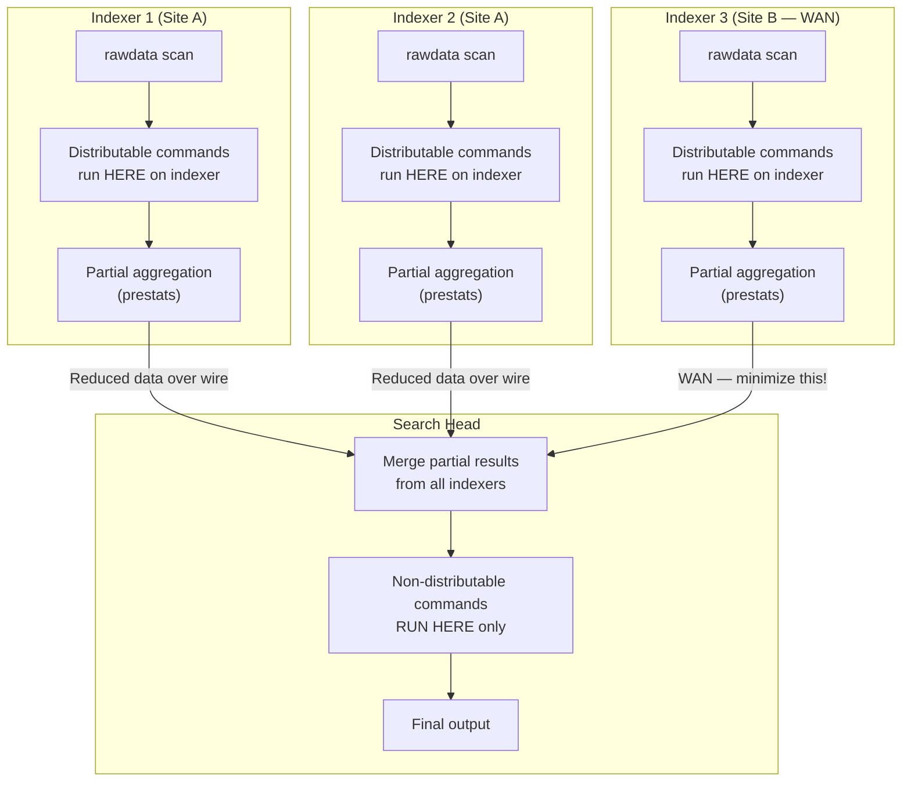
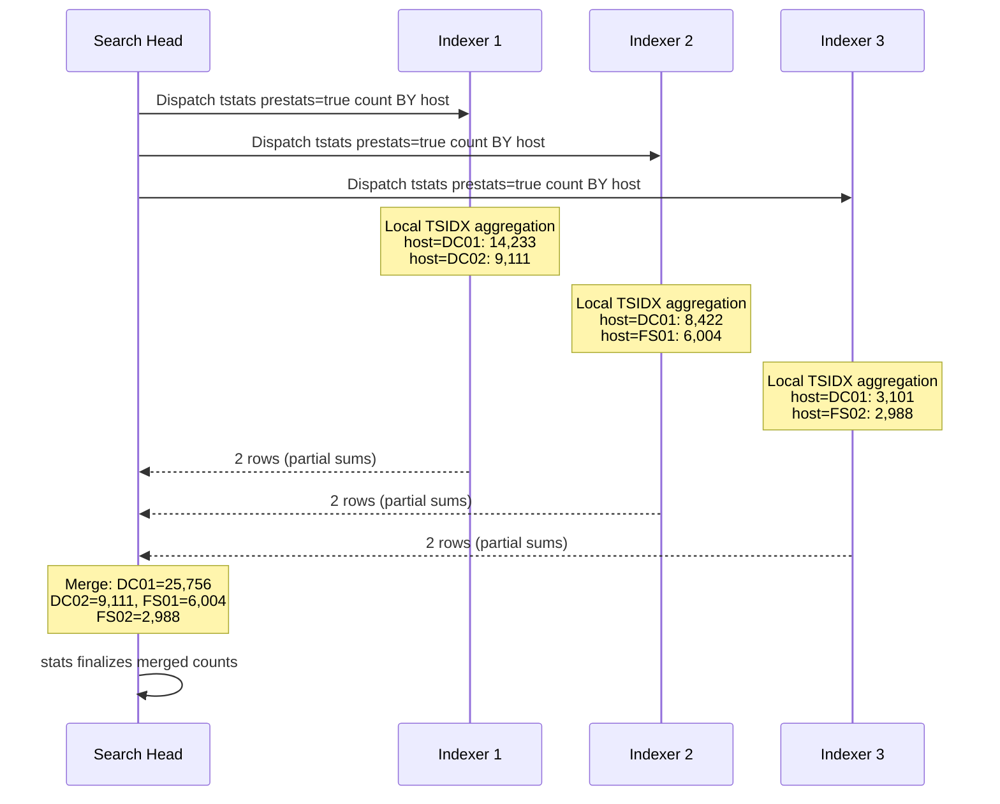
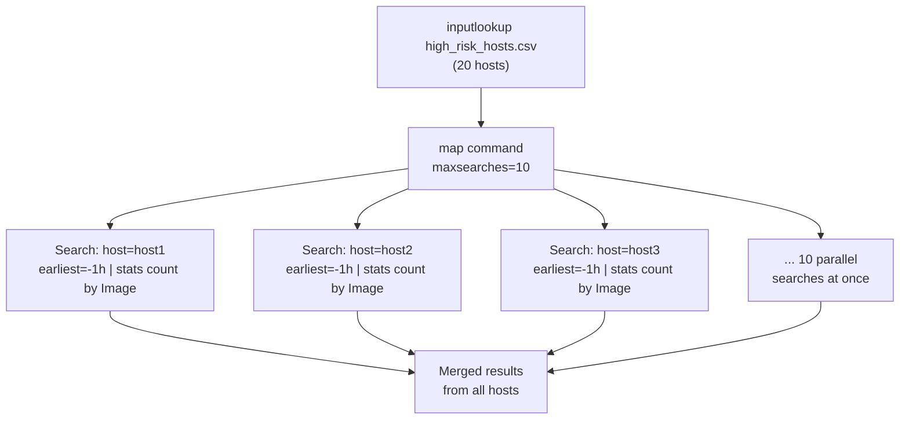

# Module 10 — Streaming & Distributable Commands
## Pushing Work to Indexers, Minimizing Search Head Load

---

## 10.1 The Splunk Execution Model: Where Commands Run

Most Splunk users think of SPL as running sequentially on the search head. In reality, Splunk has a **distributed execution model** that can run large portions of your pipeline directly on indexers — before data is ever sent across the network to the search head.

Understanding this is the single biggest lever for performance at trillion-event scale.



---

## 10.2 Command Classification Table

Every SPL command falls into one of five execution tiers. Getting this wrong means shipping raw events across a WAN or exhausting search head RAM unnecessarily.

```
┌──────────────────────────────────────────────────────────────────────────┐
│                   SPL COMMAND EXECUTION TIERS                            │
├────────────────────┬────────────────────────────────────────────────────-┤
│ TIER               │ DESCRIPTION & COMMANDS                              │
├────────────────────┼──────────────────────────────────────────────────────┤
│ 1. DISTRIBUTABLE   │ Runs on EACH indexer before results ship to SH.     │
│    STREAMING       │ Most efficient. Zero inter-node aggregation needed.  │
│                    │ Commands: eval, where, fields, rename, replace,      │
│                    │   convert, head*, regex, rex, spath, bucket,        │
│                    │   lookup (CSV), fillnull, makemv, mvexpand*,        │
│                    │   nomv, extract, kv, multikv, outputlookup*         │
├────────────────────┼──────────────────────────────────────────────────────┤
│ 2. CENTRALIZED     │ Runs on search head only, on events streamed to it.  │
│    STREAMING       │ Cheaper than transforming but can't be pushed out.   │
│                    │ Commands: streamstats, eventstats, anomalydetection, │
│                    │   autoregress, cluster, runningsum                   │
├────────────────────┼──────────────────────────────────────────────────────┤
│ 3. TRANSFORMING    │ Collapses event stream into result table.            │
│    (non-streaming) │ Forces all events to search head first.              │
│                    │ Commands: stats, chart, timechart, top, rare,        │
│                    │   geostats, contingency, associate, correlate,       │
│                    │   tstats (partially distributable via prestats)      │
├────────────────────┼──────────────────────────────────────────────────────┤
│ 4. ORCHESTRATING   │ Spawn child searches from search head.               │
│                    │ Expensive: parallel child searches, result merging.  │
│                    │ Commands: map, union (partial), append               │
├────────────────────┼──────────────────────────────────────────────────────┤
│ 5. DATASET         │ Pull data from external sources into pipeline.       │
│                    │ Always runs on search head.                          │
│                    │ Commands: inputlookup, makeresults, rest, metadata   │
└────────────────────┴──────────────────────────────────────────────────────┘

* head: distributable only when it appears BEFORE any transforming command
* mvexpand: distributable but multiplies row count — use with care
* outputlookup: distributable but writes can conflict; use append=false carefully
```

---

## 10.3 The Streaming Pipeline — Correct Command Ordering

The SPL parser identifies the first non-distributable command and **splits the pipeline at that point**. Everything before it runs distributed on indexers; everything after runs centralized on the search head.

### Visualizing the Split Point

```
Pipeline:  index=wineventlog EventCode=4624
           | eval logon_type = if(LogonType="3","network","interactive")   ← DISTRIBUTABLE
           | where NOT AccountName LIKE "%$"                                ← DISTRIBUTABLE
           | fields _time host AccountName logon_type IpAddress             ← DISTRIBUTABLE
           | rex field=IpAddress "(?<src_subnet>\d+\.\d+\.\d+)\.\d+"       ← DISTRIBUTABLE
           | lookup geo_ip.csv IpAddress OUTPUT country                     ← DISTRIBUTABLE
           ━━━━━━━━━━━━━━━━━━━━━━━━━━━━━━━━━━━━━━━━━━━━━━━━━━━━━━━━━━━━ SPLIT POINT
           | stats count by AccountName src_subnet country                  ← TRANSFORMING (SH only)
           | sort -count                                                     ← SH only
           | head 20                                                         ← SH only

Result: Indexers send pre-filtered, pre-enriched, trimmed rows to SH.
        stats runs on the small result set, not raw millions of events.
```

### Anti-Pattern: Transforming Command Too Early

```splunk
| Comment "BAD: stats forces all events to SH before where can filter"
index=wineventlog EventCode=4624 earliest=-1h
| stats count by AccountName LogonType IpAddress ComputerName
| where LogonType="3"
| sort -count

| Comment "GOOD: where is distributable — filter on indexers, THEN aggregate"
index=wineventlog EventCode=4624 earliest=-1h
| where LogonType="3"
| stats count by AccountName IpAddress ComputerName
| sort -count
```

### Anti-Pattern: `eval` After `stats`

```splunk
| Comment "BAD: eval here runs on SH after stats (wasteful only if stats was huge)"
index=sysmon EventCode=1 earliest=-1h
| stats count by Image ParentImage
| eval image_name = replace(Image, ".*\\\\", "")

| Comment "GOOD: eval runs on indexers — extracts field BEFORE stats reduces rows"
index=sysmon EventCode=1 earliest=-1h
| eval image_name = replace(Image, ".*\\\\", "")
| stats count by image_name ParentImage
```

---

## 10.4 `tstats prestats` — The Distributable Aggregation Pattern

`tstats prestats=true` pushes a **partial aggregation** to each indexer. Each indexer computes subtotals over its own buckets; the search head merges them. This is the fastest possible aggregation path.



```splunk
| Comment "tstats prestats: distributed aggregation via TSIDX, merged on SH"
| Comment "Without prestats: each indexer sends ALL matching events to SH"
| Comment "With prestats:    each indexer sends partial sums (tiny) to SH"

| Comment "=== PATTERN: prestats for high-volume event counting ==="
| tstats prestats=true count
    WHERE index=wineventlog
    BY host sourcetype _time span=5m
| stats sum(count) as event_count by host sourcetype _time
| where event_count > 5000
| sort -event_count

| Comment "=== PATTERN: prestats for multi-field aggregation ==="
| tstats prestats=true count dc(host) as host_count
    WHERE index=corelight sourcetype=bro_conn
        earliest=-1h
    BY id.orig_h
| stats sum(count) as total_conns sum(host_count) as unique_hosts by id.orig_h
| where total_conns > 10000
```

### prestats vs direct tstats — When Each Applies

```splunk
| Comment "Direct tstats: use when you need ONLY TSIDX fields in BY clause"
| Comment "No followup stats needed — tstats aggregates and returns directly"

| tstats count min(_time) as first max(_time) as last
    WHERE index=wineventlog sourcetype="WinEventLog:Security"
    BY host _time span=1h
| where count > 50000

| Comment "prestats: use when you need a stats pass for dc(), values(), etc."
| Comment "or when chaining with other commands that need the full result set"

| tstats prestats=true count
    WHERE index=sysmon sourcetype="XmlWinEventLog:Microsoft-Windows-Sysmon/Operational"
    BY host _time span=5m
| stats sum(count) as events dc(host) as unique_hosts by _time
| timechart span=5m sum(events) by host limit=20
```

---

## 10.5 Distributable `eval` Patterns for Indexer-Side Enrichment

Push as much field computation as possible to indexers — before data crosses the network.

### Indexer-Side Classification

```splunk
| Comment "All these evals run on indexers — zero SH cost until stats"
index=wineventlog sourcetype="WinEventLog:Security"
    EventCode IN (4624, 4625, 4648, 4768, 4769, 4771)
    earliest=-1h

| eval event_category = case(
    EventCode=4624, "auth_success",
    EventCode=4625, "auth_failure",
    EventCode=4648, "explicit_cred",
    EventCode IN (4768, 4769), "kerberos",
    EventCode=4771, "kerberos_failure",
    true(), "other"
)
| eval is_machine_account = if(match(coalesce(AccountName, ""), "^.*\$$"), 1, 0)
| eval logon_class = case(
    LogonType="2",  "interactive",
    LogonType="3",  "network",
    LogonType="10", "rdp",
    LogonType="9",  "runas_netonly",
    true(),         "other"
)
| eval src_ip_normalized = case(
    IpAddress IN ("-", "::1", "127.0.0.1"), "LOCAL",
    IpAddress="", "MISSING",
    true(), IpAddress
)

| Comment "=== SPLIT POINT — distributable above, transforming below ==="
| where is_machine_account=0 AND event_category != "other"
| stats count by event_category logon_class src_ip_normalized
| where count > 10
| sort -count
```

### Distributable Lookup Enrichment

```splunk
| Comment "CSV lookups are distributable — run on indexers before aggregation"
| Comment "KV Store lookups are NOT distributable — they run on search head only"

index=corelight sourcetype=bro_conn earliest=-15m
    NOT id.resp_h IN ("10.0.0.0/8", "172.16.0.0/12", "192.168.0.0/16")

| Comment "These lookups run ON INDEXERS — before network transfer"
| lookup asset_inventory.csv id.orig_h OUTPUT asset_type src_hostname
| lookup threat_intel_ips.csv id.resp_h OUTPUT threat_category threat_score

| Comment "Filter early using enriched fields (still on indexers)"
| where isnotnull(threat_category)

| fields _time id.orig_h src_hostname id.resp_h id.resp_p bytes_sent asset_type threat_category threat_score

| Comment "=== SPLIT POINT ==="
| stats sum(bytes_sent) as bytes_out
        count as connections
        dc(id.resp_h) as unique_c2_ips
        by id.orig_h src_hostname asset_type threat_category
| where bytes_out > 1000000
| sort -bytes_out
```

---

## 10.6 The `map` Command — Orchestrated Parallel Searches

`map` spawns parallel sub-searches for each row in the current result set. Unlike sequential subsearches, `map` runs up to `maxsearches` (default 10) concurrently.



```splunk
| Comment "map: Hunt across a known list of high-risk hosts in parallel"
| Comment "Use case: IOC-driven hunting — process suspicious IPs list"

inputlookup suspicious_ips_kvstore
| where threat_score > 80
| fields src_ip
| head 50

| map maxsearches=10 search="
    search index=sysmon EventCode=3
        SourceIp=\"$src_ip$\" earliest=-24h
    | stats count dc(DestinationIp) as ext_dests
            values(Image) as processes
            values(DestinationIp) as dests
            by Computer User SourceIp
    | eval pivot_src = \"$src_ip$\"
"
| stats sum(count) as total_conns
        sum(ext_dests) as unique_dests
        values(processes) as all_processes
        by pivot_src User Computer
| sort -total_conns
```

### `map` for Per-Host Baseline Comparison

```splunk
| Comment "Per-host deviation: compare each host against its own 30-day baseline"
| Comment "Without map, you'd need a giant join or eventstats"

| tstats count
    WHERE index=wineventlog EventCode=4624 earliest=-24h
    BY host
| rename count as today_count
| map maxsearches=8 search="
    | tstats count
        WHERE index=wineventlog EventCode=4624 earliest=-30d latest=-1d
        BY host
    | where host=\"$host$\"
    | eval today_count=$today_count$
    | eval baseline_avg = round(count / 29, 0)
    | eval deviation_pct = round((today_count - baseline_avg) / (baseline_avg + 1) * 100, 1)
    | eval host = \"$host$\"
    | fields host today_count baseline_avg deviation_pct
"
| where abs(deviation_pct) > 50
| sort -deviation_pct
```

---

## 10.7 Streaming Detection Patterns for Each Attack Stage

### Stage 1: Reconnaissance — Distributable LDAP Scan Detection

```splunk
| Comment "Distributable first pass: classify and filter on indexers"
| Comment "Only counting aggregation hits the search head"

index=corelight sourcetype=bro_ldap earliest=-30m

| Comment "=== Distributable tier: runs on indexers ==="
| eval ldap_target_type = case(
    match(filter, "(?i)samaccounttype=805306368"),       "user_enum",
    match(filter, "(?i)objectcategory=computer"),        "computer_enum",
    match(filter, "(?i)objectcategory=grouppolicycont"), "gpo_enum",
    match(filter, "(?i)objectclass=trusteddomain"),      "trust_enum",
    match(filter, "(?i)serviceprincipalname=\*"),        "spn_enum",
    match(filter, "(?i)msds-allowedtodelegateto"),       "delegation_enum",
    match(filter, "(?i)admincount=1"),                   "admin_enum",
    true(), "other"
)
| where ldap_target_type != "other"
| fields _time id.orig_h ldap_target_type filter result_count

| Comment "=== SPLIT POINT ==="
| stats count as query_count
        dc(ldap_target_type) as enum_type_count
        values(ldap_target_type) as enum_types
        sum(result_count) as total_results_returned
        by id.orig_h
| where enum_type_count >= 3 OR query_count > 50
| eval recon_confidence = case(
    enum_type_count >= 5, "HIGH — Automated tooling (BloodHound)",
    enum_type_count >= 3, "MEDIUM — Targeted enumeration",
    query_count > 100,    "MEDIUM — Volume-based",
    true(),               "LOW"
)
| sort -enum_type_count
```

### Stage 2: Initial Access — Streaming Auth Anomaly

```splunk
| Comment "Streaming pattern: eval-then-streamstats for real-time spray detection"
| Comment "streamstats is centralized streaming — runs on SH but streams events"

index=wineventlog sourcetype="WinEventLog:Security"
    EventCode IN (4624, 4625) earliest=-2h

| Comment "=== Distributable: on indexers ==="
| eval src = coalesce(IpAddress, WorkstationName, "UNKNOWN")
| eval outcome = if(EventCode=4624, "success", "failure")
| eval user = coalesce(AccountName, TargetUserName, "UNKNOWN")
| where NOT match(user, "^.*\$$") AND src != "UNKNOWN" AND src != "LOCAL"
| fields _time src user outcome ComputerName LogonType

| Comment "=== SPLIT POINT: sort needed for streamstats ==="
| sort 0 _time
| Comment "=== Centralized streaming: on search head, one event at a time ==="
| streamstats time_window=15m
    count(eval(outcome="failure")) as failures_15m
    count(eval(outcome="success")) as successes_15m
    dc(user) as accounts_15m
    by src

| where failures_15m > 20 AND accounts_15m > 5
| eval spray_indicator = case(
    accounts_15m > 20 AND failures_15m > 50, "HIGH: Password spray — high volume",
    accounts_15m > 10 AND failures_15m > 20, "MEDIUM: Possible spray",
    true(), "LOW"
)
| dedup src sortby -failures_15m
| table _time src failures_15m successes_15m accounts_15m spray_indicator
```

### Stage 3: Lateral Movement — Distributable SMB + Streaming Pivot Detection

```splunk
| Comment "Two-phase: distributable classification → streaming chain detection"

index=corelight sourcetype IN (bro_smb_mapping, bro_ntlm, bro_kerberos)
    earliest=-1h

| Comment "=== Distributable tier ==="
| eval activity_type = case(
    sourcetype="bro_smb_mapping" AND match(path, "(?i)(ADMIN|C|IPC)\$"), "admin_share",
    sourcetype="bro_ntlm" AND status="NTLMSSP_AUTH", "ntlm_auth",
    sourcetype="bro_kerberos" AND request_type="TGS", "kerb_tgs",
    true(), "other"
)
| where activity_type != "other"
| eval src = coalesce(id.orig_h, "UNKNOWN")
| eval dest = coalesce(id.resp_h, "UNKNOWN")
| eval lateral_user = coalesce(username, client, "UNKNOWN")
| fields _time src dest activity_type lateral_user

| Comment "=== SPLIT POINT ==="
| stats count as activity_count
        dc(dest) as unique_targets
        dc(activity_type) as activity_diversity
        values(activity_type) as activities
        by src lateral_user
| where unique_targets > 3 OR activity_diversity >= 2
| eval lateral_score = (unique_targets * 5) + (activity_diversity * 10) + (activity_count * 0.5)
| sort -lateral_score
| head 50
```

### Stage 4: Privilege Escalation — Streaming Event Sequence

```splunk
| Comment "Sequence detection with streamstats: compromise → escalation chain"

index=wineventlog sourcetype="WinEventLog:Security"
    EventCode IN (4625, 4624, 4728, 4732, 4756, 4720, 4662)
    earliest=-4h

| Comment "=== Distributable ==="
| eval actor = coalesce(SubjectUserName, AccountName, "UNKNOWN")
| eval event_class = case(
    EventCode=4625, "failure",
    EventCode=4624 AND LogonType IN ("3","10"), "lateral_logon",
    EventCode IN (4728,4732,4756), "group_add",
    EventCode=4720, "account_create",
    EventCode=4662 AND match(ObjectType, "19195a5a"), "replication_access",
    true(), "other"
)
| where event_class != "other" AND NOT match(actor, "^.*\$$")
| eval src = coalesce(IpAddress, SubjectUserName, "UNKNOWN")
| fields _time actor src event_class ComputerName

| Comment "=== SPLIT POINT: sort for streamstats ordering ==="
| sort 0 _time

| Comment "=== Centralized streaming ==="
| streamstats time_window=2h
    count as events_in_window
    values(event_class) as classes_seen
    dc(event_class) as class_diversity
    by actor

| eval has_failure     = if(mvfind(classes_seen,"failure")     >= 0, 1, 0)
| eval has_logon       = if(mvfind(classes_seen,"lateral_logon") >= 0, 1, 0)
| eval has_escalation  = if(mvfind(classes_seen,"group_add")   >= 0
                         OR mvfind(classes_seen,"account_create") >= 0, 1, 0)
| eval has_dcsync      = if(mvfind(classes_seen,"replication_access") >= 0, 1, 0)
| eval chain_score = (has_failure * 1) + (has_logon * 2) + (has_escalation * 4) + (has_dcsync * 8)

| where chain_score >= 3
| dedup actor sortby -chain_score
| table _time actor events_in_window classes_seen chain_score has_failure has_logon has_escalation has_dcsync
```

### Stage 5: Persistence — Distributable Persistence Artifact Detection

```splunk
| Comment "Persistence: detect across multiple techniques simultaneously"
| Comment "Leverage distributable eval to classify without multiple searches"

index=wineventlog sourcetype="WinEventLog:Security"
    EventCode IN (4698, 7045, 4720, 4728, 4756, 4719)
    earliest=-24h

| Comment "=== Distributable: classify all persistence techniques on indexers ==="
| eval persistence_type = case(
    EventCode=4698, "scheduled_task",
    EventCode=7045, "service_install",
    EventCode=4720, "new_user_account",
    EventCode=4728, "global_group_add",
    EventCode=4756, "universal_group_add",
    EventCode=4719, "audit_policy_change",
    true(), "other"
)
| eval actor = coalesce(SubjectUserName, AccountName, "UNKNOWN")
| eval target_object = coalesce(TaskName, ServiceName, TargetUserName, MemberName, "UNKNOWN")
| eval is_off_hours = if(
    tonumber(strftime(_time, "%H")) < 6
    OR tonumber(strftime(_time, "%H")) > 20, 1, 0)
| where persistence_type != "other" AND NOT match(actor, "^.*\$$")
| fields _time actor persistence_type target_object ComputerName is_off_hours

| Comment "=== SPLIT POINT ==="
| stats count as persist_count
        dc(persistence_type) as technique_count
        values(persistence_type) as techniques
        values(target_object) as targets
        max(is_off_hours) as any_off_hours
        by actor ComputerName
| eval priority = case(
    technique_count >= 3, "CRITICAL",
    any_off_hours=1 AND persist_count > 1, "HIGH",
    technique_count >= 2, "HIGH",
    true(), "MEDIUM"
)
| sort -technique_count
| table actor ComputerName persist_count technique_count techniques targets any_off_hours priority
```

### Stage 6: Exfiltration — Distributable Flow Classification + Streaming Accumulation

```splunk
| Comment "Exfiltration: distributable classification → streaming byte accumulation"

index=corelight sourcetype=bro_conn earliest=-6h
    bytes_sent > 0

| Comment "=== Distributable ==="
| lookup asset_inventory.csv id.orig_h OUTPUT asset_type src_hostname
| eval is_external_dest = if(
    NOT cidrmatch("10.0.0.0/8", id.resp_h)
    AND NOT cidrmatch("172.16.0.0/12", id.resp_h)
    AND NOT cidrmatch("192.168.0.0/16", id.resp_h), 1, 0)
| eval dest_port_class = case(
    id.resp_p=443,  "HTTPS",
    id.resp_p=80,   "HTTP",
    id.resp_p=22,   "SSH",
    id.resp_p=21,   "FTP",
    id.resp_p=53,   "DNS",
    id.resp_p=25,   "SMTP",
    true(),         "OTHER"
)
| where is_external_dest=1
| fields _time id.orig_h src_hostname asset_type id.resp_h id.resp_p dest_port_class bytes_sent

| Comment "=== SPLIT POINT: sort needed for streamstats ==="
| sort 0 _time id.orig_h

| Comment "=== Centralized streaming: accumulate bytes over rolling window ==="
| streamstats time_window=1h
    sum(bytes_sent) as bytes_1h
    dc(id.resp_h) as unique_dests_1h
    dc(dest_port_class) as port_diversity_1h
    by id.orig_h

| where bytes_1h > 104857600
| dedup id.orig_h sortby -bytes_1h
| eval bytes_1h_mb = round(bytes_1h / 1048576, 1)
| eval exfil_confidence = case(
    bytes_1h > 1073741824 AND port_diversity_1h > 2, "HIGH: >1GB via multiple protocols",
    bytes_1h > 104857600 AND unique_dests_1h < 3,    "MEDIUM: Large single-dest transfer",
    bytes_1h > 104857600, "LOW: Large external transfer",
    true(), "NONE"
)
| where exfil_confidence != "NONE"
| table id.orig_h src_hostname asset_type bytes_1h_mb unique_dests_1h port_diversity_1h exfil_confidence
```

---

## 10.8 `union` — Distributable Multi-Dataset Merging

`union` merges multiple datasets without a subsearch penalty, and unlike `append`, can be partially distributable.

```splunk
| Comment "union: efficient multi-sourcetype merging"
| Comment "Useful when sourcetypes share structure but different field names"

| union
    [search index=corelight sourcetype=bro_kerberos earliest=-1h
     | eval src=id.orig_h | eval protocol="kerberos" | eval user=client
     | fields _time src protocol user cipher request_type]
    [search index=corelight sourcetype=bro_ntlm earliest=-1h
     | eval src=id.orig_h | eval protocol="ntlm" | eval user=username
     | fields _time src protocol user status]
    [search index=wineventlog EventCode IN (4768,4769,4771,4776) earliest=-1h
     | eval src=IpAddress | eval protocol="win_kerb_ntlm"
     | eval user=coalesce(AccountName,TargetUserName)
     | fields _time src protocol user EventCode]

| Comment "Now correlate merged auth events from all three sources"
| stats count dc(protocol) as auth_sources values(protocol) as protocols by src user
| where auth_sources >= 2
| sort -count
```

---

## 10.9 Optimizing `streamstats` — The Centralized Streaming Bottleneck

`streamstats` is centralized but streams events one-by-one — it doesn't hold them all in RAM like `transaction`. However, it still requires a `sort` first (which IS expensive).

### Avoiding the `sort 0` Bottleneck

```splunk
| Comment "sort 0 is a full sort — expensive on millions of events"
| Comment "Strategy: Pre-filter to drastically reduce events before sort"

| Comment "BAD: sort 0 on millions of events"
index=wineventlog EventCode IN (4624, 4625) earliest=-24h
| sort 0 _time AccountName
| streamstats time_window=1h count by AccountName

| Comment "GOOD: Aggressive pre-filter → sort → streamstats on small set"
index=wineventlog EventCode IN (4624, 4625) earliest=-24h
| where NOT match(AccountName, "^.*\$$")
    AND IpAddress != "-"
    AND IpAddress != "::1"
| stats count as event_count by AccountName IpAddress
| where event_count > 20
| join type=inner AccountName [
    search index=wineventlog EventCode IN (4624, 4625) earliest=-24h
    | sort 0 _time
    | streamstats time_window=1h
        count(eval(EventCode=4625)) as failures
        count(eval(EventCode=4624)) as successes
        by AccountName
    | where failures > 10 AND successes > 0
    | dedup AccountName
]
| table AccountName IpAddress event_count failures successes
```

### `streamstats` with `time_window` vs `window`

```splunk
| Comment "time_window: sliding TIME window (uses _time field)"
| Comment "window: sliding COUNT window (last N events)"
| Comment "time_window is more useful for security but requires sorted input"

| Comment "Pattern: Use time_window for temporal anomaly detection"
index=sysmon EventCode=3 earliest=-2h
    NOT DestinationIp IN ("10.0.0.0/8")
| sort 0 _time Computer
| streamstats time_window=10m
    dc(DestinationIp) as unique_ext_dests
    count as conn_count
    by Computer Image
| where unique_ext_dests > 20 OR conn_count > 100
| dedup Computer Image sortby -unique_ext_dests
| table _time Computer Image conn_count unique_ext_dests
```

---

## 10.10 Distributable vs Non-Distributable: Lookup Types

Lookup type determines where in the pipeline (indexer or search head) it executes.

```
LOOKUP TYPE DISTRIBUTABILITY:
━━━━━━━━━━━━━━━━━━━━━━━━━━━━━━━━━━━━━━━━━━━━━━━━━━━━━━━━━━━━━━━━━━
Lookup Type          Distributable?   Notes
━━━━━━━━━━━━━━━━━━━━━━━━━━━━━━━━━━━━━━━━━━━━━━━━━━━━━━━━━━━━━━━━━━
CSV file             YES              Copied to all indexers
KV Store             NO               Only on search head (REST API)
External (Python)    NO               Executes on search head
Geo (MMDB)           YES              MMDB copied to indexers
CIDR match           YES              In-memory on indexers
Temporal (time-range)NO               Requires search head coordination
━━━━━━━━━━━━━━━━━━━━━━━━━━━━━━━━━━━━━━━━━━━━━━━━━━━━━━━━━━━━━━━━━━
Implication: Use CSV lookups for hot-path enrichment (threat intel,
asset inventory). Use KV Store only post-aggregation or for state.
━━━━━━━━━━━━━━━━━━━━━━━━━━━━━━━━━━━━━━━━━━━━━━━━━━━━━━━━━━━━━━━━━━
```

```splunk
| Comment "Optimal lookup placement example"
| Comment "CSV lookup (distributable) enriches BEFORE aggregation on indexers"
| Comment "KV Store lookup (non-distributable) enriches AFTER aggregation on SH"

index=corelight sourcetype=bro_conn earliest=-15m

| Comment "--- Distributable CSV lookups run on indexers ---"
| lookup asset_inventory.csv id.orig_h OUTPUT asset_type src_criticality
| lookup geo_ip.csv id.resp_h OUTPUT country city
| lookup port_protocols.csv id.resp_p OUTPUT protocol_name risk_level

| where src_criticality IN ("tier0", "tier1")
    AND country NOT IN ("US", "CA", "GB")
    AND risk_level = "high"

| fields _time id.orig_h id.resp_h id.resp_p asset_type src_criticality country protocol_name

| Comment "=== SPLIT POINT ==="
| stats count dc(id.resp_h) as unique_dests by id.orig_h asset_type country protocol_name

| Comment "--- Non-distributable KV Store lookup runs on search head ---"
| Comment "Runs on already-aggregated small result set — acceptable cost"
| lookup threat_intelligence_kvstore id.orig_h OUTPUT threat_score intel_tags
| where isnotnull(threat_score) OR count > 100
```

---

## 10.11 Distributable Alerting with `sendalert`

```splunk
| Comment "sendalert: send individual events to an alert action AS THEY ARE FOUND"
| Comment "Without sendalert: wait for full search to finish before alerting"
| Comment "With sendalert on streaming pipeline: alert fires per matching event"
| Comment "Use case: near-real-time alerting on severity-1 events"

index=wineventlog EventCode=4662 earliest=-5m
    ObjectType="{19195a5a-6da0-11d0-afd3-00c04fd930c9}"
    NOT SubjectUserName="*$"
    NOT SubjectUserName IN ("MSOL_*", "AAD_*", "ADSync*")

| Comment "=== All distributable below — runs on indexers ==="
| eval actor = SubjectUserName
| eval domain = SubjectDomainName
| eval target_dc = ComputerName
| eval alert_severity = "CRITICAL"
| eval mitre_technique = "T1003.006"
| eval alert_title = "DCSync Attempt by " . actor . " on " . target_dc

| Comment "=== sendalert fires immediately on each matching event ==="
| sendalert "PagerDuty DCSync Alert"
    param.actor=$actor$
    param.severity=$alert_severity$
    param.mitre=$mitre_technique$
```

---

## 10.12 Summary: The Streaming & Distributable Design Checklist

```
FOR EVERY PRODUCTION SEARCH, ASK:
━━━━━━━━━━━━━━━━━━━━━━━━━━━━━━━━━━━━━━━━━━━━━━━━━━━━━━━━━━━━━━━━━━

□ Are ALL filter conditions (where, eval+where) BEFORE the first
  transforming command (stats/chart/timechart)?

□ Are all CSV lookups placed BEFORE stats so they run on indexers?

□ Are KV Store lookups placed AFTER stats (they can't be pushed)?

□ Is | fields used immediately after the index filter to trim events?

□ If using tstats, is prestats=true applied when chaining with stats?

□ If using streamstats, is the input pre-filtered to minimum events
  before the required sort 0?

□ Is the split point (first non-distributable command) as late
  as possible in the pipeline?

□ Are there any subsearches that could be replaced with
  lookup / inputlookup / union / append?

□ If using map, is the input list small enough (<100 rows ideally)?

□ For multi-index searches, is there aggressive pre-filtering
  per index before union/append to minimize cross-site transfer?

□ For scheduled alerts, is the search window appropriate and
  is dedup/distinct counting applied to handle window overlap?

━━━━━━━━━━━━━━━━━━━━━━━━━━━━━━━━━━━━━━━━━━━━━━━━━━━━━━━━━━━━━━━━━━
```

---

[← Advanced Detection Engineering](./08-advanced-detection-engineering.md) | [Performance Reference →](./09-performance-reference-card.md) | [← Back to Index](./README.md)
